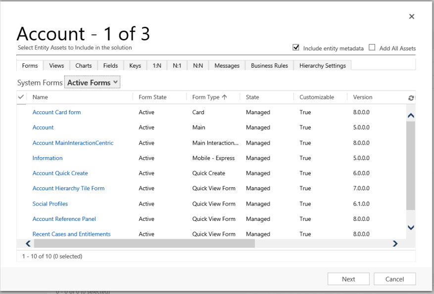

# Create segmented solutions 
Use solution segmentation so that you only include entity components that are updated when you distribute solution updates. With solution segmentation, you export solution updates with selected entity assets, such as entity fields, forms, and views, rather than entire entities with all the assets. To create a segmented solution, you use the **Solutions** area in Power Apps. More information: [Use segmented solutions](../../alm/segmented-solutions-alm.md)

## Create a segmented solution with entity assets 
 To create a segmented solution, start with creating an unmanaged solution and add only the components that you've updated. The wizard-like setup takes you step by step through the process of adding entity assets. 

For example, imagine that you've created a new custom entity that doesn't exist in any other environment named *Custom entity* and also added a new field named *topten* for the account entity. To create a segmented solution, follow these steps. 
  
1. Go to the Power Apps portal and then select **Solutions**.  
  
2.  Select **New solution** and create a solution. Enter information in the required fields. Select **Create**.  
  
3.  Open the solution you created. On the command bar, select **Add Existing**, and then select **Entity**.  
  
4.  In the **Add existing entities** pane, select one or more entities you want to add to the solution. For example, select **Account** and **Custom entity**. Select **Next**.  

5.  In the **Select entities** pane, you can choose from the assets to include: 
    - **Include all components**. This option includes all components *and* metadata associated with the entity. It can include other entities or entity components such as business process flows, reports, connections, and queues. 
    - **Include entity metadata**. This option includes *only* the metadata associated with the entity. Metadata includes the entity attributes, such as auditing, duplicate detection, or change tracking. 
    - **Select components**. This option lets you individually select each component that’s associated with the entity, such as fields, relationships, business rules, views, forms, and charts. 
    - Don't include any components. 

      For this example, because *Custom entity* has never been imported into the target environment, next to **Custom entity** select **Include all components**. Under **Account**, choose **Select components**.  
      > [!div class="mx-imgBorder"] 
      > 
  
6.  Since only the *topten* custom field is new to the account  entity, select **Top Ten**, and then select **Add**.  
     > [!div class="mx-imgBorder"] 
     > 

7. Select **Add** to add the components to the solution. 

### Create a segmented solution using solution explorer  
The following illustrations provide an example of creating a segmented solution by choosing entity assets from the `Account`, `Case`, and `Contact` entities.  

> [!NOTE]
> The case entity is included with some Dynamics 365 applications, such as Dynamics 365 Customer Service. 
  
Start by opening an unmanaged solution you created. Choose the **Entity** component.  

 > [!div class="mx-imgBorder"] 
 >   
  
 Then, select the solution components.  
  
   
  
 Follow the wizard. In Step 1, starting in alphabetical order, select the assets for the first entity, the `Account` entity, as shown here.  
  
   
  
 Open the **Fields** tab and select the **Account Number** field.  
  
   
  
 In Step 2, for the **Case** entity, add all assets.  
  
   
  
 In Step 3, add the **Anniversary** field for the **Contact** entity.  
  
   
  
 As a result, the segmented solution that’s created contains three entities, `Account`, `Case`, and `Contact`. Each entity contains only the assets that were chosen.  
  
 > [!div class="mx-imgBorder"] 
 >   
  
  
### See also  
 [Solutions overview](solutions-overview.md)

