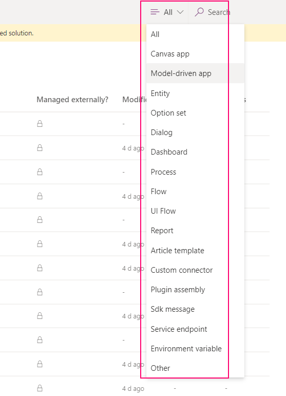
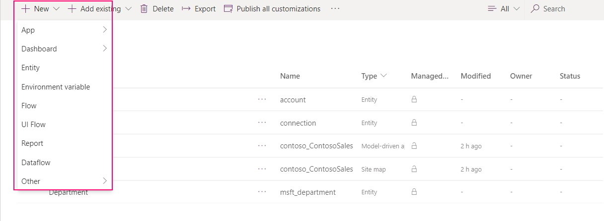
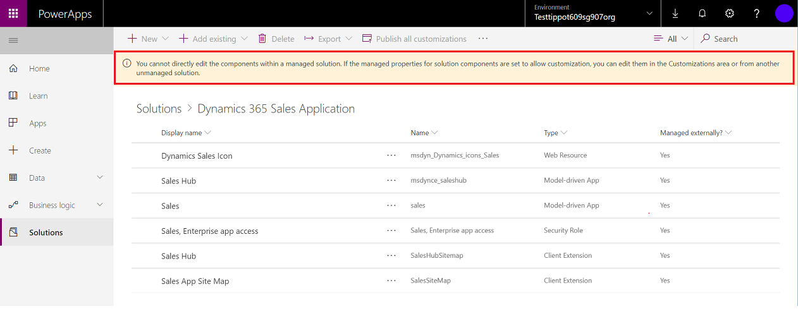

# Use solutions in PowerApps

 Within PowerApps, you can view a list of solutions by selecting **Solutions** in the left navigation. You can then select a solution to view all of its components. 
 
> [!div class="mx-imgBorder"]  
>   
 
> [!NOTE]
>  The solutioning experience is available only online and for environment version 9.1.0.267 and later. To check your version, please go to …[PowerApps admin center](https://admin.powerapps.com/)> **Environments** > select your environment > **Details** tab. For earlier version environments, selecting a solution opens it in the classic experience.  
 
 You can browse through all the components in a solution by scrolling through the items. If there are more then 100 items in the list you can select **Load the next 100 items** to see more. 
 
> [!div class="mx-imgBorder"]  
>   

 ## Search and filter in a solution
 
 You can also search for a specific component by its name. 
 
> [!div class="mx-imgBorder"]  
>   
 
 Or filter all items in the list by the component type.
  
> [!div class="mx-imgBorder"]  
>   
 
 ## Contextual commands
 
 As you select each component, the actions available in the command bar will change depending on the type of the component you have selected and if the solution is the default or a managed one. 
 
> [!div class="mx-imgBorder"]  
>   
 
 When you don't select any component, the command bar will show actions applied to the solution itself. 
 
> [!div class="mx-imgBorder"]  
>   
 
 ## Create components in a solution
 With solutions that are unmanaged or the default one, you can use the **New** command to create different types of components. This takes you to a different create experience depending on the component type that you choose. After you finish creating the component, it will be added to the solution. 
 
> [!div class="mx-imgBorder"]  
>   
 
 ## Add an existing component to a solution
 
 With solutions that are unmanaged and not the default one, you can use the **Add existing** command to bring in components that aren’t already in the solution.  
 
> [!div class="mx-imgBorder"]  
>   
  
 With solutions that are managed, there will be no commands available and you’ll see the message as shown below. You’ll need to locate the component in the solution named **Default Solution** and try to edit it there or add it to another unmanaged solution that you’ve created. The component might not be customizable. More information: [Managed properties](solutions-overview.md#managed-properties)

> [!div class="mx-imgBorder"]  
>   

 Many of the customizations you’ll want to do will involve entities. You can use the **Entity** filter to show a list of all the entities in the current solution that can be customized in some way. Once you drill into an entity, you can see the components that are part of the entity as shown with the account entity in the following screenshot. 
 
> [!NOTE]
>  Currently, when you add an existing entity to a solution the system automatically adds all the components that are part of the entity to your solution. If this is not what you prefer, use the command **Switch to classic** to navigate to the classic experience and add only those components that you want. <!-- We will soon improve this experience from PowerApps and allow you to select only the specific component(s) under entity that you want to add into a solution. -->
  
> [!div class="mx-imgBorder"]  
>   

## Classic solution explorer

In PowerApps, you can view the classic solution explorer by selecting **Solutions** in the left navigation pane, and then selecting **Switch to classic** in the command bar. Classic solution explorer is the one that was previously available through the **Settings > Advanced customizations** area in PowerApps. If you are a Dynamics 365 for Customer Engagement user, you use the classic solution explorer to work with solutions.  

## Known limitations

- Deleting or removing a managed solution doesn't delete the canvas app in PowerApps.
- Custom connectors are not available in a solution.
- Canvas apps must be opened after a solution is imported to update the connections.
- After adding an existing SDK assembly, it doesn't appear in the solution. 
- If a canvas app is packaged in a managed solution, it can still be edited in the target environment.
- Dependencies are not available for canvas apps.
- Deleting a managed solution will not rollback to a different canvas app's version. 
-	Canvas app access (CRUD and security) is managed entirely in PowerApps and not the Common Data Service for Apps (CDS) database.
-	CDS APIs to call canvas apps are blocked and don't return anything. 
-	Canvas apps created in a solution can't be shared as co-owner to an AAD Security Group.
-	Canvas apps won't display in the classic solution explorer.
-	Existing canvas apps are not solution aware. 

 For details about customizing the individual components in a solution, see the following topics:  
  
-   For entity, entity relationships, field and message customizations, see [Metadata](create-edit-metadata.md).  
  
-   For entity forms see [Forms](../model-driven-apps/create-design-forms.md).  
  
-   For processes, see [Processes](../model-driven-apps/guide-staff-through-common-tasks-processes.md).  
  
-   For business rules, see [Business Rules](../model-driven-apps/create-business-rules-recommendations-apply-logic-form.md).  
