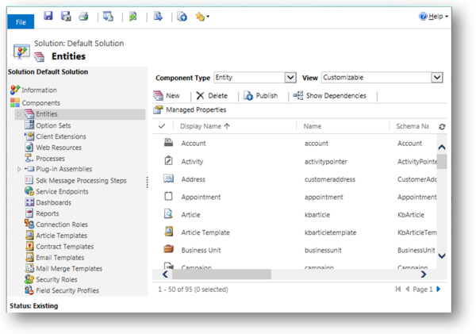
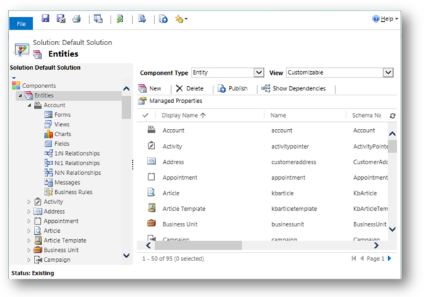

# Use the solution explorer

 Within the solution explorer you can navigate through a hierarchy of nodes using the navigation pane on the left side as shown in the following screenshot:  
  
   
  
> [!NOTE]
>  Use your mouse and keyboard when working with customization tools in the solution explorer. This part of the application isn’t optimized for touch.  
  
 As you select each node, you can see a list of the solution components. The actions available in the command bar will change depending on the context of the node you have selected and if the solution is the default solution or a managed solution. With unmanaged solutions that are not the default solution, you can use the **Add Existing** command to bring in solution components that aren’t already in the solution.  
  
With managed solutions there will be no commands available and you’ll see the message:  

> [!NOTE]
> You can’t directly edit the components within a managed solution. If the managed properties for solution components are set to allow customizations, you can edit them using a PowerApps design tool or from another unmanaged solution.    
  
 You’ll need to locate the solution component in the default solution and try to edit it there or add it to another unmanaged solution that you’ve created. The solution component might not be customizable. More information: [Managed properties](solutions-overview.md#managed-properties)
  
 Many of the customizations you’ll want to do will involve entities. You can expand the **Entities** node to show a list of all the entities in the system that can be customized in some way. You can further expand each entity to see the solutions components that are part of the entity as shown with the account entity in the following screenshot:  
  
   
  
 For details about customizing the individual solution components found in the solution explorer, see the following topics:  
  
-   For entity, entity relationships, field and message customizations, see [Metadata](create-edit-metadata.md).  
  
-   For entity forms see [Forms](../model-driven-apps/create-design-forms.md).  
  
-   For processes, see [Processes](../model-driven-apps/guide-staff-through-common-tasks-processes.md).  
  
-   For business rules, see [Business Rules](../model-driven-apps/create-business-rules-recommendations-apply-logic-form.md).  
