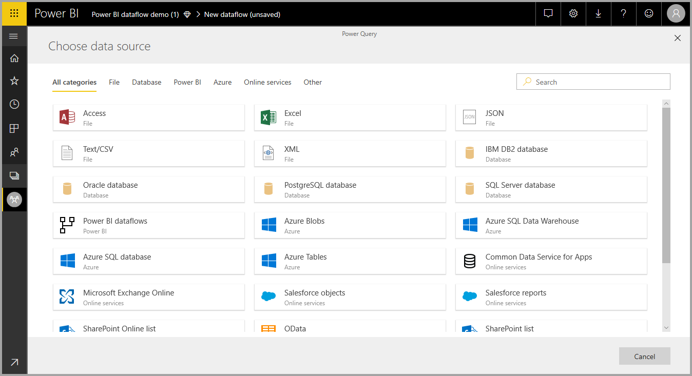
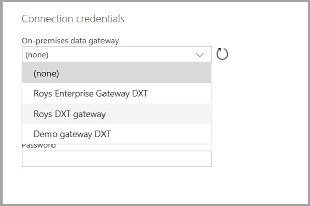

# Using an on-premises data gateway in Power Platform Dataflows
[!INCLUDE [cc-beta-prerelease-disclaimer](../../includes/cc-beta-prerelease-disclaimer.md)]

Install an on-premises data gateway to transfer data quickly and securely
between a Power Platform dataflow and a data source that isn't in the cloud,
such as an on-premises SQL Server database or an on-premises SharePoint site.
You can view all gateways for which you have administrative permissions and
manage permissions and connections for those gateways.

With a gateway, you can connect to on-premises data through these connections:

-   SharePoint

-   SQL Server

-   Oracle

-   Informix

-   Filesystem

-   DB2

## Prerequisites

-   A PowerApps account. Don't have one? [Sign up for 30 days free](https://docs.microsoft.com/powerapps/maker/signup-for-powerapps).

-   Administrative permissions on a gateway. These permissions are provided by
    default for gateways you install. Administrators can grant other people
    permissions for gateways. 

-   A license that supports accessing on-premises data using an on-premises
    gateway. For more information, see the “Connect to your data and systems” section of the
    [Find the right PowerApps plan page](https://powerapps.microsoft.com/pricing/).

-   Gateways and on-premises connections can only be created and used in the
    user's default environment. More information: [Working with environments and Microsoft PowerApps](../canvas-apps/working-with-environments.md).

## Install a gateway
1.  In the left navigation pane of [powerapps.com](https://make.powerapps.com/?utm_source=padocs&utm_medium=linkinadoc&utm_campaign=referralsfromdoc), select **Gateways**.

    

2.  Select a gateway from the list. If you don't have administrative permissions for a gateway, select
    [Install a gateway now](https://go.microsoft.com/fwlink/?LinkID=820931), and then follow the prompts in the wizard.

     

     For details about how to install a gateway, see [Understand on-premises data gateways](../canvas-apps/gateway-reference.md).

## Use an on-premises data source in a dataflow
1. Select an on-premises data source from the data sources list.

   

2. Provide the connection details for the enterprise gateway that will be used to access the on-premises data. You must select the gateway itself, and provide credentials for the selected
gateway. Only gateways for which you are an administrator appear in the list.

    

You can change the enterprise gateway used for a given dataflow and change the gateway assigned to all of your queries using the dataflow authoring tool.

> [!NOTE]
> The dataflow will try to find or create the required data sources using the new gateway. If it cannot do so, you won't be able to change the gateway until all needed dataflows are available from the selected gateway.

## View and manage gateway permissions
1.  In the left navigation pane of [powerapps.com](https://make.powerapps.com/?utm_source=padocs&utm_medium=linkinadoc&utm_campaign=referralsfromdoc), select **Gateways** and then select the gateway you want.

2.  To add a user to a gateway, select **Users**, specify a user or group, and then specify a permission level:

    -   **Can use.** Users with this permission can create connections on the gateway to use for
        apps and flows, but can't share the gateway. Use this permission for
        users who will run apps but not share them.

    -   **Can use + share.** Users with this permission can create a connection on the gateway to
        use for apps and flows, and automatically share the gateway when sharing
        an app. Use this permission for users who need to share apps with other
        users or with the organization.

    -   **Admin.** Admins have full control of the gateway, including adding users, setting permissions, creating connections to all available data sources, and deleting the gateway.

      For **Can use** and **Can use + share** permission levels, select the data sources that the user can connect to over the gateway.

## View and manage gateway connections
1.  In the left navigation bar of *powerapps.com*, select **Gateways**, and then choose the gateway you want.

2.  Perform the action that you want: 
    - To view details, edit the settings, or delete a gateway, select **Connections** and then select a connection.
    - To share a connection, select **Share** and then add or remove users.

      > [!NOTE]
      > You can only share some types of connections, such as a SQL Server connection. For more information, see [Share canvas-app resources in PowerApps](../canvas-apps/share-app-resources.md).  
      >
      > For more information about how to manage a connection, see [Manage canvas-app connections in PowerApps](../canvas-apps/add-manage-connections.md).

## Limitations
There are a few known limitations when using enterprise gateways and dataflows.

-   Each dataflow can use only one gateway. As such, all queries should be
    configured using the same gateway.

-   Changing the gateway impacts the entire dataflow.

-   If several gateways are needed, the best practice is to build several
    dataflows (one for each gateway) and use the compute or entity reference
    capabilities to unify the data.

-   Dataflows are only supported using enterprise gateways. Personal gateways
    will not be available for selection in the drop-down lists and settings
    screens.

For information about troubleshooting issues with gateways, or configuring the
gateway service for your network, see [Understand on-premises data gateways](../canvas-apps/gateway-reference.md).

## Next steps

- [Create and use dataflows in PowerApps](create-and-use-dataflows.md)

- [Add data to an entity in Common Data Service by using Power Query](data-platform-cds-newentity-pq.md)

- [Connect Azure Data Lake Storage Gen2 for dataflow storage](/power-bi/service-dataflows-connect-azure-data-lake-storage-gen2)

