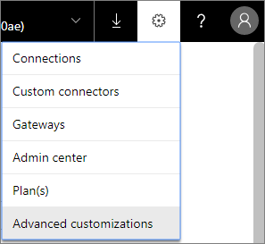

<!-- TODO: The Developer Resources page have to be updated to match this page -->

# View or download developer resources

This page provides resources for developers and information about the specific instance you are working on. 

## View the Developer Resources page for your environment

1. From the PowerApps portal select the  Settings button and choose **Advanced customizations**.

    

1. Within the **Advanced customizations** panel, choose the **Developer Resources** link: 

## Getting Started 

This section provides links for developers to find resources. The following resources are available:

|Link |Description|
|---------|---------|
|[Developer Center](https://go.microsoft.com/fwlink/?LinkId=551006)|The main entry point for documentation for developers.|
|[Developer Forums](https://go.microsoft.com/fwlink/?LinkId=550993)|Ask and answer questions with other developers.|
|[NuGet Packages](https://go.microsoft.com/fwlink/?LinkId=550994)|Discover NuGet packages to add SDK assemblies to your projects.|
|[Download Tools](https://go.microsoft.com/fwlink/?LinkID=512122)|Tools that you will need are available to download from NuGet. Use the PowerShell script on this page to get the latest versions.|
|[Sample Code](https://go.microsoft.com/fwlink/?LinkId=553007)|A list of samples available.|
|[Developer Overview](https://go.microsoft.com/fwlink/?LinkId=550995)|Link to a topic providing an overview for developers.|

<!-- TODO update 512122 to go to https://docs.microsoft.com/dynamics365/customer-engagement/developer/download-tools-nuget -->

## Connect your apps to this instance of Common Data Service for Apps

This section provides information you need to connect to your Common Data Service for Apps instance.

### Instance Web API

This is the URL for the Web API for your instance. The Web API is an OData v4 RESTful API. You can also download the service document that describes the metadata and operations available in your instance. More information: [Developer Documentation: Use the Dynamics 365 Customer Engagement Web API](/dynamics365/customer-engagement/developer/use-microsoft-dynamics-365-web-api)

### Organization Service

This is the URL for the SOAP endpoint for the Organization Service for your instance.
You can download the WSDL for this service here, but usually you will use the CrmSvcUtil.exe code generation tool to build entity classes for .NET projects. More information: 
- [Developer Documentation: Create early bound entity classes with the code generation tool (CrmSvcUtil.exe)](/dynamics365/customer-engagement/developer/org-service/create-early-bound-entity-classes-code-generation-tool)
- [Developer Documentation: Use the Organization Service to read and write data or metadata](/dynamics365/customer-engagement/developer/org-service/use-organization-service-read-write-data-metadata)

### Instance Reference Information

This information uniquely describes your instance. There is a GUID **ID** and a **Unique Name**.
This information is needed when you use Azure extensions with your instance.
More information: [Developer Documentation: Azure extensions for Dynamics 365 Customer Engagement](/dynamics365/customer-engagement/developer/azure-extensions)

## Connect your apps to the Common Data Service for Apps Discovery Service

Because people may have access to multiple CDS for apps environments, the discovery services allow for retrieving the available environments that a person can access based on their user credentials.

### Discovery Web API

This is the endpoint address for the RESTful OData v4 version of the discovery service to use for your instance. You can also download the service document here.
More information: [Developer Documentation: Discover the URL for your organization using the Web API](/dynamics365/customer-engagement/developer/webapi/discover-url-organization-web-api)

### Discovery Service

This is the endpoint address for the SOAP version of the discovery service to use for your instance. You can also download the service document here.
More information: [Developer Documentation: Discover the URL for your organization using the Discovery Service](/dynamics365/customer-engagement/developer/org-service/discover-url-organization-organization-service)
  
### More information

[Developer Documentation: Developer resources page](/dynamics365/customer-engagement/developer/developer-resources-page) 
[Developer Documentation: Use the Dynamics 365 Customer Engagement Web API](/dynamics365/customer-engagement/developer/use-microsoft-dynamics-365-web-api) 
[Developer Documentation: Use the Organization Service to read and write data or metadata](/dynamics365/customer-engagement/developer/org-service/use-organization-service-read-write-data-metadata) 
[Developer Documentation: Azure extensions for Dynamics 365 Customer Engagement](/dynamics365/customer-engagement/developer/azure-extensions) 
[Developer Documentation: Discover the URL for your organization using the Web API](/dynamics365/customer-engagement/developer/webapi/discover-url-organization-web-api) 
[Developer Documentation: Discover the URL for your organization using the Discovery Service](/dynamics365/customer-engagement/developer/org-service/discover-url-organization-organization-service)
  

