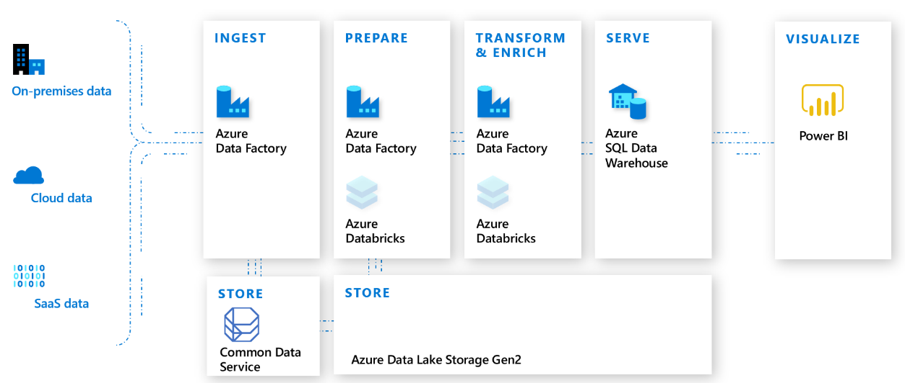

# Importing and exporting data
----------------------------

There are multiple ways to import and export data into Common Data Service, including Dataflows, Power Query, Azure Data Factory, Logic Apps, and Power Automate.

Dynamics customers also have access to the Data Export Service.

## Dataflows and Power Query

Dataflows enable you to connect with business data from various sources, clean the data, transform it, and then load it into Common Data Service.

Dataflows supports tens of popular on-premises, cloud, and SaaS data sources.

More information: [Create and use dataflows in Power Apps](/powerapps/maker/common-data-service/create-and-use-dataflows).

## Azure Data Factory

Azure Data Factory (ADF) is a data integration service that provides a low code / no code approach to construct ETL (Extract, Transform and Load) and ETL (extract, transform, load) processes within a visual environment or by writing your own code. 

With ADF, you can visually integrate Common Data Service and other data sources using more than 90 natively built and maintenance free connectors.

In addition to bringing data into the Common Data Service, Azure Data Factory can also be used to prepare, transform, and enrich data with Databricks and move data into Azure Synapse Analytics.

## Exporting Data from Common Data Service

Exporting data, either to another data technology or to another Common Data Service environment, can utilize any of the same technologies mentioned for importing data, such as Dataflows, Azure Data Factory, Power Query, and Power Automate.

Dynamics customers that are targeting SQL Server or Microsoft Azure SQL Database can utilize the Data Export Service. It is an add-on service made available as a Common Data Service solution that adds the ability to replicate Common Data Service data to a Microsoft Azure SQL Database store in a customer-owned Microsoft Azure subscription. The supported target destinations are Microsoft Azure SQL Database and Microsoft Azure SQL Server on Microsoft Azure virtual machines. Data Export intelligently synchronizes the entire Common
Data Service schema and data initially and thereafter synchronizes on a continuous basis as changes occur (delta changes) in Common Data Service.

### See also
