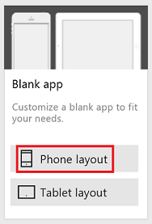
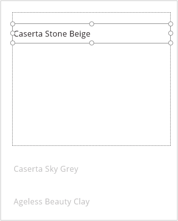
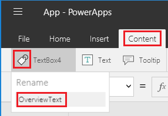

# Show items of different heights in a PowerApps gallery
If different items in your data set contain different amounts of data in the same field, you can completely show items that contain more data without adding empty space after items that contain less data. Add and configure a **Flexible height** gallery control so that you can:

* Configure **Label** controls to expand or shrink based on their contents.
* Position each control so that it automatically appears just under the control above it.

In this tutorial, you show data about flooring products in a **Flexible height** gallery control. The image of each product appears 5 pixels below the overview, whether the overview contains five lines of text or two lines.

**Suggested reading**

If you've never added controls to a gallery, follow the steps in [Show a list of items](add-gallery.md) before you proceed in this topic.

## Add data to a blank app
1. Download [this Excel file](https://az787822.vo.msecnd.net/documentation/get-started-from-data/FlooringEstimates.xlsx), which contains names, overviews, and links to images of flooring products.

    

2. Upload the Excel file to a cloud-storage account such as OneDrive, Dropbox, or Google Drive.

3. In PowerApps Studio, click or tap **New** on the **File** menu.

4. On the **Blank app** tile, click or tap **Phone layout**.

    

5. Add a connection to the **FlooringEstimates** table in the Excel file.

    For more information, see [Add a connection](add-data-connection.md).

## Add data to a gallery
1. On the **Insert** tab, click or tap **Gallery**, and then click or tap **Flexible height**.

    
2. Resize the gallery to take up the entire screen.

3. Set the gallery's **[Items](../controls/properties-core.md)** property to **FlooringEstimates**.

## Show the product names
1. In the upper-left corner of the gallery, click or tap the pencil icon to select the gallery template.

    

2. With the gallery template selected, add a **[Label](controls/control-text-box.md)** control to it.

3. Set the **Text** property of the **Label** control to this expression: 
   **ThisItem.Name**

    

## Show the product overviews
1. With the gallery template selected, add another **Label** control, and move it below the first **Label** control.  

2. Set the **Text** property of the second **Label** control to this expression:  **ThisItem.Overview**

3. With the second **Label** control selected, click or tap the name-tag icon on the **Content** tab, and rename the control to **OverviewText**.

    

4. Set the **AutoHeight** property of the **OverviewText** box to **true**.

    This step ensures that the box will grow or shrink to fit its contents.

      

## Show the product images
1. Resize the template so that it's twice as tall as it was.

    You can add controls to the template more easily as you build the app, and this change won't affect how the app looks when it runs.

2. With the gallery template selected, add an **[Image](controls/control-image.md)** control, and move it below the **OverviewText** box.

3. Ensure that the **Image** property of the **Image** control is set to this expression: 
    **ThisItem.Image**

4. Set the **[Y](../controls/properties-core.md)** property of the **Image** control based on the position and the size of the **OverviewText** box, as in this expression:
    **OverviewText.Y + OverviewText.Height + 5**

    

Apply the same concept if you want to add more controls: set each control's **Y** property based on the **Y** and **Height** properties of the control above it.

## Next steps
Learn more about how to work with a [gallery](working-with-forms.md) control and [formulas](working-with-formulas.md).
