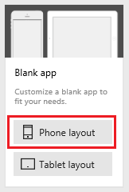
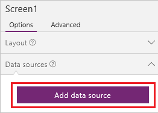
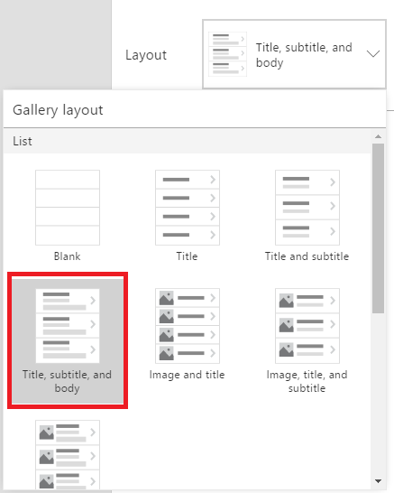
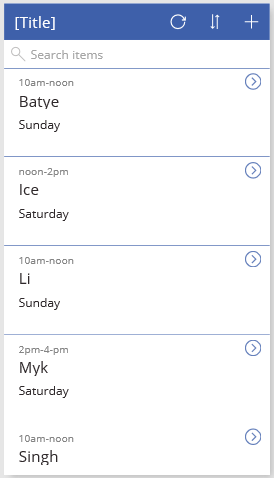
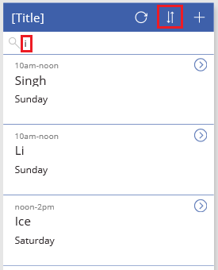
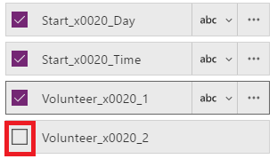

# Create an app from scratch
Create your own app from scratch using any one of a variety of data sources, adding more sources later if you want. Specify the appearance and behavior of each UI element so that you can optimize the result for your exact goals and workflow. This approach is much more time-intensive than [generating an app automatically](get-started-create-from-data.md), but experienced app makers can build the best app for their needs.

> [!NOTE]
> This topic was written for PowerApps Studio for Windows, but the steps are similar if you [open PowerApps in a browser](create-app-browser.md).

By following this tutorial, you'll create an app that contains two screens. On one screen, users can browse through a set of records:

On the other screen, users can create a record, update one or more fields in a record, or delete an entire record:

## Prerequisites
You can review this tutorial for general concepts only, or you can follow it exactly if you complete these steps.

1. Copy this data, and then paste it into an Excel file.

   | Start Day | Start Time | Volunteer 1 | Volunteer 2 |
   | --- | --- | --- | --- |
   | Saturday |10am-noon |Vasquez |Kumashiro |
   | Saturday |noon-2pm |Ice |Singhal |
   | Saturday |2pm-4-pm |Myk |Mueller |
   | Sunday |10am-noon |Li |Adams |
   | Sunday |10am-noon |Singh |Morgan |
   | Sunday |10am-noon |Batye |Nguyen |

2. Format that data as a table, named **Schedule**, so that PowerApps can parse the information.

    For more information, see [Create an Excel table in a worksheet](https://support.office.com/article/Create-an-Excel-table-in-a-worksheet-E81AA349-B006-4F8A-9806-5AF9DF0AC664).

3. Save the file under the name **eventsignup.xls**, and then upload it to a [cloud-storage account](connections/cloud-storage-blob-connections.md), such as OneDrive.

4. If you're new to PowerApps:

   * Learn how to [add a control and set its properties](add-configure-controls.md), which determine how the control appears and behaves.
   * Learn how to [add and rename a screen](add-screen-context-variables.md).

## Create a blank app, and connect to data
1. In PowerApps Studio, click or tap **New** on the **File menu** (near the left edge of the screen).

    

2. On the **Blank app** tile, click or tap **Phone layout**.

    

3. If prompted, take the intro tour to understand the main areas of PowerApps (or click or tap **Skip**).

    

    You can always take the tour later by clicking or tapping the question-mark icon near the upper-left corner of the screen and then clicking or tapping **Take the intro tour**.

4. In the left navigation bar, click or tap an icon in the upper-right corner to switch to the thumbnail view.

    

5. In the right-hand pane, click or tap **Add data source**.

    

6. Perform either of these steps:

   * If you already have a connection to your cloud-storage account, click or tap it.
   * If you don't have a connection to your cloud-storage account, click or tap **Add Connection**, click or tap your account type, click or tap **Connect**, and then (if prompted) provide your credentials.

7. Under **Choose an Excel file**, browse to **eventsignup.xlsx**, and then click or tap it.

    

8. Under **Choose a table**, select the **Schedule** check box, and then click or tap **Connect**.

    

    The **Data sources** tab of the right-hand pane shows which data sources you've added to your app.

    

    This tutorial requires only one data source, but you can add more data sources later.

## Show the data
1. In the **Home** tab, click or tap **New screen** and then click or tap **List screen**.

    

    A screen is added with several default controls, such as a search box and a **[Gallery](controls/control-gallery.md)** control. The gallery covers the entire screen under the search box.

2. Click or tap anywhere in the gallery except an arrow, such as directly under the search box.

    

3. In the right-hand pane, open the **Layouts** list, and then click or tap the option that shows a title, a subtitle and body.

    

4. In the property list, click or tap **[Items](controls/properties-core.md)**, copy this formula, and paste it into the formula bar:

    **SortByColumns(Search(Schedule, TextSearchBox1.Text, "Volunteer_x0020_1"), "Volunteer_x0020_1", If(SortDescending1, SortOrder.Descending, SortOrder.Ascending))**

    If you're not sure where the property list is, see [Add and configure controls](add-configure-controls.md).

    > [!NOTE]
> For Excel or SharePoint data sources that contain column names with spaces, PowerApps shows the spaces as **"\_x0020\_"**. In this example, the column **"Volunteer 1"** appears in a formula as **"Volunteer_x0020_1"**.

    This gallery shows the data from the **Schedule** table.

    

    A search box can filter the gallery based on text that the user types. If a user types at least one letter in the search box, the gallery shows only those records for which the **Volunteer 1** field contains the text that the user typed.

    The sort button can sort the records based on data in the **Volunteer 1** column. If a user clicks or taps that button, the sort order toggles between ascending and descending.

    That formula contains the **Sort**, **If**, **IsBlank**, **Filter**, and **Text** functions. For more information about these and other functions, see the [formula reference](formula-reference.md)

5. Type an **i** in the search box, and click or tap the sort button once (or an odd number of times).

    The gallery shows these results.

    

    More information about the **[Sort](../functions/function-sort.md)**, **[Filter](functions/function-filter-lookup.md)**, and [other functions](formula-reference.md)

6. Select the **[Label](controls/control-text-box.md)** control at the top of the screen by clicking or tapping the control.

    

7. In the property list, click or tap **[Text](controls/properties-core.md)**, copy this text, and then paste it in the formula bar. 
   **"View Records"**

    

## Create the ChangeScreen and its banner
1. Delete **Screen1**, and rename **Screen2** to **ViewScreen**.

    

2. Add a screen, and rename it **ChangeScreen**.

    

3. On the **Insert** tab, click or tap **Text**, and then click or tap  **[Label](controls/control-text-box.md)**.

4. Configure the **Label** control that you just added:

   * Set its **Text** property to this formula:
      **"Change record"**

   * Set its **Fill** property to this formula:
      **RGBA(62, 96, 170, 1)**.

   * Set its **Color** property to this formula:
      **RGBA(255, 255, 255, 1)**

   * Set its **Align** property to **Center**.
   * Set its **X** property to **0**.

   * Set its **Width** property to **640**.
     The **Label** control reflects your changes.

     

## Add and configure a form
1. On the **Insert** tab, click or tap **Forms**, and then click or tap  **Edit**.

2. Move and resize the form to cover most of the screen.

    

    The form is named **Form1** by default unless you already added and removed a form. In that case, rename the form to **Form1**.

3. Set **[DataSource](controls/control-form-detail.md)** property of **Form1** to **Schedule**.

4. Set the **Item** property of **Form1** to this expression:
    **BrowseGallery1.Selected**

5. In the right-hand pane, click or tap the checkbox for each field to show it.

    

6. Near the bottom of the form, click or tap **Add a custom card**.

    

7. Add a **[Label](controls/control-text-box.md)** control in the new card.

8. Set the **[AutoHeight](controls/control-text-box.md)** property of the new control to **true**, and set its **[Text](controls/properties-core.md)** property to this formula:
    **Form1.Error**

    The label will show any errors from the form.

9. In the left navigation bar, click or tap the thumbnail for the **ChangeScreen** to select it.

10. On the **Insert** tab, click or tap **Icons**, click or tap the option to add a **Back arrow**, and then move the arrow to the lower-left corner of the screen.

11. Set the arrow's **[OnSelect](controls/properties-core.md)** property to this formula:

     **ResetForm(Form1);Navigate(ViewScreen,ScreenTransition.None)**

      When the user clicks or taps the arrow, the **[Navigate](functions/function-navigate.md)** function opens the **ViewScreen**.

12. Add a **[Button](controls/control-button.md)** control under the form, and set the button's **[Text](controls/properties-core.md)** property to **"Save"**.

     

13. Set the **[OnSelect](controls/properties-core.md)** property of the button to this formula::

    **SubmitForm(Form1); If(Form1.ErrorKind = ErrorKind.None, Navigate(ViewScreen, ScreenTransition.None))**

    When the user clicks or taps the button, the **[SubmitForm](functions/function-form.md)** function saves any changes to the data source, and the **ViewScreen** reappears.

14. At the bottom of the screen, add another button, set its **[Text](controls/properties-core.md)** property to **"Remove"**, and set its **[OnSelect](controls/properties-core.md)** property to this formula:

    **Remove(Schedule,BrowseGallery1.Selected); If(IsEmpty(Errors(Schedule)),Navigate(ViewScreen,ScreenTransition.None))**

    When the user clicks or taps this button, the **[Remove](functions/function-remove-removeif.md)** function removes the record, and the **ViewScreen** reappears.

15. Set the **[Visible](controls/properties-core.md)** property of the **Remove** button to this formula:
     **Form1.Mode=FormMode.Edit**

    This step hides the **Remove** button when the user is creating a record.

    The **ChangeScreen** matches this example:

    

## Set navigation from ViewScreen
1. In the left navigation bar, click or tap the thumbnail for the **ViewScreen**.

    

2. Click or tap the **Next arrow** for the first record in the gallery.

    

3. Set the **[OnSelect](controls/properties-core.md)** property of that arrow to this formula:

    **Navigate(ChangeScreen,ScreenTransition.None)**

4. In the upper-right corner, click or tap the plus icon.

    

5. Set the **[OnSelect](controls/properties-core.md)** property of the selected icon to this formula:

    **NewForm(Form1);Navigate(ChangeScreen,ScreenTransition.None)**`

     When the user clicks or taps this icon, **ChangeScreen** appears with each field empty, so that the user can create a record more easily.

## Run the app
As you customize the app, test your changes by running the app in Preview mode, as the steps in this section describe.

1. In the left navigation bar, click or tap the top thumbnail to select the **ViewScreen**.

    

2. Open Preview mode by pressing F5 (or clicking or tapping the **Preview** icon near the upper-right corner).

    

3. Click or tap the Next arrow for a record to show details about that record.

4. On the **ChangeScreen**, change the information in one or more fields, and then save your changes by clicking or tapping **Save**, or remove the record by clicking or tapping **Remove**.

5. Close Preview mode by pressing Esc (or by clicking or tapping the close icon under the title bar).

    

## Next steps
* Press Ctrl-S to save your app in the cloud so that you can run it from other devices.
* [Share the app](share-app.md) so that other people can run it.
* Learn more about [galleries](add-gallery.md), [forms](add-form.md), and [formulas](working-with-formulas.md).
