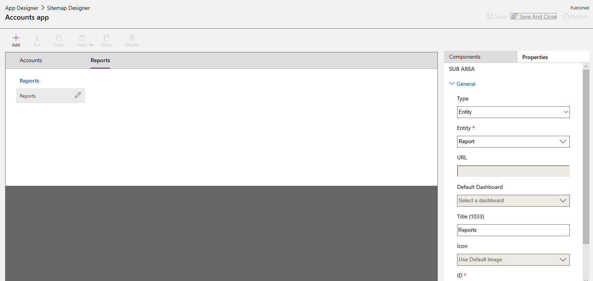

# Add reporting to your model-driven app

PowerApps apps can include reports that provide useful business information to the user. These reports are based on SQL Server Reporting Services and provide the same set of features that are available for typical SQL Server Reporting Services reports.

> [!div class="mx-imgBorder"] 
> 

System reports are available to all users. Individuals who create or otherwise own reports can share them with specific colleagues or teams, or can make the reports available to the organization, so that all users can run them. These reports use FetchXML queries that are proprietary to Common Data Service and Dynamics 365 for Customer Engagement apps and retrieve data to build the report. Reports that you create in a PowerApps app are Fetch-based reports.

> [!NOTE]
> You can't run, create, or edit reports on mobile devices, such as tablets or phones. 

Reports can be built in any of the following ways.

- From a model-driven app using the report wizard. More information: [Create or edit a report using the Report Wizard](/dynamics365/customer-engagement/basics/create-edit-copy-report-wizard) 
- From a model-driven app using an advanced find query. To do this, you build an advanced find query and then select **Download as FetchXML**. Next, open the xml file in the report wizard, fill in the required fields, and save the report. More information: [Add a report](/dynamics365/customer-engagement/basics/add-existing-report) 
- Create custom reports using SQL Server Data Tools and Report Authoring Extensions. More information: [Reporting and Analytics Guide](/dynamics365/customer-engagement/analytics/reporting-analytics-with-dynamics-365)

## Add reporting your Unified Interface app
You can add fetch-based reporting functionality to your app so that users can run, share, create, and edit reports. To do this, you add the report entity to your app's site map. 

1. Sign in to [PowerApps](https://web.powerapps.com/?utm_source=padocs&utm_medium=linkinadoc&utm_campaign=referralsfromdoc) and open an existing app for editing. 
2. In App Designer, select  next to **Site Map**. 
3. In the Sitemap Designer, select **Add** and then select **Area**. 
4. In the **Title** box, enter *Reports* or another name that you want. 
5. Select the **Reports** area, select **Add**, select **Group**, and then in the group **Title** box enter *Reports* or another name that you want. 
6. Select the group **Reports**, select **Add**, select **Subarea** and enter the following properties: 

   - **Type**. Select **Entity**.
   - **Entity**. From the list of entities, select the **Report** entity.  
   - **Title**. Enter a descriptive title, such as *Reports*.

   

7. Select **Save and Close** to return to the app designer. 

8. In App Designer select **Save**, and then select **Publish**.

Now the app displays a **Reports** area where users can view, run, assign, share, and edit the reports they have permission to as well as create new reports using the report wizard. 

> [!div class="mx-imgBorder"] 
> 

<!-- Link to Mint's end user reporting topics -->