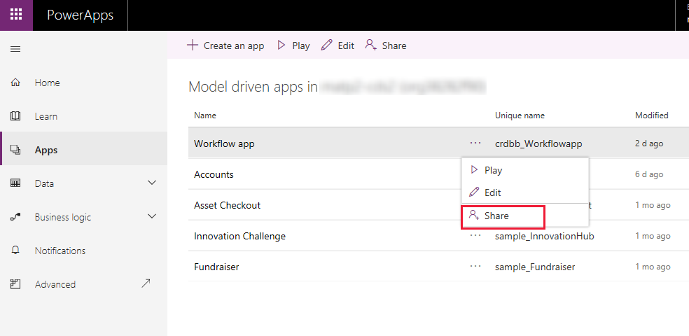
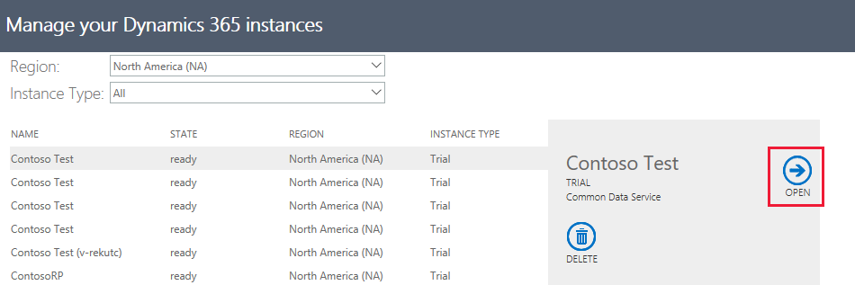

# Navigate to advanced model-driven app making and customization areas

This topic describes how to access advanced customization and administration areas that are available within a PowerApps environment.

## Solutions
The solutions area is where you can view, edit, create, import, export, and delete managed and unmanaged solutions. 

1.	Sign in to [PowerApps](https://web.powerapps.com/?utm_source=padocs&utm_medium=linkinadoc&utm_campaign=referralsfromdoc).
2.	On the left navigation pane select **Solutions**. 

## Solution explorer
Use solution explorer to perform app making and customization tasks that can’t be completed from PowerApps home page.

1.	Sign in to [PowerApps](https://web.powerapps.com/?utm_source=padocs&utm_medium=linkinadoc&utm_campaign=referralsfromdoc). 
2.	On the left navigation pane select **Solutions**.  
3.	Select **Switch to classic** on the toolbar to open solution explorer. 

    Notice that the **Switch to classic** command isn't available when you select a solution in the list.

## My Apps
Similar to the **Apps** area of PowerApps, the My Apps page lists all model-driven and canvas apps that you have privileges to in your environment. In addition to launching an app, from My Apps you can also assign security roles to it. 

To get to My Apps:
1.	Sign in to [PowerApps](https://web.powerapps.com/?utm_source=padocs&utm_medium=linkinadoc&utm_campaign=referralsfromdoc).
2.  Select **…** > **Share**. 

    > [!div class="mx-imgBorder"] 
    >  

4. Then follow these steps: [Add security roles to the app](https://docs.microsoft.com/powerapps/maker/model-driven-apps/share-model-driven-app#add-security-roles-to-the-app)
 
## Settings
Use the settings area to configure environment settings, activate or deactivate processes, and more. 

First, see if the setting you need is in the   > **Advanced customizations** menu.

To find settings not availabe from **Advanced customizations**:  
1.	Access your environment from the Dynamics 365 Administration Center. For environments located in North America go to [https://port.crm.dynamics.com/G/instances/InstancePicker.aspx](https://port.crm.dynamics.com/G/instances/InstancePicker.aspx). For other locations, see Direct sign in to the Dynamics 365 Administration Center.
2.	Select the environment you want, and then select **Open**.

    > [!div class="mx-imgBorder"] 
    > 

## See also
[Create or edit a model-driven app by using the app designer](create-edit-app.md)
[Create or edit apps in PowerApps Studio for web](../canvas-apps/create-app-browser.md)
