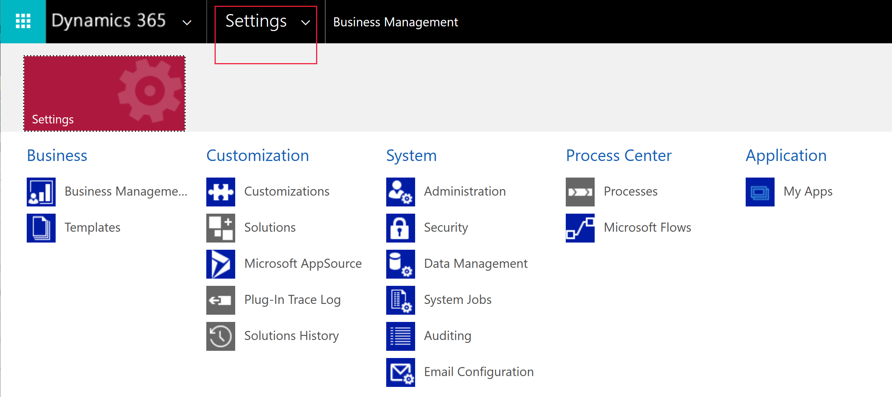

# Navigate to advanced model-driven app making and customization areas

This topic describes how to access advanced customization and administration areas that are available within a PowerApps environment.

## Solutions
The solutions area is where you can view, edit, create, import, export, and delete managed and unmanaged solutions. 

1.	Sign in to [PowerApps](https://make.powerapps.com/?utm_source=padocs&utm_medium=linkinadoc&utm_campaign=referralsfromdoc).
2.	On the left navigation pane select **Solutions**. 

## Solution explorer
Use solution explorer to perform app making and customization tasks that can’t be completed from the PowerApps home page.

1.	Sign in to [PowerApps](https://make.powerapps.com/?utm_source=padocs&utm_medium=linkinadoc&utm_campaign=referralsfromdoc). 
2.	On the left navigation pane select **Solutions**.  
3.	Select **Switch to classic** on the toolbar to open the **All Solutions** view. 
    Notice that the **Switch to classic** command isn't available when you select a solution in the list.
4.  In the list of available solutions select the solution you want in the **Display Name** column to open solution explorer.

## Apps
The Apps area lists all model-driven and canvas apps that you have privileges to in your environment. In addition to launching an app, from the Apps area you can also assign security roles to it. 

To share an app:
1.	Sign in to [PowerApps](https://make.powerapps.com/?utm_source=padocs&utm_medium=linkinadoc&utm_campaign=referralsfromdoc).

2.  Select **Apps**.
 
3.  Select **…** > **Share**. 

    > [!div class="mx-imgBorder"] 
    >  

4. Then follow these steps: [Add security roles to the app](https://docs.microsoft.com/powerapps/maker/model-driven-apps/share-model-driven-app#add-security-roles-to-the-app)
 
## Settings
Use the settings area to configure environment settings, activate or deactivate processes, and more. 

First, see if the setting you need is in the   > **Advanced customizations** menu.

To find settings not available from **Advanced customizations**:  
1.	From a PowerApps model-driven app, select **Settings**  on the app toolbar, and then select **Advanced Settings**. 
2.	Select **Settings**, and then select the settings area that you want.

    > [!div class="mx-imgBorder"] 
    >  

## See also
[Create or edit a model-driven app by using the app designer](create-edit-app.md)
[Create or edit apps in PowerApps Studio for web](../canvas-apps/create-app-browser.md)
