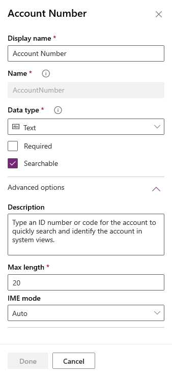
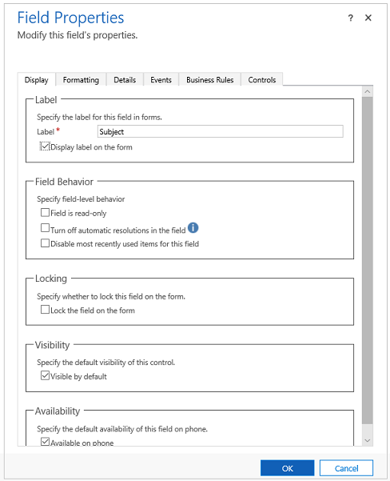

# Model-driven app common field properties

You can view and edit common properties of entity fields for a model-driven app using Power Apps solution explorer or   Power Apps portal. The Power Apps portal provides an easy way to create and edit entity fields with the Common Data Service.
The portal enables configuring the most common options, but certain options can only be set using solution explorer.

## Common field properties in Power Apps portal

1. From the [Power Apps portal](https://make.powerapps.com/?utm_source=padocs&utm_medium=linkinadoc&utm_campaign=referralsfromdoc), select **Data** > **Entities** and select the entity that has the fields you want to view.

2. Select the field that you want to view.

    > [!div class="mx-imgBorder"] 
    > 

The following table describes the common properties of fields. Certain types of fields have special properties. These are described in [Create and edit fields for Common Data Service](create-edit-field-portal.md).

 |Property|Description|
 |--|--|
 |**Display Name**|The text to be displayed for the field in the user interface.|
 |**Name**|The unique name across your environment. A name will be generated for you based on the display name that you've entered, but you can edit it before saving. Once a field is created the name cannot be changed as it may be referenced in your applications or code. The name will have the customization prefix for your **Common Data Service Default Publisher** prepended to it.|
 |**Data type**|Controls how values are stored as well as how they are formatted in some applications. Once a field is saved, you cannot change the data type with the exception of converting text fields to autonumber fields.|
 |**Required**| A record can't be saved without data in this field. |
 |**Searchable**| This field appears in Advanced Find and is available when customizing views. |
 |**Calculated or Rollup**| Use to automate manual calculations. Use values, dates, or text.|
 |**Advanced Options**| Add a description, and specify a maximum length and IME mode for the field.

There are many different types of fields, but you can only create some of them. For more information about all types of fields, see [Types of fields and field data types](types-of-fields.md). You can set additional options depending on your choice of **Data type**.

## Common field properties in solution explorer
 
Fields in a form display controls people use to view or edit data in an entity record. Fields can be formatted to occupy up to four columns within a section.  

You can access **Common field properties** in solution explorer. Under **Components**, expand **Entities**, expand the entity you want, and then select **Forms**. In the list of forms, open the form of type **Main**. Then double-click one of the fields to view Common field properties.

  
The following table describes properties that all fields have. Certain types of fields have special properties. These are described in [Special field properties](special-field-properties-legacy.md).  
  
|Tab|Property|Description|  
|---------|--------------|-----------------|  
|**Display**|**Label**|**Required**: By default the label will match the display name of the field. You can override that name for the form by entering a different label here.|  
||**Display label on the form**|You can choose not to display the label at all.|  
||**Field Behavior**|Specify the field level behavior using the check boxes.|  
||**Locking**|This will prevent the field from being removed from the form accidentally. This will prevent any configuration you have applied to the field, such as event handlers, from being cleared if the field were removed. To remove this field a customizer would need to clear this setting first.|  
||**Visibility**|Showing the field is optional and can be controlled using scripts. More information: [Visibility options](visibility-options-legacy.md)|  
||**Availability**|Choose if you want the tab to be available on the phone.|
|**Formatting**|**Select the number of columns the control occupies**|When the section containing the fields has more than one column you can set the field to occupy up to the number of columns that the section has.|  
|**Details**|**Display Name**, **Name**, and **Description**|These read-only fields are for reference. Click the **Edit** button for convenient access to the field definition if you want to edit it.   Each instance of a field in the form has a name property so that they can be referenced in form scripts, but this name is managed by the application. The first instance of the field is the name of the field specified when it was created. More information: [Create and edit fields](../common-data-service/create-edit-fields.md)   For each additional time that a field is included in a form, the name appends a number starting with 1 to the end. So if the field name is ‘new_cost’, the first instance is ‘new_cost’, the second is ‘new_cost1’, and so on for each instance of the field in the form.  **Note:** The field **Description** value provides tooltip text for the field when people place their cursor over it.|  
|**Events**|**Form Libraries**|Specify any JavaScript web resources that will be used in the field `OnChange` event handler.  |  
||**Event Handlers**|Configure the functions from the form libraries that should be called for the field `OnChange` event. More information: [Configure Event Handlers](configure-event-handlers-legacy.md)|  
|**Business Rules**|**Business Rules**|View and manage any business rules that reference this field. More information: [Create business rules and recommendations](create-business-rules-recommendations-apply-logic-form.md)|  
|**Controls**|**Controls**|Add controls and specify their availability on Web, Phone and Tablet .|  

## Next steps

[Use the Main form and its components](use-main-form-and-components.md)
