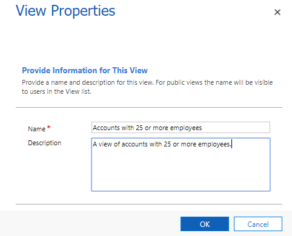
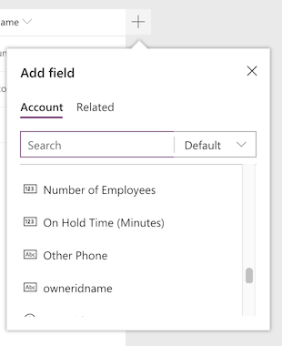

# Create or edit a model-driven app view

   

 In this topic, you create a new custom public view. You also edit an existing view.  
  
### Create a new view  
  
1.  Sign in to [PowerApps](https://web.powerapps.com/?utm_source=padocs&utm_medium=linkinadoc&utm_campaign=referralsfromdoc).  

    

    > [!IMPORTANT]
    > “If the **Model-driven** design mode isn't available, you may need to [Create an environment](https://docs.microsoft.com/powerapps/administrator/create-environment). 

2.  Expand **Data**, select **Entities**, select the **Account** entity, and then select the **Views** tab. 

3.  On the toolbar, select **Add view**.  

4.  In the **View Properties** dialog box, provide a **Name**, such as **Accounts with 25 or more employees**, optionally a **Description** for the view, and then select **OK**.

    > [!div class="mx-imgBorder"] 
    > 
  
5.  In the Common Tasks right pane, select **Add Columns**, in the **Add Columns** dialog box select **Number of Employees**, and then select **OK**.  

    > [!div class="mx-imgBorder"] 
    > 
  
6. In the Common Tasks right pane, select **Edit Filter Criteria**, in the Edit Filter Criteria dialog box, select **Number of Employees**, select **Is Greater Than or Equal To**, and then enter **25**.  

    > [!div class="mx-imgBorder"] 
    > 

7.  Select **OK** to close the **Edit Filter Criteria** dialog box and then select **Save and Close** on the view editor.  
  
8.  Notice that your view is now available from the **Views** tab on the PowerApps site making it available to add to an app.
  
### Edit a view  
  
1.  From the **Views** tab on the PowerApps site, select the **Number of Employees** view.
  
2.  Change the **Name** for the view to **Number of Employees with 25 or more employees in Arizona**, and then select **OK**.  

3.  In the Common Tasks right pane, select **Add Columns**, in the **Add Columns** dialog box select **Address 1: City**, and then select **OK**.  

4. In the Common Tasks right pane, select **Edit Filter Criteria**, in the Edit Filter Criteria dialog box, add a second filter claus. Select **Address 2:State/Province**, select **Equals**, and then enter **Arizona**. 

    > [!div class="mx-imgBorder"] 
    > 

5. Select **OK** to close the **Edit Filter Criteria** dialog box and then select **Save and Close** on the view editor..  
  

## Create a new view from an existing view  
 Follow the procedure to edit a view, except instead of choosing **Save and Close**, select **Save As** and enter a new **Name** and **Description** for the view.  
 
### Next steps
[Choose and configure columns](choose-and-configure-columns.md)  
  
[Edit filter criteria](edit-filter-criteria.md)  
  
[Configure sorting](configure-sorting.md)  
