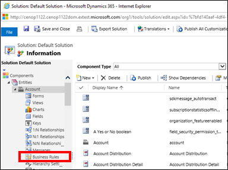
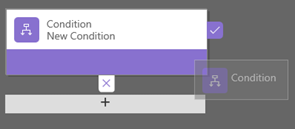
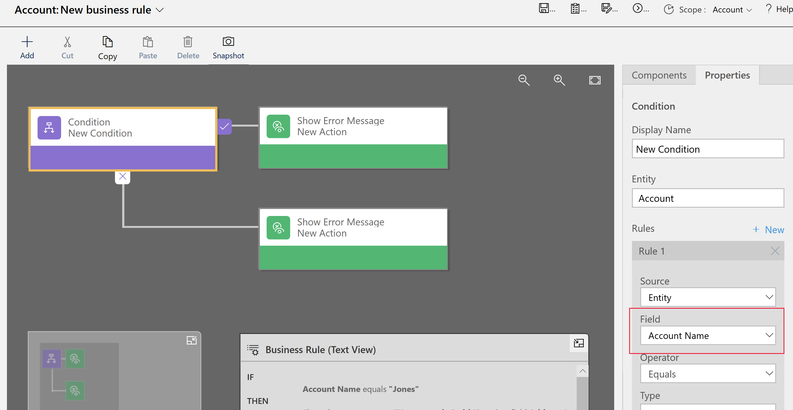
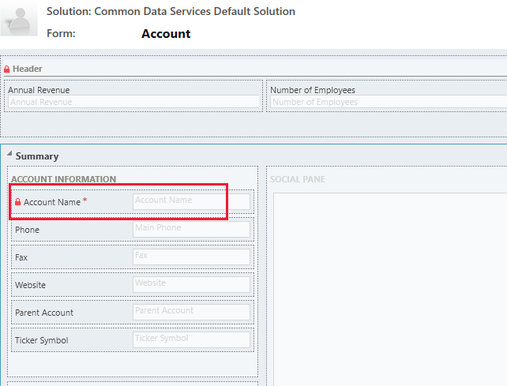

# Create business rules and recommendations to apply logic in a model-driven app form

This topic shows you how to create business rules and recommendations to apply form logic in a model-driven app without writing JavaScript code or creating plug-ins. Business rules provide a simple interface to implement and maintain fast-changing and commonly used rules. They can be applied to Main and Quick Create forms, and they work in model-driven apps, legacy web apps, Dynamics 365 for tablets, and Dynamics 365 for Outlook (online or offline mode).

> [!NOTE]
> To define a business rule for an entity so that it applies to all forms and server, see [Create a business rule for an entity](/powerapps/maker/common-data-service/data-platform-create-business-rule).
  
 By combining conditions and actions, you can do any of the following with business rules:  
  
-   Set field values  
  
-   Clear field values  
  
-   Set field requirement levels  
  
-   Show or hide fields  
  
-   Enable or disable fields  
  
-   Validate data and show error messages  
  
-   Create business recommendations based on business intelligence.  
  
## Create a business rule or business recommendation
  
1. Open [solution explorer](advanced-navigation.md#solution-explorer).  
  
2.  Open the entity you want to create the business rule for (for example, open the **Account** entity), and then double-click **Business Rules**.  
  
   
  
3.  Select **New**.  
  
     The Business Rule designer window opens with a single condition already created for you. Every rule starts with a condition. The business rule takes one or more actions based on that condition.  
  
   
  
   > [!TIP]
> If you want to modify an existing business rule, you must deactivate it before you can modify it.

4.  Add a description, if you want, in the description box in the upper-left corner of the window.  
  
5.  Set the scope, according to the following:  
  
    |||  
    |-|-|  
    |**If you select this item...**|**The scope is set to...**|  
    |**Entity**|All forms and server|  
    |**All Forms**|All forms|  
    |Specific form (**Account** form, for example)|Just that form|  
  
6. **Add conditions.** To add more conditions to your business rule:  
  
    1.  Drag the **Condition** component from the **Components** tab to a plus sign in the designer.  
  
          
  
    2.  To set properties for the condition, click the **Condition** component in the designer window, and then set the properties in the **Properties** tab on the right side of the screen. As you set properties, an expression is created at the bottom of the **Properties** tab.  
  
    3.  To add an additional clause (an AND or OR)  to the  condition, click **New** in the **Properties** tab to create a new rule, and then set the properties for that rule. In the **Rule Logic** field, you can specify whether to add the new rule as an AND or an OR.  
  
          
  
    4.  When you're done setting properties for the condition, click **Apply**.  
  
7. **Add actions.** To add an action:  
  
    1.  Drag one of the action components from the **Components** tab to a plus sign next to **Condition** component. Drag the action to a plus sign next to a check mark if you want the business rule to take that action when the condition is met, or to a plus sign next to an  x if you want the business rule to take that action if the condition is not met.  
  
          
  
    2.  To set properties for the action, click the **Action** component in the designer window, and then set the properties in the **Properties** tab.  
  
    3.  When you're done setting properties, click **Apply**.  
  
8. **Add a business recommendation.** To add a business recommendation:  
  
    1.  Drag the **Recommendation** component from the **Components** tab to a plus sign next to a **Condition** component. Drag the **Recommendation** component to a plus sign next to a check mark if you want the business rule to take that action when the condition is met, or to a plus sign next to an  x if you want the business rule to take that action if the condition is not met.  
  
    2.  To set properties for the recommendation, click the **Recommendation** component in the designer window, and then set the properties in the **Properties** tab.  
  
    3.  To add more actions to the recommendation, drag them from the **Components** tab, and then set properties for each action in the **Properties** tab.  
  
        > [!NOTE]
        >  When you create a recommendation, a single action is added by default. To see all the actions in a recommendation, click **Details** on the **Recommendation** component.  
  
    4.  When you're done setting properties, click **Apply**.  
  
9. To validate the business rule, click **Validate** on the action bar.  
  
10. To save the business rule, click **Save** on the action bar.  
  
11. To activate the business rule, select it in the Solution Explorer window, and then click **Activate**. You can't activate the business rule from the designer window.  
  
> [!TIP]
>  Here are a few tips to keep in mind as you work on business rules in the designer window:  
>   
> - To take a snapshot of everything in the Business Rule window, click **Snapshot** on the action bar. This is useful, for example, if you want to share and get comments on the business rule from a team member.  
> - Use the mini-map to navigate quickly to different parts of the process. This is useful when you have a complicated process that scrolls off the screen.  
> - As you add conditions, Actions, and business recommendations to your business rule, code for the business rule is built and appears at the bottom of the designer window. This code is ready only.  
  
   
## Localize error messages used in business rules  
 If you have more than one language provisioned for your organization, you will want to localize any error messages that you have set. Each time you set a message, a label is generated by the system. If you export the translations in your organization, you can add localized versions of your messages and then import those labels back into the system, so that people using languages other than your base language can view the translated messages.  

## Common issues
This section describes common issues that may occur when you use business rules. 

### Full Name field not supported with unified interface apps
Actions or conditions that use a **Full Name** (fullname) field aren’t supported in apps based on the unified interface.  Alternatively, you can use actions or conditions with **First Name** (firstname) and **Last Name** (lastname) fields. 

### Business rules on editable grid
Business Rules on an editable grid are supported only if the conditional field is also a column on the grid. If the field is not a column the business rules won’t work. Verify that each field referenced in the business rule is also included on the form. Note that business rules on an editable grid do not fire if the editable grid is configured on a dashboard page.

### Is your business rule not firing for a form?
A business rule may not execute because the field referenced in the business rule isn’t included with the form. 
1.	Open solution explorer. Expand the entity that you want and then select **Forms**. 
2.	Open the form that you want and then on the form designer ribbon select **Business Rules**. 
3.	In the form designer, open the business rule. 
4.	In the business rule designer select each condition and action to verify all the fields referenced in each condition and action. 

     > [!div class="mx-imgBorder"] 
     > 

 5.	Verify that each field referenced in the business rule is also included on the form. If not, add the missing field to the form.

     > [!div class="mx-imgBorder"] 
     > 

## Frequently asked questions (FAQ)
*Can business rules unlock fields on a read-only form?*
- Yes, a business rule can unlock fields and edit actions on a read-only form.

*How do I troubleshoot a business rule that isn't working?* 
- See [Is your business rule not firing for a form?](#is-your-business-rule-not-firing-for-a-form) in this topic.

## See also  
 [Create custom business logic through processes](guide-staff-through-common-tasks-processes.md)   
 [Create a business process flow](/flow/create-business-process-flow)   

