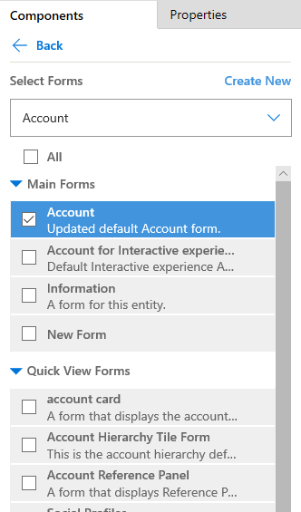
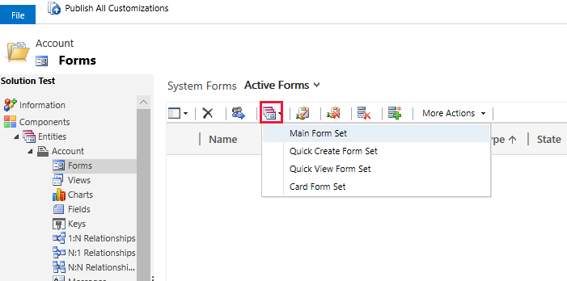
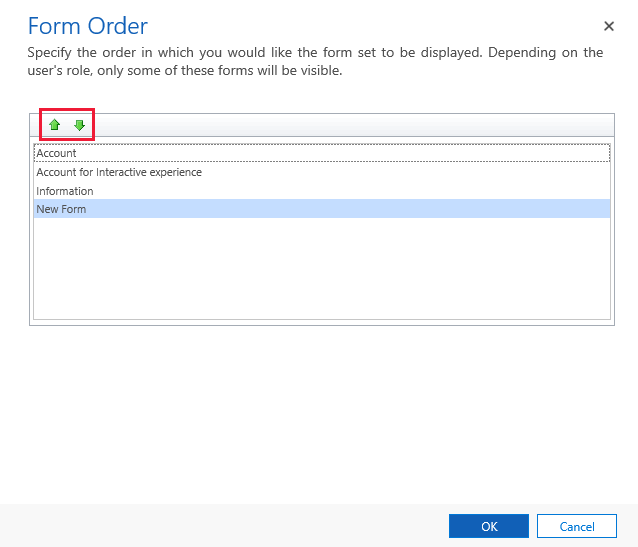
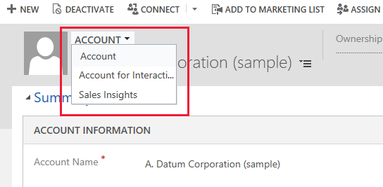

# Create and design model-driven app forms 

With PowerApps, forms provide the user interface that people use to interact with the data they need to do their work. It's important that the forms people use are designed to allow them to find or enter the information they need efficiently. 

In the default solution or an unmanaged solution, you can create new forms or edit existing forms for all entities that allow form customization. 
In an unmanaged solution, you can edit the managed properties for an unmanaged custom entity that was created for the solution.
If you’re viewing a managed solution, you can’t create new forms or edit existing forms for entities. However, if the managed properties for an entity in the managed solution are set to allow customization, you can add or edit forms to that entity. 
  

 
## Type of forms
There are different types of forms, and each type has a specific functionality or use. More information: [Type of forms in PowerApps](types-forms.md).  

  
   
## Updated versus classic entities  
Power Apps provides many options for designing forms. With Unified Interface, most entities were updated to better suit the responsive interface. Updated entities as well as your own custom entities include support for the Dynamics 365 for tablets client, business process flows, and business rules. When you use these entities, you can design once and deploy to all clients.  
  
There are still a number of entities, referred to here as classic entities, that retain the appearance and capabilities from earlier versions. These entities are used less often. They are listed here:  
  
||||||  
|-|-|-|-|-|  
|Address|Article|Article Comment|Bulk Delete Operation|Connection|  
|Discount|Discount List|Document Location|Email Attachment|Follow|  
|Goal|Goal Metric|Import Source File|Invoice Product|Order Product|  
|Price List|Queue Item|Quote Product|Rollup Field|Rollup Query|  
|Saved View|Service|Service Activity|SharePoint Site|Site|  
|Territory|Unit|Unit Group|||  
  
## Form display FAQ

### Why is my form not visible in the form selector drop down in my app?
A form may not be available because it hasn’t been added to the app.
1. Open the app in app designer.
2. In the **Entity View** area select **Forms** next to the entity.
3. On the **Components** tab verify the main forms that are included for the app. Verify that the form you want to display is checked. If not, select it, save, and then publish the app.

   > [!div class="mx-imgBorder"] 
   > 
   
### Why isn't my form displayed as the default form in the app?
A form can be set as the default form through the form order configuration or when a user sets the default form as a personalization setting.
1. Open solution explorer. Expand the entity that has the forms your want to order, and then select **Forms**.
2. On the toolbar select **Form Order** > **Main Form Set**. 

   > [!div class="mx-imgBorder"] 
   > 
   
3. The form order is displayed. Select the form and use the up and down arrows to move the form within the form order. The form at the top of the list is the default form. 

   > [!div class="mx-imgBorder"] 
   > 
   
4. Select **OK** to save the form order changes.
5. On the form designer toolbar, select **Publish** to make the form order available in apps.
 
#### Form order user personalization setting
Notice that, when an app user changes the form selection in the form selector drop down of an app, that form becomes the default form for the user. This personalization overrides the default form specified for the entity in the app.

   > [!div class="mx-imgBorder"] 
   > 
   
### Related topics  
    
[Assign form order](assign-form-order.md)  
[Control access to forms](control-access-forms.md)  
[How main forms appear in different clients](main-form-presentations.md)  
