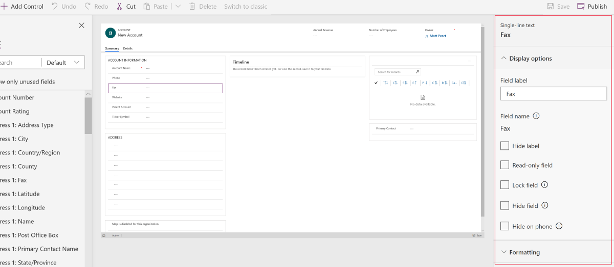

# Properties available in the form designer

Located on the right-pane of the model-driven form designer, the property pane lets you quickly view and update the properties of any element selected from the preview or navigation panes. 

> [!div class="mx-imgBorder"] 
> 

## Form properties

|Name  |Description  |
|---------|---------|
|**Title**     | Enter a name that will be meaningful to people. This name will be shown to people when they use the form. If they can use multiple forms configured for the entity they will use this name to differentiate between available forms.   This property is required.        |
|**Description**     |  Enter a description that explains how this form is different from other main forms. This description is only shown in the list of forms for an entity in the solution explorer.        |
|**Max Width**     | Set a maximum width (in pixels) to limit the width of the form. The default value is 1900.   This property is required.       |
|**Show image**      | Show the entity’s **Primary Image** if it has one set. This setting will enable showing the image field in the header of this form.   See Enable or disable entity options for more information about entity options.         |

## Tab properties

|Category   |Name  |Description  |
|---------|---------|---------|
|**Display options**      | **Tab label**      | The localizable label for the tab visible to users.   This property is required.         |
| **Display options**      |  **Name**     |  The unique name for the tab that is used when referencing it in scripts. The name can contain only alphanumeric characters and underscores.  This property is required.      |
| **Display options**      |  **Expand this tab by default**      |  The tab state can toggle between expanded or collapsed using form scripts or by people selecting the label. Choose the default state for the tab.       |
| **Display options**      | **Hide tab**     | When selected, tab is hidden by default and can be shown using code.       |
| **Display options**      | **Hide on phone**     |  For a condensed version of this form on phone screens, tabs can be hidden.     |
| **Formatting**   | **Layout**     |  Tabs may have up to three columns. Use these options to set the number of tabs and what percentage of the total width they should fill.      |

## Section properties

|Category   |Name  |Description  |
|---------|---------|---------|
|**Display options**      | **Section label**    | The localizable label for the section visible to users.   This property is required.      |
|**Display options**      | **Name**    | The unique name for the section that is used when referencing it in scripts. The name can contain only alphanumeric characters and underscores.   This property is required.        |
|**Display options**      | **Hide label**   |  When selected, the section label is hidden.  |
|**Display options**      | **Lock section**    | Lock this section to keep it from being removed.      |
|**Display options**      | **Hide section**     | When selected, section is hidden by default and can be shown using code.      |
|**Display options**      | **Hide on phone**     |  For a condensed version of this form on phone screens, sections can be hidden.     |
|**Formatting**     |  **Columns**    |  Specify up to four columns to be in the section.      |

## Field properties

|Category  |Name  |Description  |
|---------|---------|---------|
|**Display options**     | **Field label**    | By default the label will match the display name of the field. You can override that name for the form by entering a different label here.       |
|**Display options**     |  **Field name**    | The name of the field. This comes from the field properties on the entity and is read-only.     |
|**Display options**     | **Hide label**     | When selected, the field label is hidden.      |
|**Display options**     | **Read-only field**    | When selected, the field value is not editable.      |
|**Display options**     |  **Lock field**   |  Lock this field to keep it from being removed.     |
|**Display options**     |  **Hide field**     | When selected, field is hidden by default and can be shown using code.      |
|**Display options**     |  **Hide on phone**    | For a condensed version of this form on phone screens, fields can be hidden.         |
|**Display options**     | **Field width**      |  When the section containing the fields has more than one column you can set the field to occupy up to the number of columns that the section has.       |

## See also
[Create and edit forms using the form designer](create-and-edit-forms.md)