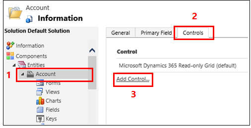
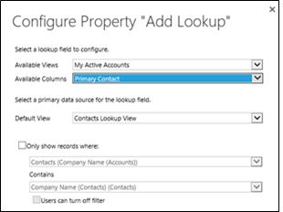
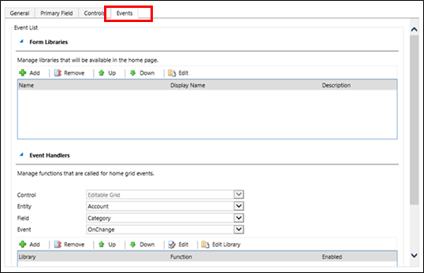

# Make model-driven app grids (lists) editable using the Editable Grid custom control

In previous releases of Dynamics CRM, users couldn’t enter data directly in grids (sometimes called lists) or sub-grids on forms. They had to select the record in the grid to open a form, edit the data, and then save, which required multiple steps. With editable grids, users can do rich in-line editing directly from grids and sub-grids whether they’re using a web app, tablet, or phone.  
  
   
  
 When editable grids are enabled through the Editable Grids custom control, users can edit most types of fields, including basic Lookup fields and option sets.  

**Editable grids support:**
  
-   In-line editing of records at the entity or sub-grid level (includes custom entities)  
  
-   System views and personal views  
  
-   Web and mobile clients  
  
-   Navigation with a keyboard or mouse  
  
-   Grouping and sorting (you can group by/sort by any column in the current view)  
  
-   Filtering  
  
-   Moving and resizing columns  
  
-   Pagination  
  
-   Saving changes from one session to another for grouping, sorting, filtering, pagination, and moving and resizing columns  
  
-   Lookup configuration  
  
-   Calculated fields and rollup fields  
  
-   Business rules (Show error message, Set field value, Set business required, Set default value, Lock or unlock field)  
  
-   JavaScript events  
  
-   Enabling or disabling of cells based on security role  
  
-   Users can continue to use search and charts, and can access the action bar as with read-only grids  
  
## Make main grids editable  
  
1.  Open [solution explorer](advanced-navigation.md#solution-explorer).  
  
2.  In the **Entities** list, open the appropriate entity, select the **Controls** tab, and then select **Add Control**.  
  
       
  
3.  In the **Add Control** dialog box, select **Editable Grid**, and then select **Add**.  
  
4.  In the **Editable Grid** row that’s added, select the form factor(s) you want to apply the grid to. This makes the editable grid control the default control for the selected form factor(s).  
  
         

   > [!NOTE]
   >  At runtime, users can toggle between editable grids and read-only grids.  
      
5.  To add a lookup, in the **Editable Grid** option group, select **Add Lookup**, and then in the **Configure Property “Add Lookup”** dialog box:  
  
    1.  In the **Available Views** list, select the view to add the lookup to (for example, select **My Active Accounts**).  
  
    2.  In the **Available Columns** list, select the lookup column to add (for example, select **Primary Contact**).  
  
    3.  In the **Default View** list, select the data source for the lookup field.  
  
    4.  If you want to limit the records displayed, select the **Only show records where** check box, and then select your criteria from the list, and then select **OK**.  
  
           
     
6.  If you have a nested grid, select the pencil button for **Nested grid view**, and then select the entity and view for the nested grid. For the **Nested grid parent ID** select the relationship for the entities. For example, the ParentAccountID field connects the **Account** and **Contact** entities.  
  
    > [!NOTE]
    >  Nested grids are only available for phones and tablets, not the web.  
  
7.  If you don’t want to allow the user to group data by any column in the view (you want to save space, for example), in the **Group by Column** row, select the pencil button, and then in the **Configure Property “Group by Column”** dialog box, select **Disabled**, and then select **OK**.  
  
    > [!TIP]
    >  This is mostly useful for sub-grids on forms.  
  
8.  If you want to add JavaScript events, select the **Events** tab, and then select the appropriate entities, fields, and events. More information: [Developer Documentation: Use editable grids](/dynamics365/customer-engagement/developer/customize-dev/use-editable-grids-dynamics-365.md)  
  
       
  
9. To save your work, select **Save** on the action bar.  
  
10. When you’re ready to make changes available to your team, select **Publish** on the action bar.  
  
11. To test your changes, go to the view you specified in step 5, and then make some in-line editing changes.  
  
## Make a sub-grid on a form editable

> [!NOTE] 
> - To save an editable grid change within a sub-grid, the user must explicitly save before navigating out of the form.
> - If you are using legacy forms (versions prior to Dynamics CRM 2016) and enable an editable grid on a sub-grid, the editable sub-grid will not be rendered. System administrators can turn off legacy forms in system settings, if needed.
  
1.  Open [solution explorer](advanced-navigation.md#solution-explorer).  
  
2.  Open the form that contains the sub-grid.  
  
3.  Select the appropriate control, and then select **Change Properties** on the ribbon.  
  
4.  In the **Set Properties** dialog box, select **Controls**, select **Add Control**, and then follow the same steps listed above.  
  
## Supported standard entities  
  
||||  
|-|-|-|  
|**Web/tablet/phone**|**Tablet/phone only**|**Web only**|  
|Account   Appointment   Bookable Resource   Bookable Resource Booking   Bookable Resource Booking Header   Bookable Resource Category   Bookable Resource Category Assn   Bookable Resource Characteristic   Bookable Resource Group   Booking Status   Case   Category   Characteristic   Competitor   Contact   Email   Entitlement   Feedback   Invoice   Knowledge Article   Knowledge Article Views   Knowledge Base Record   Lead   Opportunity   Order   Phone Call   Price List   Product   Queue   Quote   Rating Model   Rating Value   SLA KPI Instance   Social Activity   Social Profile   Sync Error   Task   Team   User|Activity   Attachment   Channel Access Profile Rule Item   Competitor Address   Connection   Connection Role   Email Signature   Email Template   Expired Process   Invoice Product   Knowledge Article Incident   Lead To Opportunity Sales   Process   Mailbox   New Process   Note   Opportunity Product   Opportunity Sales Process   Order Product   Organization   Phone to Case Process   Price List Item   Queue Item   Quote Product   Sharepoint Document   Translation Process|Campaign   Campaign Activity   Campaign Response   Channel Access Profile   Channel Access Profile Rule   Contract   Entitlement Template   External Party   Fax   Letter   Marketing List   Position   Quick Campaign   Recurring Appointment   Sales Literature   SLA|  
 
##  Data types that aren’t editable in an editable grid
The following data types aren’t editable in editable grids: Customer and Partylist Lookup fields; Composite (address) fields; State/Status fields; Lookup entity-related fields (for example, the Account entity includes a contact lookup, where the Contact field is editable but the EmailAdress(Contact) field is not editable).  
 
## Next steps  
 [Use keyboard shortcuts in editable grids](https://docs.microsoft.com/dynamics365/customer-engagement/basics/keyboard-shortcuts#editable-grids-views)

