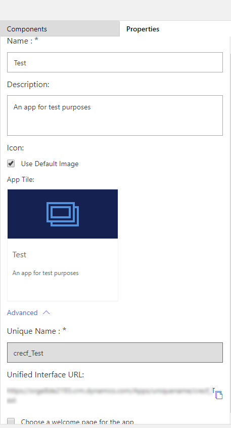

# Manage model-driven app properties in the app designer

App properties define important details about the app, like its title or URL. You define app properties when you create an app. If you want to change those properties later, you can do that in the app designer.  
  
1.  In the app designer, on the right side, select the **Properties** tab.  

    > [!div class="mx-imgBorder"] 
    >   
  
2.  Change the information, as required:  

   > [!NOTE]
   > The **Client** and **App URL Suffix** properties are no longer available when you create a new app.

    |Property|Description|  
    |--------------|-----------------|
    |**Name**|Enter a unique and meaningful name for the app.|  
    |**Description**|Type a short description of what the app is.|  
    |**Icon**|By default, the **Use Default App** check box is selected. To select a different web resource as an icon for the app, clear the check box, and then select an icon from the drop-down list. This icon is displayed on the app's preview tile.|
    |**Unique Name**| You cannot change the unique name. Using the unique name, you can query tables to get data from the database.| 
    |**Client**|Defines the type of client that the app will be used for. -  **Web:** This is the classic Dynamics 365 customer engagement web browser client. -  **Unified Interface:** This is the new web browser client that has a similar interface across PC and mobile devices.|
    |**App URL Suffix**| The URL you chose while creating the app is shown here by default. You can change the app URL in the **Manage App** dialog box. Notice that you can't export or import the app URL suffix through a solution at this time.|
    |**Choose a welcome page for the app**|This option allows you to select from the web resources available in your environment. The welcome pages you create can contain useful information to users such as links to videos, upgrade instructions, or getting started information. For more information about how to create a web resource, such as an HTML file that you can use as a welcome page, see [Create and edit web resources to extend the web application](create-edit-web-resources.md).|
    |**Enable Mobile Offline**|This option enables the app to be available offline on mobiles to the profiles that are selected using **Mobile Offline Profiles** drop down list.|
  
3.  Save the app.  
  
## Next steps  
 [Create or edit an app](create-edit-app.md)
