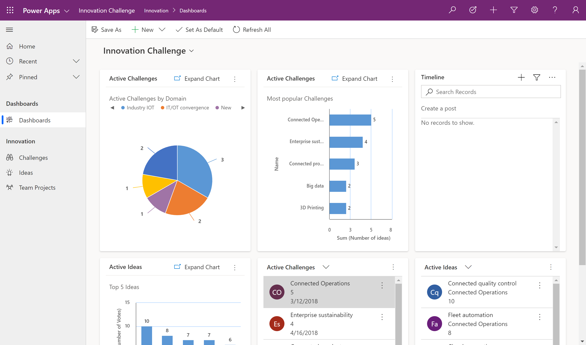

# What are model-driven apps in PowerApps?

Model-driven app design is a component-focused approach to app development. Model-driven app design doesn’t require code and the apps you make can be simple or very complex.  Unlike canvas app development where the designer has complete control over app layout, with model-driven apps much of the layout is determined for you and largely designated by the components you add to the app. 

Model-driven app design provides the following benefits:
- Rich component-focused no-code design environments 
- Create complex responsive apps with a similar UI across a variety of devices from desktop to mobile
- Design capability similar to what’s is available in the Dynamics 365 customer engagement platform 
- Your app can be distributed as a solution
 
## The approach to model-driven app making
At a fundamental level, model-driven app making consists of three key focus areas.

- Modeling business data 
- Defining business processes 
- Composing the app

### Modeling business data
To model business data you determine what data your app will need and how that data will relate to other data. Model-driven design uses a metadata-driven architecture so that designers can customize the application without writing code. Metadata means “data about data” and it defines the structure of the data stored in the system. [Tutorial: Create a custom entity that has components in PowerApps](../common-data-service/create-custom-entity.md)

### Defining business processes
Defining and enforcing consistent business processes is a key aspect of model-driven app design. Consistent processes help make sure your app users focus on their work and not on remembering to perform a set of manual steps. Processes can be simple or complex and often change over time. To create a process, select **Advanced** to open [solution explorer](#advanced-model-driven-app-making). Next, on the left navigation pane in solution explorer select **Processes**, and then select **New**. More information: [Working with business logic](#working-with-business-logic)  

### Composing the model-driven app
After modeling data and defining processes, you build your app by selecting and configuring the components you need using the app designer.

## Next steps

[Build your first model-driven app](build-first-model-driven-app.md)

[Understand model-driven app components](model-driven-app-components.md)

