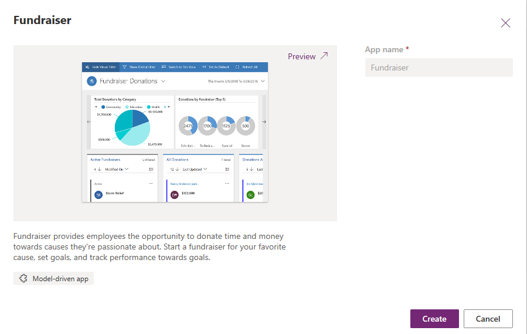
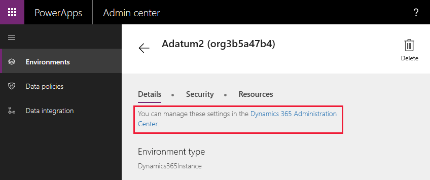

# Model-driven sample apps

In [powerapps.com](https://powerapps.com), use a sample app to explore design possibilities and discover concepts that you can apply as you develop your own apps. Each sample app uses fictitious data to showcase a real-world scenario. 

Be sure to check out documentation specific to each sample app for more details. 

## Get sample apps

In order to play or edit model-driven sample apps, the apps must first be provisioned in a Common Data Service database. First create a trial environment and database and be sure to check **Include sample apps and data**.

> [!IMPORTANT]
> This option installs all available sample apps in your database. Sample apps are for educational and demonstration purposes and we do not recommend installing them in production databases. 

## Customize a sample app

1. Sign in to [powerapps.com](https://powerapps.com)  

    

2. From the **Create** page, hover over the sample app and click **Make this app**.

3. The App designer will open providing multiple options for customizing the app. 
4. For additional customization options, click **Advanced** from the left navigation in the portal.

## Remove sample apps and data 
- Deleting a sample app requires deleting the corresponding  [managed solution](https://docs.microsoft.com/dynamics365/customer-engagement/developer/uninstall-delete-solution). 
- Deleting the solution also deletes any sample data specific to the custom entities for the app.
- If customizations were made to the sample app, there may be [dependencies](https://docs.microsoft.com/dynamics365/customer-engagement/developer/dependency-tracking-solution-components), which must be removed before deleting the solution.

### Steps
1. Login to the [PowerApps admin portal](https://admin.powerapps.com).

2. Select an environment.

3. Click **Dynamics 365 Administration Center** 

    

4. Select your Database from the list and click **OPEN**.

    

5. Navigate to **Settings/Solutions**.

6. Select the solution for the app that is to be deleted and click **delete**.

    

*Alternatively navigate to the list of solutions by clicking **Advanced** in the maker portal and delete everything in the URL after .dynamics.com/*

> [!IMPORTANT]
> Do not delete other system solutions unless you're aware of the impact.

## Install or uninstall Sample Data
1. Follow steps 1-4 above.
2. Navigate to **Settings/Data Management/Sample Data**.
3. If sample data is installed, the option to remove is available. Otherwise the option to install is available. 

    

