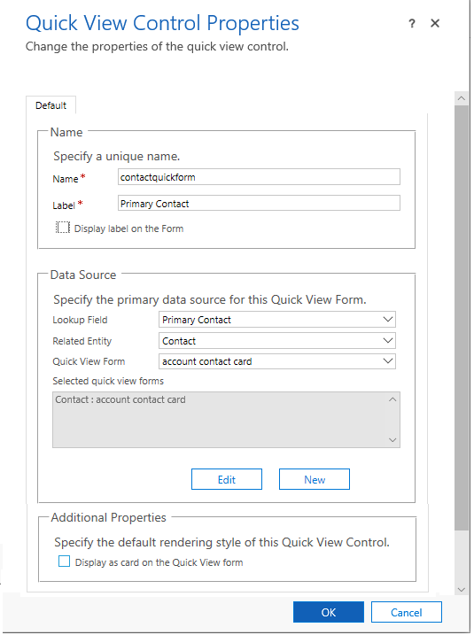

# Model-driven app quick view control properties

A quick view control on a model-driven app form displays data from a record that is selected in a lookup on the form. The data displayed in the control is defined using a quick view form. The data displayed is not editable, but when the primary field is included in the quick view form, it becomes a link to open the related record. More information: [Create and edit quick view forms](create-edit-quick-view-forms.md)  

  

You can access **Quick view control properties** from the PowerApps site. 
1.  On the [PowerApps](https://web.powerapps.com/?utm_source=padocs&utm_medium=linkinadoc&utm_campaign=referralsfromdoc) site, select **Model-driven** (lower left of the navigation pane).  

     

2.  Expand **Data**, select **Entities**, select the entity that you want, and then select the **Forms** tab. 

3. In the list of forms, open the form of type **Main**. Then on the **Insert** tab, select **Quick View Form** to view quick view control properties.

    
  
|Property|Description|  
|--------------|-----------------|  
|**Name**|**Required**: The unique name for the quick view form that is used when referencing it in scripts.|  
|**Label**|**Required**: A label to display for the quick view form.|  
|**Display label on the Form**|Displays the label on the form.|  
|**Lookup Field**|Choose one of the lookup fields included in the form.|  
|**Related entity**|This value depends on the **Lookup Field** you choose. It is usually the primary entity for the 1:N entity relationship for the lookup.   If the entity includes a **Potential Customer** lookup that can accept either an account or contact, in the **Quick View Form** field you can choose a quick view form for both account and contact by changing this value and then choosing another quick view form.|  
|**Quick View Form**|If the **Related entity** has any quick view forms you can select them here. Otherwise, select **New** to create one.   Select **Edit** to change the selected quick view form.|  
|**Additional Properties**|You can specify the default rendering style by selecting the check box.|

## Next steps

[Use the Main form and its components](use-main-form-and-components.md)
 
