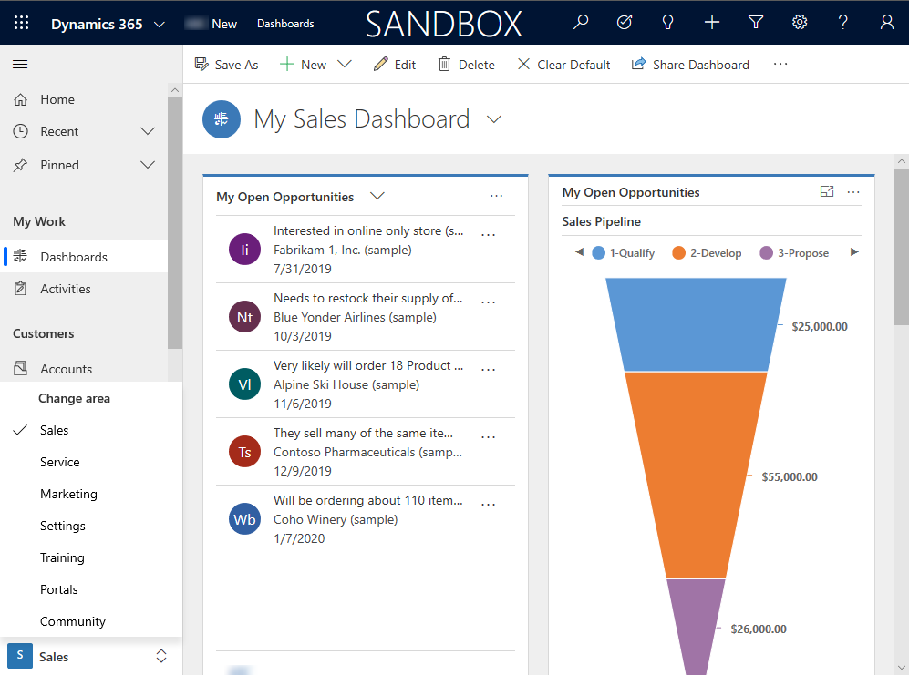
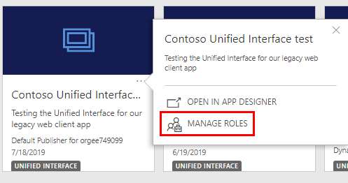
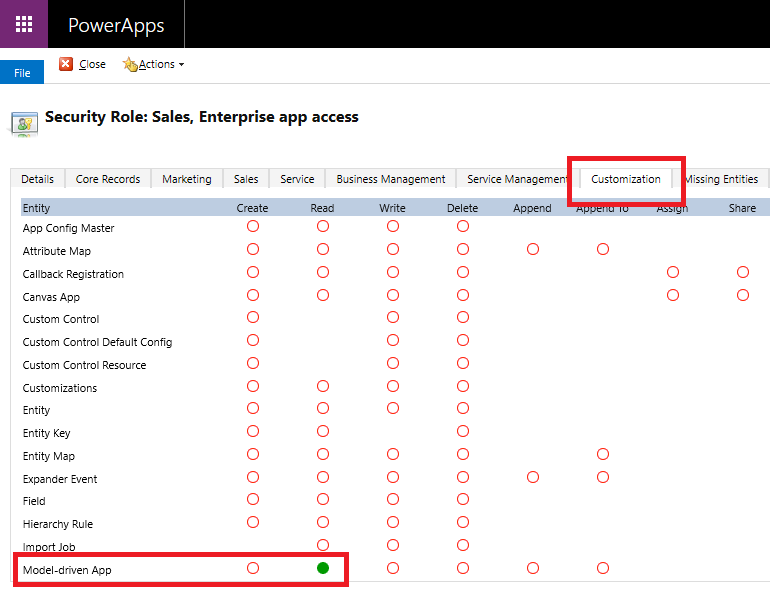
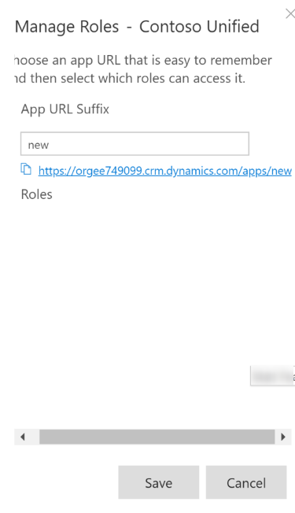

# Quick start for using an existing environment to validate your legacy web client app with the Unified Interface

This quick start topic shows you how to use an existing environment to create a Unified Interface application that’s based on your environment’s default solution. Using an existing environment allows you to continue to explore and test the Unified Interface while running your existing Web Client applications in parallel.  For similar instructions that show you how to create a new sandbox environment to isolate the testing and validation tasks needed  for your Web Client applications, see [Quick start for transitioning your Dynamics 365 for Customer Engagement apps Web Client application to Unified Interface](transition-web-app.md).

> [!IMPORTANT]
>  For environments with Dynamics 365 for Field Service or Dynamics 365 for Project Service Automation apps, see [Dynamics 365 for Customer Engagement apps](transition-web-app.md#dynamics-365-for-customer-engagement-apps).

## Prerequisites 
- An existing Dynamics 365 for Sales or Service Web Client application. 
- Although not required, we recommend using a non-production environment to test your application. More information: [Manage sandbox instances](/dynamics365/customer-engagement/admin/manage-sandbox-instances) 

## Overview 
This topic is for existing customers who are currently using Web Client applications that need to plan and execute their transition to the Unified Interface. 

We recommended using a non-production environment to execute a test using **Use Unified Interface Only** mode to avoid impacting current deployment or development cycles. To do this, you create a new solution based on your existing application as it stands today. This can be done in your current development sandbox environment without impact to your existing work.  

Once you complete the tasks described in this topic in your development environment using a solution, you can import the solution into your testing environment, which allows a wider group of business users to test and compare the app in a familiar environment. 

Follow your application lifecycle management (ALM) and development operations processes. We recommend performing all the steps described inside of a solution context. Once you test and validate the app in the development environment, you can further test the app by launching it as a pilot program to more users, such as in a production environment. Having the model-driven app and site map inside of a solution enables your app to be exported from the environment where you created this new app following your existing processes onward in your environment pipeline. 

## Process for validating your Web Client app in an existing environment
 
The process for validating your Web Client app in an existing environment includes three steps:  

1.	Create a new solution that's based on the default solution
2.	Create a new model-driven app 
3.	Configure app properties  

If you’ve recently switched the **Use Unified Interface only** mode to **On** in your development environment, such as instructed by following the [Quick start for transitioning your Dynamics 365 for Customer Engagement apps Web Client application to Unified Interface](transition-web-app.md) topic, you must turn the setting back to **Off** so you can run the existing legacy web client apps.

### Create a new solution that's based on the default solution
1. Sign-in to the [PowerApps maker portal](https://make.powerapps.com).   
2. From the list of environments, select the environment you want.  
3. On the left navigation pane, select **Solutions**. 
4. On the menu bar, select **New solution**. 
5. On the **New solution** pane, enter the following properties. 
   - **Name**. Enter a name for the solution, for example *Unified Interface App*. 
   - **Publisher**. Select the publisher which your organization uses. Be sure to follow your customization governance for your existing customizations. This will ensure the schema names for the model-driven app and its site map are consistent with your existing standards. 
   - **Version**. This should be set following your existing standards and governance for solutions. 
6. Select **Create**.  
7. The new solution is created in the list of solutions. Select it to open the solution and go to the next section. 

### Create a new model-driven app in the new solution
In this step you will create a new app that leverages your existing customizations so that you can experience them in the Unified Interface. You create the app within the container of the new solution, which you created in the previous section.  

1. On the menu bar select **New**, point to **App**, and then select **Model-driven app**.
2. On the **Create a New App** page, enter the following properties. 
   - **Name**. Enter a name for the application as you see fit. For example, *You Application Name* + *New* or *Unified Interface Test*.  
   - **Unique Name**. This begins with your solution prefix and the simplified version of the app Name you specified. You can make changes or leave it as it appears.  
   - **Description**. Add a description for the app, such as *For testing purposes of the new Unified Interface of our solution*.  
3. Select **Use existing solution to create the App**, and then select **Next**. 
4. In the **Select Solution** list select **Default Solution**, in the **Select Sitemap** list select **Site Map**, and then select **Done**.  

   > [!div class="mx-imgBorder"] 
   > 

5. The App Designer opens displaying all the app components that were in the default solution. Select **Publish**.  
6. After the publishing process completes, select **Play**.  

 A new window opens in the browser with your new model-driven app that contains all of the entities, sitemap, and sitemap customizations that were in your default Dynamics 365 for Customer Engagement application.  
> [!div class="mx-imgBorder"] 
> 

Notice that when you go back to the browser tab with the PowerApps maker portal **Solutions** area, your new model-driven app and a similarly named sitemap client extension are both part of the solution you created.  
> [!div class="mx-imgBorder"] 
> 

In this step you created a new model-driven app inside of a solution, which you can import into your testing or evaluation environments. You could start to experience the new app now, but before doing so, in the next step you’ll configure a couple settings for the new app. Doing this will make it possible to share with other users.

### Configure app properties
The tasks required to configure the model-driven app properties include: 
- Assigning user roles to the new app to enable non-administrators access to use the app.  
- Customizing a friendly URL so that a shortcut to the new app can be easily shared, bookmarked, or remembered by users. 

1. Navigate to *environment URL*/**apps**. The URL will look similar to this: https://*YourEnvironment*.crm.dynamics.com/apps. Doing so opens a list of all the apps in your environment. 
2. Locate your new model-driven app you created.  
3. On the app tile select the ellipsis, and then select **Manage Roles**.   

   > [!div class="mx-imgBorder"] 
   > 

4. The available roles area listed on the right pane. Select the roles as needed to give non-administrator users access to the app. 

> [!IMPORTANT]
> Make sure that all users are granted at least one security role that contains **Read** access to the **Model-driven App** privilege. This privilege can be found on the Customization tab within the security role. Users without this privilege receive an error upon opening any model-driven app.  Notice that System Administrator and System Customizer security roles already have this privilege enabled. 
   > [!div class="mx-imgBorder"] 
   > 

5. Optionally, in the **Manage Roles** pane you can expand the **App URL Suffix** to customize the friendly URL for the model-driven app. Notice that you can specify most anything, for example, enter *new* so that the preview displays the URL *https://YourEnvironment.crm.dynamics.com/apps/new*.   

   > [!div class="mx-imgBorder"] 
   > 

   This becomes the friendly URL to use and share so that users can directly launch into the experience of the Unified Interface. Users can bookmark this link for their convenience. 

6. Select **Save**. 

Now users with the appropriate role can see your new app in the app list on both Dynamics 365 for Customer Engagement app list drop-down or on the Dynamics 365 Home page (http://home.dynamics.com).   

Because the **Use Unified Interface only** mode is set to **Off**, when users navigate to the root URL of your environment, they will still land on the default **Dynamics 365 – Custom** application as before. This is expected if you want to continue supporting your existing legacy web client apps while testing and working on the Unified Interface apps.  

## Compare your new app to the default Dynamics 365 app  
Now you are ready to launch the app. You can compare the new Unified Interface app to the Dynamics 365 – Custom app using the same data, user roles, business rules, workflows, plugins, etc., because they are in the same environment. This allows you to educate your organization that all the core fundamentals are still there, and, at the same time, start to explore the new Unified Interface enhancements.  

> [!TIP]
> If you want to show the apps side-by-side on one monitor, you can press the Windows and left arrow keys (or right arrow key) together to split your browser windows on the same monitor. 

> [!NOTE]
> If you continue to make customizations in your default site map, such as changes in the navigation or deeper ribbon customizations for buttons and actions, you will need to repeat the process by creating another model-driven app or perform the same customizations in the new site map related to your model-driven app.  

## Validate your new App  
With your application showcasing the Unified Interface you can start validating your app, processes and customizations to identify how the transition will look. We recommend that you test all use cases, but you can start with the most critical ones or group into logical patterns of design. Since Unified Interface is based on responsive design, we recommend that you always perform tests with different devices that have different screen resolutions. As you test the application you will be able to verify that your customizations are compatible with Unified Interface and whether there are any features that require a re-design or have missing functionality.  

> [!IMPORTANT]
> The current version of Common Data Service and Dynamics 365 for Customer Engagement apps still includes several deprecated features. You should review your application for any deprecated features and replace as necessary with new capabilities. More information: [Important changes (deprecations) coming in Dynamics 365 Customer Engagement](/dynamics365/get-started/whats-new/customer-engagement/important-changes-coming)

> [!TIP]
> The PowerApps Checker tool assists in quality checking of your solution's components.  More information: [Use solution checker to validate your model-driven apps in PowerApps](../common-data-service/use-powerapps-checker.md)

## Next steps
Based on your findings your implementation team or partner can estimate the amount of effort needed to transition your application into the Unified Interface and also identify potential usability improvements. With multiple new features and capabilities available in Unified Interface there is opportunity to increase value for your application users. 

Transitioning to the Unified Interface is a great opportunity for you to make a modern user interface and revisit your existing processes to verify that they're still valid or need improvement. This is also a good time to consider whether your application reflects your business requirements and whether the existing application could be spread across multiple apps for various teams and roles.
More information: [Design model-driven apps by using the app designer](design-custom-business-apps-using-app-designer.md) 

### See also
<!-- Unified Interface transition community (link tbd)    -->
[Unified Interface Playbook](unified-interface-playbook.md)  
[Approaching a user experience and Unified Interface transition](approaching-unified-interface.md)  
[About Unified Interface](/dynamics365/customer-engagement/admin/about-unified-interface)  
[What are model-driven apps in PowerApps?](model-driven-app-overview.md)  
[Update your apps to Unified Interface](/dynamics365/customer-engagement/admin/update-apps-to-unified-interface)  
[Configure model-driven app interactive experience dashboards](configure-interactive-experience-dashboards.md)  
[Use custom controls for model-driven app data visualizations](use-custom-controls-data-visualizations.md)  
[PowerApps component framework overview](/powerapps/developer/component-framework/overview)  
[Unified Interface for everybody](/power-platform-release-plan/2019wave2/microsoft-powerapps/unified-interface-app-everybody)
