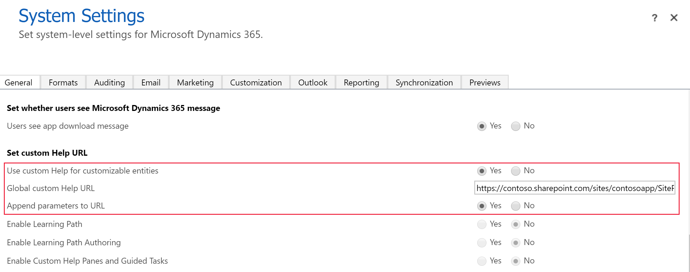

# Enable and use customizable help
Customizable help lets you provide your own contextual information to model-driven app users filling in forms. 

> [!NOTE]
> Instead of creating and maintaining your own Help, custom help panes and guided tasks are available that you can use to author Help that gives your Unified Interface application a custom in-product help experience that is tailored to your organization. More information: [Create guided help for your Unified Interface app](../common-data-service/create-custom-help-pages.md)

With model-driven apps, you can replace the default Help with the custom Help of your choice, at the global (environment) level or entity level. Custom Help makes the content exposed through the Help links more relevant for your custom or customizable entities. With a single, global URL you can override the out-of-the-box Help links for all customizable entities. Per entity URLs override the out-of-the-box Help links on grids and forms for a specific customizable entity. You can include additional parameters in the URL, such as language code and entity name. These parameters allow a developer to add functionality to redirect the user to a page that’s relevant to their language or the entity context within the application. The entity level custom Help settings are solution aware, therefore you can package them as a part of a solution and transport them between environments or distribute them in solutions. 

## Set up customizable Help
Customizable Help can be set at the global and entity levels. 

### Set customizable Help at the global level
People with the system administrator security role can use the settings to override default Help at the global level. 
1. Open a model-driven app, and then on the command bar select **Settings**  > **Advanced  Settings** .
2. Go to **Settings** > **Administration**.
3. Select **System Settings**, and then select the **General** tab. 
4. Under the **Set custom Help URL** section, select and define the following customizable Help global settings: 
     - **Use custom Help**. Select to enable.  
     - **Help URL**. Enter the URL to your custom Help. 
     - **Append Parameters to URL**. Select **Yes** to allow for parameters such as language code or entity name to be appended to the **Help URL** that you specify in the entity definition. More information: [Append parameters to URL](#append-parameters-to-url)  

    > [!div class="mx-imgBorder"] 
    > 

5. Select **OK**.

### Set customizable Help for a specific entity
After you enable custom Help at the global level, system customizers can override the global Help URL for an entity in the entity definition. 

1. Open solution explorer.
2. Expand **Entities**, and then select the entity you want. 
3. On the **General** tab under the **Help** section of the entity definition, in the **Help URL** box enter the URL of your custom Help page. 

    > [!div class="mx-imgBorder"] 
    > 

#### Append parameters to URL
As described previously, to allow for the appending of parameters to the **Help URL** for the entity definition, set **Append Parameters to URL** in the **System Settings** > **General** tab to **Yes**. 

Examples of the parameters that can be appended to the URL:

- User Language Code: userlcid
- Entity Name: entity
- Entry Point: hierarchy chart or form
- Form Id: formid

