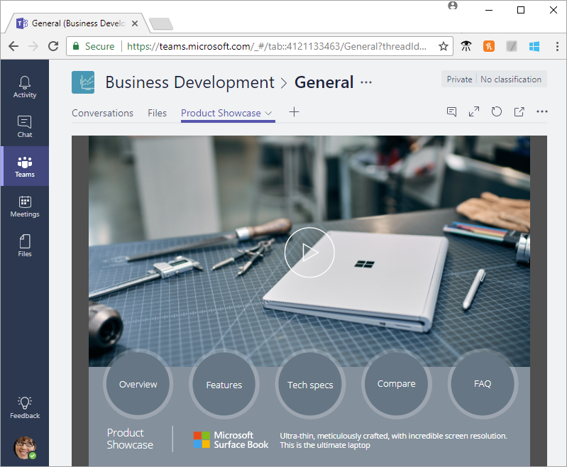
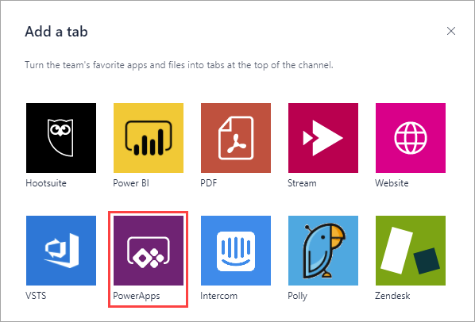

# Quickstart: Add an app to Microsoft Teams

Microsoft Teams is a chat-based collaboration platform built on Office 365 technologies. You can customize the Teams experience by adding PowerApps canvas-based apps to your channels in Teams. In this quickstart, you learn how to add the Product Showcase sample app to a Teams channel, and then open the app from that channel. 

If you're not signed up for PowerApps, [sign up for free](https://web.powerapps.com/signup?redirect=marketing&email=) before you begin.

## Prerequisites

To follow this quickstart, you need an [Office 365 subscription](https://signup.microsoft.com/Signup?OfferId=467eab54-127b-42d3-b046-3844b860bebf&dl=O365_BUSINESS_PREMIUM&ali=1) and a [channel in Teams](https://www.youtube.com/watch?v=he2f1quaR7M).

## Sign in to PowerApps

Sign into PowerApps at [https://web.powerapps.com]([https://web.powerapps.com).

## Add an app

1. In Microsoft Teams, select a team, and a channel under that team. In this example, it's the **General** channel under the **Business Development** team.

    

2. Choose **+** to add a tab.

    

3. In the **Add a tab** dialog box, choose **PowerApps**.

    

4. Choose **Sample apps** > **Product Showcase** > **Save**.

    

    The app is now available to use in the channel.

    

> [!NOTE]
> You must [share](../share-app.md) your own apps before you add them to Teams (sample apps are shared by default).

## Open an app

1. In Microsoft Teams, choose the team and the channel that contains the app.
   
    

2. Choose the **Product Showcase** tab.
   
    
   
    The app opens in the channel.
   
    

## Known issues

In the desktop app for Microsoft Teams:

* Apps must load content such as images and .pdf files over a secure (https) connection.
* Not all sensors, such as **Acceleration**, **Compass**, and **Location**, are supported.
* Only these audio formats are supported: AAC, H264, OGG Vorbis, and WAV.

## Clean up resources

To remove the app from the channel, choose the **Product Showcase** tab > **Remove**.

## Next steps

In this quickstart, you added the Product Showcase sample app to a Teams channel, and then opened the app from that channel. To learn more about PowerApps, continue to the PowerApps tutorials.

> [!div class="nextstepaction"]
> [PowerApps Tutorials](get-started-create-from-blank.md)