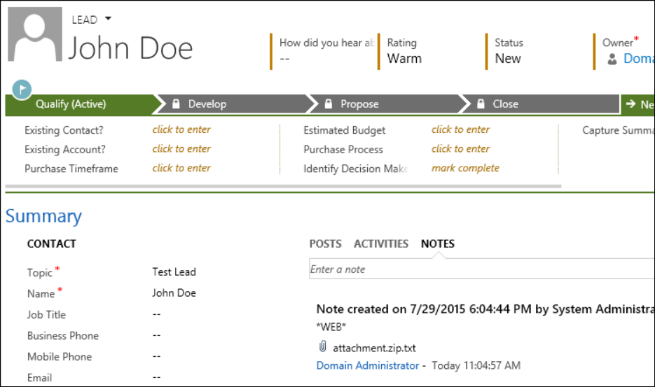
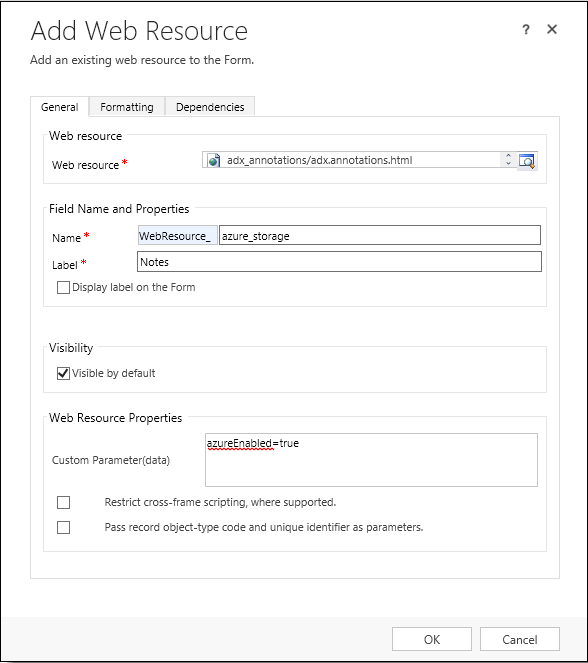
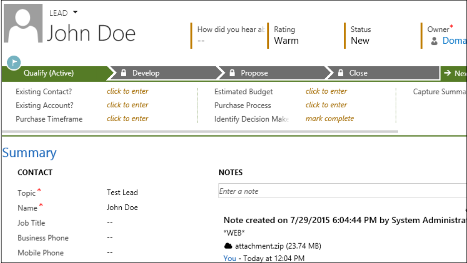
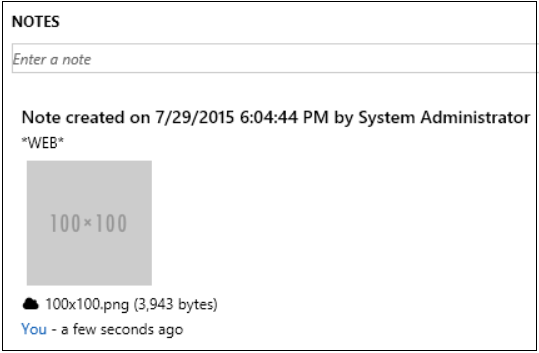

# Add the Azure Storage web resource to a form

Attachments uploaded to Azure Storage instead of directly to Common Data Service  can be managed by using notes in Common Data Service .

To enable attachments from a particular form to be uploaded into Azure Storage, you must add a web resource to that form and you must [configure Azure Storage for your organization](enable-azure-storage.md).

> [!Note]
> In this example, the form is added to the Lead form for the Lead entity. We recommend using caution when editing existing forms.

When a file (for example, attachments.zip) is uploaded to Azure Storage by using the portal, it is represented by a note on an entity and a placeholder for the attachment.



Note that the attachment file is now named attachment.zip.txt. By default, Common Data Service  has no conception of an Azure file, so this placeholder .txt file is stored in Common Data Service  instead. The Azure Storage context for the placeholder file shows details about the file.
```
{
 Name: attachment.zip,
 Type: application/x-zip-compressed,
 Size: 24890882,
 "Url": "https://accountname.blob.core.windows.net/storage/81a9a9491c36e51182760026833bcf82/attachment.zip"
}
```

To see and interact with the file stored in Azure, you must add the web resource adx.annotations.html to the form. As a pre-requisite, ensure that your users have read access to adx_setting. Otherwise, the web resource will not render properly.

1. In the form editor for the relevant form, select **Web Resource** on the **Insert** tab.

2. In the **Web resource** box, select **adx_annotations/adx.annotations.html**.

3. Enter a name and label for the resource.

4. In the **Custom Parameter (data)** box, enter **azureEnabled=true**. <br>You can also use the web resource without enabling Azure support in this way, in which case it will function almost entirely the same as the default control.</br>

5. On the **Formatting** tab, choose whatever formatting rules you prefer. We recommend that you clear the **Display border** check box.

6. Select **OK** to save the resource.

7. Optionally, you might want to remove the existing notes control, or move it to a tab or section that is marked to be not visible by default.

8. Save the form, and then publish the changes.

   

The new control will now be rendered on the page, giving you the ability to manage your attachments in Azure Storage.



The paper-clip icon has been replaced with a cloud icon to denote that this file is stored in Azure Storage. You can continue to store attachments in Common Data Service ; those files will be denoted with the paper-clip icon.

> [!Note]
> You must add cross-origin resource sharing (CORS) rule on your Azure Storage account as follows, otherwise you will see the regular attachment icon rather than the cloud icon.
> - **Allowed origins**: Specify your domain. For example, contoso.crm.dynamics.com.
> - **Allowed verbs**: GET, PUT, DELETE, HEAD, POST
> - **Allowed headers**: Specify the request headers that the origin domain may specify on the CORS request. For example, x-ms-meta-data\*, x-ms-meta-target\*. For this scenario, you must specify *, otherwise the web resource will not render properly.
> - **Exposed headers**: Specify the response headers that may be sent in the response to the CORS request and exposed by the browser to the request issuer. For example, x-ms-meta-\*.
> - **Maximum age (seconds)**: Specify the maximum amount time that a browser should cache the preflight OPTIONS request. For example, 200.
> 
> [!include[More information](../../includes/proc-more-information.md)] [CORS support for the Azure Storage Services](https://docs.microsoft.com/rest/api/storageservices/cross-origin-resource-sharing--cors--support-for-the-azure-storage-services).

If the attached file is an image, the control will display the image as a thumbnail whether it is stored in Common Data Service  or Azure Storage.

> [!Note]
> The thumbnail feature is limited to images under 1 MB in size.



## CORS protocol support

The [cross-origin resource sharing (CORS)](http://www.w3.org/TR/cors/) protocol consists of a set of headers that indicates whether a response can be shared with another domain.
The following site settings are used to configure CORS:

|                 Name                  |                                                                            Description                                                                            |
|---------------------------------------|-------------------------------------------------------------------------------------------------------------------------------------------------------------------|
| HTTP/Access-Control-Allow-Credentials | The only valid value for this header is true (case-sensitive). If you don't need credentials, omit this header entirely (rather than setting its value to false). |
|   HTTP/Access-Control-Allow-Headers   |                                                   A comma-delimited list of the supported HTTP request headers.                                                   |
|   HTTP/Access-Control-Allow-Methods   |                                      A comma-delimited list of the allowed HTTP request methods such as GET, POST, OPTIONS.                                       |
|   HTTP/Access-Control-Allow-Origin    |                   To allow any resource to access your resources, you can specify \*. Otherwise, specify the URI that can access the resources.                   |
|  HTTP/Access-Control-Expose-Headers   |                A comma-delimited list of HTTP header names other than the simple response headers that the resource might use and can be exposed.                 |
|      HTTP/Access-Control-Max-Age      |                                                       Maximum number of seconds the results can be cached.                                                        |
|                                       |                                                                                                                                                                   |

