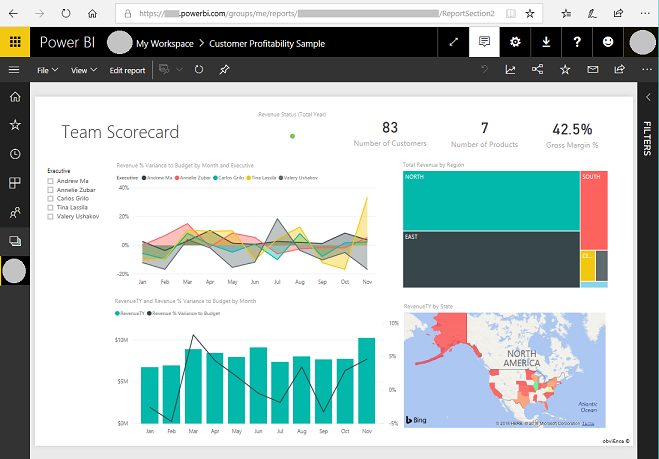
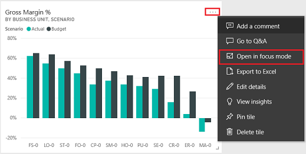

# Add a Power BI report or dashboard to a web page in portal

You can add a Power BI report or dashboard to a web page in portal by using the [powerbi](../liquid/portals-entity-tags.md#powerbi) Liquid tag. You can add the tag in the **Copy** field on a web page or in the **Source** field on a web template. If you're adding a Power BI report or dashboard created in the new workspace in Power BI, you must specify the authentication type as **powerbiembedded** in the *powerbi* Liquid tag.

> [!TIP]
> This article explains how to add a Power BI report or dashboard using *powerbi* liquid tag. To add **Power BI component** on a webpage in your portal using the portals Studio, go to [Add a Power BI component to a webpage using the portals Studio](../compose-page.md#add-power-bi).

For example: 

```

```

> [!NOTE]
> If you have specified AAD as the authentication type in powerbi Liquid tag, you must share it with the required users before adding the secure Power BI report or dashboard to a web page in portal. More information: [Share Power BI workspace](https://docs.microsoft.com/power-bi/service-how-to-collaborate-distribute-dashboards-reports#collaborate-with-coworkers-in-an-app-workspace) and [Share Power BI dashboard and report](https://docs.microsoft.com/power-bi/service-share-dashboards).

## Get the path of a dashboard or report

1.	Sign in to [Power BI](https://powerbi.microsoft.com/).

2.	Open the dashboard or report you want to embed in your portal.

3.	Copy URL from the address bar.

    > [!div class=mx-imgBorder]
    > 

## Get the ID of a dashboard tile

1.	Sign in to [Power BI](https://powerbi.microsoft.com/).

2.	Open the dashboard from which you want to embed a tile in your portal.

3.	Point to the tile, select **More options**, and then select **Open in focus mode**.

    > [!div class=mx-imgBorder]
    > 

4.	Copy the tile ID from the URL in the address bar. The tile ID is the value after /tiles/.

    > [!div class=mx-imgBorder]
    > 

## Hide the Filters pane in portals web page

Power BI allows you to [hide the Filters pane](https://docs.microsoft.com/power-bi/create-reports/power-bi-report-filter#hide-the-filters-pane-while-editing) allowing extra space on screen when Filters pane isn't needed. Similarly, you can hide the Filters pane for a dashboard or a report embedded on a web page in your portal. To hide, you can use the [Power BI JavaScript embed configuration](https://github.com/Microsoft/PowerBI-JavaScript/wiki/Embed-Configuration-Details) attribute called `powerbi-settings-filter-pane-enabled` and set its value to `false`.

For example, use the following sample code in your web page's [copy (HTML)](../configure/web-page.md#web-page-attributes) attribute to hide Power BI Filters pane in portals.

```html
<div id="hide-powerbi-filters">

</div>
<script>
  $(function() {
    //Set the "powerbi-settings-filter-pane-enabled" setting to "false" to hide the Power BI Filters pane.
    $('#hide-powerbi-filters.powerbi').attr("powerbi-settings-filter-pane-enabled", "false");
  })
</script>
```

### See also

- [Add a Power BI component to a webpage using the portals Studio](../compose-page.md#add-power-bi)
- [Set up Power BI integration](set-up-power-bi-integration.md)
- [powerbi Liquid tag](../liquid/portals-entity-tags.md#powerbi)
