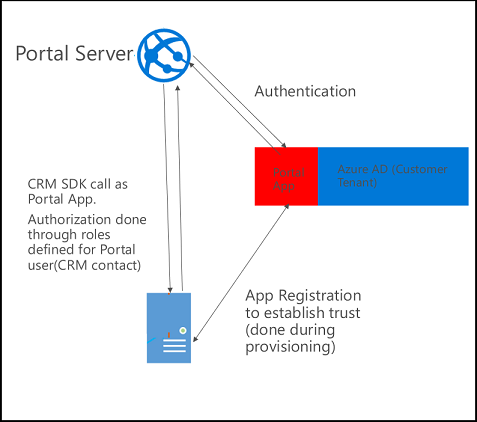
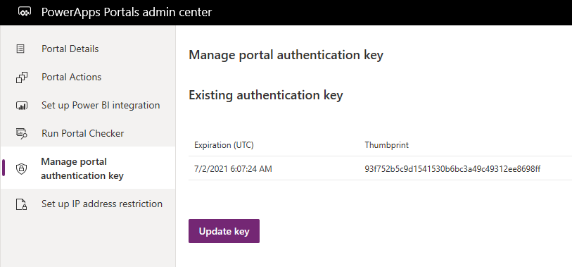
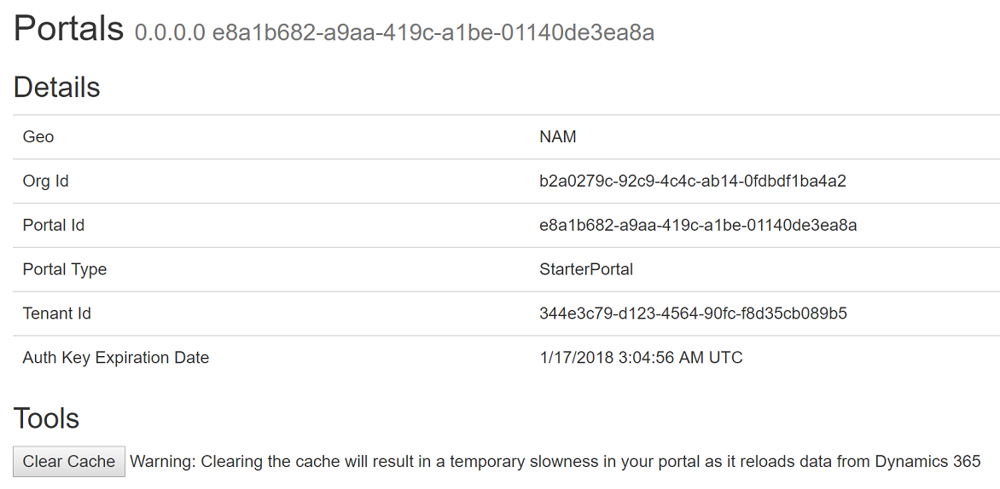
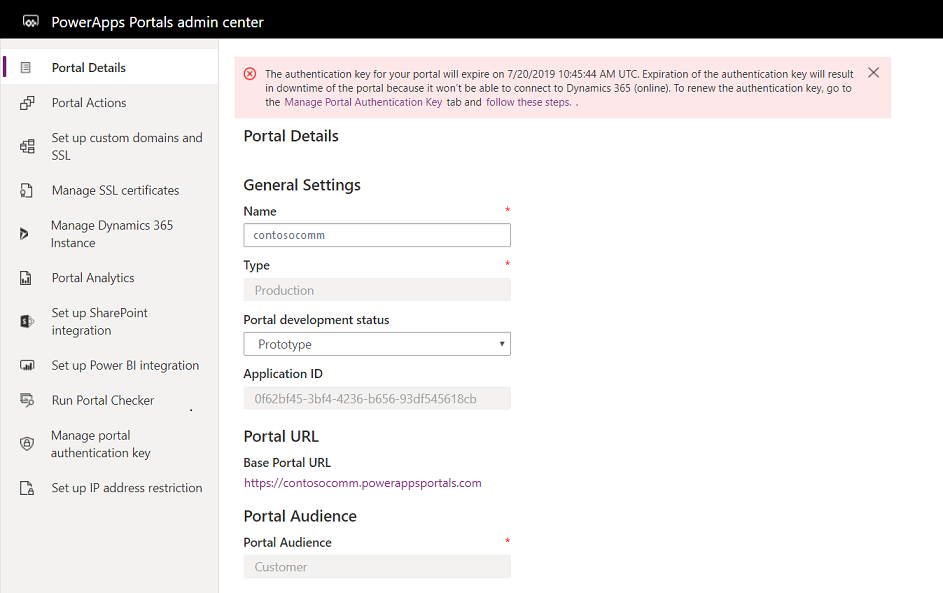
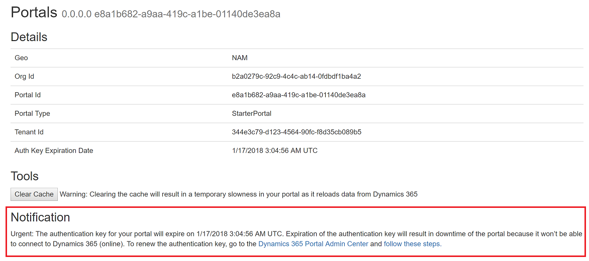
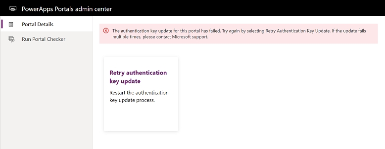

# Connect to a Common Data Service environment using a portal

A portal connects to a Common Data Service environment using an Azure Active Directory application. The application is created in the same tenant where the portal is provisioned. The application is registered with the Common Data Service environment during the portal provisioning process.

Each portal has a separate Azure Active Directory application associated with it, whether it's connected to the same Common Data Service environment or not. The default Azure Active Directory authentication provider created for a portal uses the same Azure Active Directory application to authenticate the portal. Authorization is enforced by web roles assigned to the user accessing the portal.

You can see the associated portal application in Azure Active Directory. The name of this application will be Microsoft CRM Portals, and the portal ID is in the **App ID URI** field in the Azure Active Directory application. The person who provisions the portal owns this application. Don't delete or modify this application, or you might break the portal functionality. You must be the application owner to manage a portal from the Power Apps Portals admin center.

## Authentication key

For a portal to connect to Common Data Service using an Azure Active Directory application, it requires an authentication key connected to the Azure Active Directory application. This key is generated when you provision a portal and the public part of this key is automatically uploaded to the Azure Active Directory application.

> [!IMPORTANT]
> The authentication key will expire in two years. It must be renewed every two years to ensure that your portal will continue to connect to the Common Data Service environment. If you do not update the key, the portal will stop working.  

### Authentication key details

The details of an authentication key are displayed on Power Apps Portals admin center and portal.

**Power Apps Portals admin center**

1. Open [Power Apps Portals admin center](admin-overview.md).

2. Select **Manage portal authentication key**. The authentication key is displayed along with its expiration date and thumbprint.

   > [!div class=mx-imgBorder]
   > 

**Portal**

1. Sign in to the portal as administrator.

2. Navigate to the URL <portal_path>/_services/about. The authentication key expiration date is displayed. 

   > [!div class=mx-imgBorder]
   > 

> [!NOTE]
> To view authentication key information, you must sign in to the portal in the same browser session and you must have all website access permission.

### Authentication key expiration notification

Before the authentication key expires, you'll be notified by emails, Power Apps Portals admin center, and portal.

**Email**

Email will be sent to those users who have signed up for email notification for the organization connected to their portal. More information about signing up for email notification: [Manage email notifications to admins](https://docs.microsoft.com/dynamics365/customer-engagement/admin/manage-email-notifications)

Email notifications are sent at the following intervals: 
- 90 days 
- 60 days 
- 30 days 
- 15 days 
- 7 days 
- 6 days 
- 5 days 
- 4 days 
- 3 days 
- 2 days 
- 1 day 
- 12 hours 
- 6 hours 
- 3 hours

You'll also be notified after the key expires every day until 1 week after key expiration.

> [!NOTE]
> - Intervals are calculated in UTC from the key expiration date.
> - Email is not guaranteed to be exactly at the intervals as listed above. Email notification can be delayed or missed. Be sure to check for the key expiration date online as well.

**Power Apps Portals admin center**

A message about key expiration is displayed at the top of the page.

> [!div class=mx-imgBorder]
> 

**Portal**

When you navigate to the URL <portal_path>/_services/about, a notification about key expiration is displayed at the bottom of the page.

> [!NOTE]
> You must sign in to your portal in the same browser session, and you must be assigned all website access permission.

> [!div class=mx-imgBorder]
> 

## Renew portal authentication key

You must renew the key every two years to ensure that your portal can connect to Common Data Service environment.

> [!NOTE]
> To renew the key, you must have permissions to manage your portal.

1. Open [Power Apps Portals admin center](admin-overview.md).

2. Select **Manage portal authentication key**. The authentication key is displayed along with its expiration date and thumbprint.

    > [!div class=mx-imgBorder]
    > 

3. Select **Update key**.

4. Select **Update** in the message. The update process starts, and a message is displayed.

> [!NOTE]
> - While this process runs in the background, the portal will restart once.
> - When you update a key, it's valid for next two years.
> - This process will take five to seven minutes.
> - Updating authentication key doesn't change any other portal configuration or the portal state.

### Troubleshooting

If the key update fails, an error message is displayed along with the following action:

- **Retry Authentication Key Update**. This action allows you to restart the portal authentication key update process. If the update fails multiple times, contact Microsoft support.

    > [!div class=mx-imgBorder]
    > 
