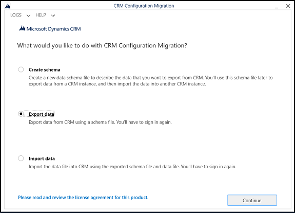
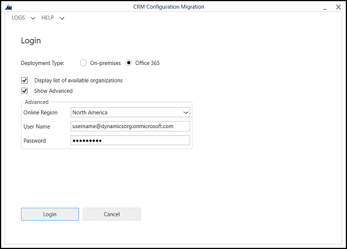
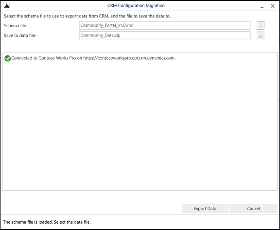
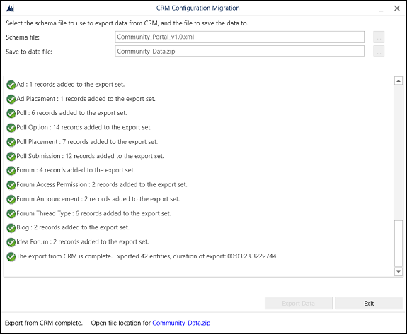
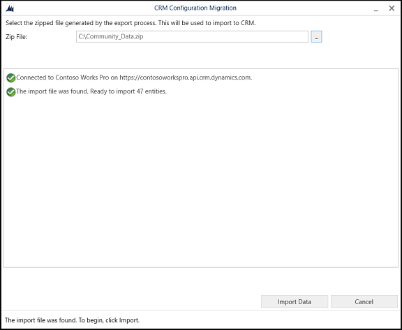

# Migrate Dynamics 365 Portals configuration

[!include[cc-beta-prerelease-disclaimer](../../../includes/cc-beta-prerelease-disclaimer.md)]

Portal development involves several configurations and customizations to achieve a desired experience for portal end users.

After you have completed development or configuration of your Dynamics 365 Portals instance, you might want to migrate your latest Dynamics 365 Portals configuration from development to testing or the production environments. Migration involves exporting the existing configuration from the source Dynamics 365 instance, and then importing it into the target Dynamics 365 instance.

To export configuration data, you would need to use the Configuration Migration tool and a portal-specific configuration schema file. For more information about this tool, see [Manage configuration data](https://docs.microsoft.com/en-us/dynamics365/customer-engagement/admin/manage-configuration-data).

> [!NOTE]
> - We recommend you to use the latest version of the Configuration Migration tool. The Configuration Migration tool can be downloaded from NuGet. More information for downloading the tool: [Download tools from NuGet](https://docs.microsoft.com/en-us/dynamics365/customer-engagement/developer/download-tools-nuget).
> - The minimum solution version of Dynamics 365 Portals supported by schema files for configuration migration is 8.4.0.275. However, we recommend that you use the latest solution version.

Schema files are available for the following portal types:
- [Community portal](https://go.microsoft.com/fwlink/p/?linkid=2019704)
- [Customer Self-Service portal](https://go.microsoft.com/fwlink/p/?linkid=2019705)
- [Partner portal](https://go.microsoft.com/fwlink/p/?linkid=2019803)
- [Employee Self-Service portal](https://go.microsoft.com/fwlink/p/?linkid=2019802)
- [Custom portal](https://go.microsoft.com/fwlink/p/?linkid=2019804)

The default schema files contain information about portal entities, relationships, and uniqueness definitions for each entity. More information: [Export portal configuration data](#export-portal-configuration-data)

After exporting the configuration data, you must import it into the target environment. More information: [Import portal configuration data](#import-portal-configuration-data)

> [!NOTE]
> The schema files are provided to reduce the effort required to build a schema from scratch. Schema can be tailored for your implementation using standard ways provided by the tool. Schema files can be loaded in the Configuration Migration tool and altered to add, remove, and modify entities, attributes, and so on.

## Export portal configuration data

You can export portal configuration data from a source system by using portal-specific configuration schema files.

1.	Download the Configuration Migration tool and extract to the desired folder.

2.	Download a portal configuration schema file using links provided above for your portal type.

3.	Double-click the **DataMigrationUtility.exe** file in the 
`<your_folder>\Tools\ConfigurationMigration` folder to run the Configuration Migration tool, choose **Export data** in the main screen, and then select **Continue**.
    
    > [!div class=mx-imgBorder]
    > 

4.	On the **Login** screen, provide authentication details to connect to your Dynamics 365 instance from where you want to export data. If you have multiple organizations on the Dynamics 365 instance and want to select the organization from where to export the data, select the **Display list of available organizations** check box, and then select **Login**.

    > [!div class=mx-imgBorder]
    > 

5.	If you have multiple organizations, and you had selected the **Display list of available organizations** check box in the previous step, the next screen allows you to choose the organization that you want to connect to. Select a Dynamics 365 organization to connect to. 

    > [!NOTE]
    > If you do not have multiple organizations, this screen is not displayed.

6.	In **Schema file**, browse and select the portal-specific configuration schema file to be used for the data export.

7.	In **Save to data file**, specify the name and location of the data file to be exported.

    > [!div class=mx-imgBorder]
    > 

8.	Select **Export Data**. The screen displays the export progress status and the location of the exported file at the bottom of the screen once the export is complete.

    > [!div class=mx-imgBorder]
    > 

    > [!IMPORTANT]
    > The Configuration Migration tool does not support filtering of records in an entity. By default, all the records in the selected entity will be exported. Therefore, if you have created more than one website record, all website records will be exported.

9.	Select **Exit** to close the tool.

## Import portal configuration data

1.	Run the Configuration Migration tool and choose **Import data** in the main screen, and then select **Continue**.

    > [!div class=mx-imgBorder]
    > 

2.	On the **Login** screen, provide authentication details to connect to your Dynamics 365 instance from where you want to export data. If you have multiple organizations on the Dynamics 365 instance and want to select the organization from where to export the data, select the **Display list of available organizations** check box, and then select **Login**.

3.	If you have multiple organizations, and you had selected the **Display list of available organizations** check box in the previous step, the next screen allows you to choose the organization that you want to connect to. Select a Dynamics 365 organization to connect to. 

    > [!NOTE]
    > - If you do not have multiple organizations, this screen is not displayed.
    > - Ensure that the portal solution is already installed for the organization where you plan to import the configurations.

4.	The next screen prompts you to provide the data file (.zip) to be imported. Browse to the data file, select it, and then select **Import Data**. 

    > [!div class=mx-imgBorder]
    > 

5.	The next screen displays the import status of your records. The data import is done in multiple passes to first import the foundation data while queuing up the dependent data, and then import the dependent data in the subsequent passes to handle any data dependencies or linkages. This ensures clean and consistent data import. 

6.	Select **Exit** to close the tool. 
