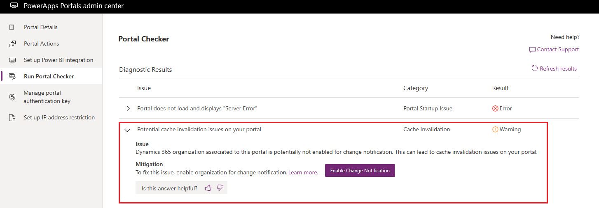
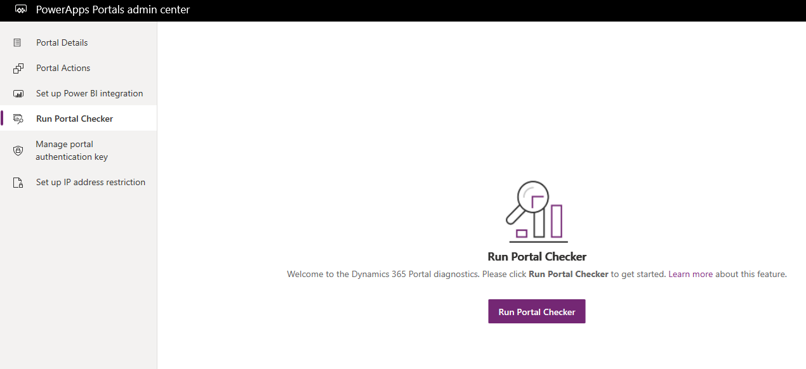

# Portal checker

Portal checker is a self-service diagnostic tool that can be used by portal administrators to identify common issues in their portal. Portal checker helps to identify issues with your portal by looking at various configuration parameters and provides suggestions on how to fix them.

When you run portal checker, the results are displayed in the **Diagnostic results** section in a grid format. The results grid has the following columns:

- **Issue**: Displays the top-level issue faced by a customer; for example, performance issue.
- **Category**: Displays the top-level area where issues can be categorized; for example, provisioning, solution upgrade, and so on.
- **Result**: Displays the status of issue; for example, error, warning, and so on.

By default, information in the grid is sorted by the **Result** column in this order: error, warning, and pass.

> [!div class=mx-imgBorder]
> 

You can expand an issue to view detailed information and mitigation steps. If the mitigation requires any action, you'll see a button that will perform the action. You can also provide feedback on whether the mitigation was useful.

> [!div class=mx-imgBorder]
> 

If required, you can rerun the diagnostic checks, which will refresh the results with updated data.

> [!NOTE]
> If portal is turned off or IP address filtering is enabled, certain diagnostic checks will not be run on your portal.

For a list of common issues diagnosed by the portal checker tool, see [Common portal issues diagnosed by portal checker and their best practices](https://docs.microsoft.com/en-us/dynamics365/customer-engagement/portals/portal-faq).

To run portal checker:

1.	Open [PowerApps Portals admin center](admin-overview.md).

2.	Go to **Run Portal Checker**.

    > [!div class=mx-imgBorder]
    > 

3.	Select **Run Portal Checker**. The diagnostic session will start and gather data about the customer issues. The results are displayed in the **Diagnostic results** section.

    > [!div class=mx-imgBorder]
    > 

4.	To rerun the diagnostic checks, select **Refresh results**.

    > [!div class=mx-imgBorder]
    > 
