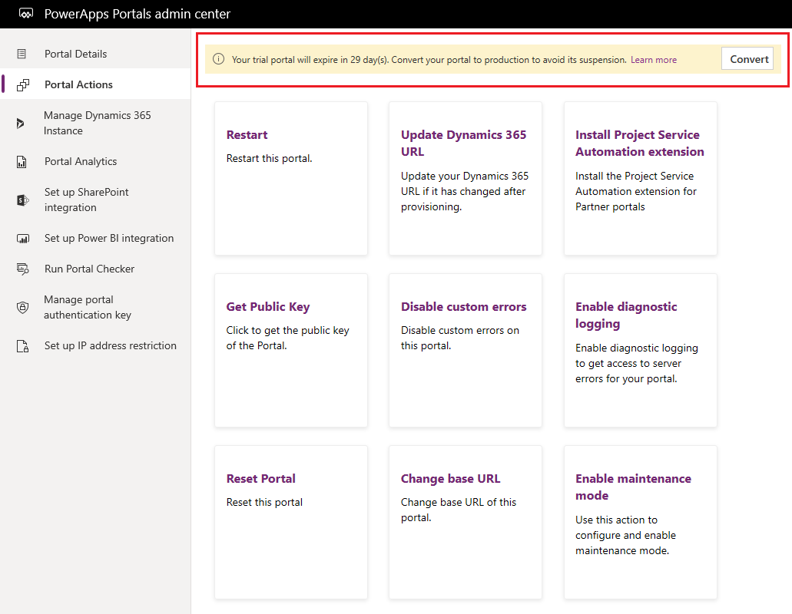
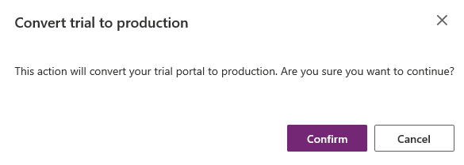

# About portal lifecycle

A portal is always created as a trial. A trial portal, which expires after 30 days, is useful for trying out its capabilities at no cost. After expiration, a portal is suspended and shut down. Seven days after suspension, the trial portal is deleted. On every change of portal lifecycle stage, such as nearing to suspension, suspended, deleted, and converted from trial to production, you will receive notifications as a toast and through email.

As an administrator, you can convert a trial or suspended portal to a production portal. While converting a trial portal to production, ensure that the environment is also a production environment. You can’t convert a trial portal to production in a trial environment. If you delete the environment in which a trial portal is created, the portal is also deleted.

The first portal is free to be created in an environment in a tenant. If you need to create more than one portal, you must have 1 GB of unused storage space in the tenant.

## Stages in portal lifecycle

### Trial portal

A portal is always created as a trial portal. You can convert it to production from the Power Apps Portals admin center if you have the required licenses. For information on converting a trial portal to production, see [Convert a trial portal to production](#convert-a-trial-portal-to-production).

To convert a trial portal to production, the environment should have required add-ons for external users, or a license for internal users. For more information on licensing, see [Power Apps and Power Automate licensing FAQs](https://docs.microsoft.com/power-platform/admin/powerapps-flow-licensing-faq) and [Power Apps portals licensing](https://docs.microsoft.com/power-platform/admin/powerapps-flow-licensing-faq#can-you-share-more-details-regarding-the-new-power-apps-portals-licensing).

### Suspended portal

You will continue to see notifications in the Power Apps Portals admin center about the expiration of your trial portal. Trial portals expire after 30 days. If you don't convert your portal to production within the trial period, the portal is shut down and placed on the suspended status. You won't be able to access your portal after its expiration.

However, the suspended portal can still be converted to production within seven days of suspension. 

### Deleted portal

If you don't convert your portal to production within the seven-day suspension period, the portal is deleted. The portal data is not deleted from the environment, but the space used by the portal in an environment will be released, and you can create a new portal.

> [!NOTE]
> Following conditions apply to portals [provisioned using portal add-on plan](../provision-portal-add-on.md) purchased earlier:
>
> - Trial add-on portal:
>
>     Expires at the completion of 30 days trial period, followed by suspension for 7 days. The portal is deleted after suspension period ends. Trial add-on portal can still be converted to production during trial or suspended period.
>
> - Production add-on portal:
>
>     Expires at the completion of purchased license period, followed by suspension for 7 days. The portal is deleted after suspension period ends. You can extend the license of a production add-on portal while the portal is in configured or suspended state. If suspended, the portal can be converted to configured state after extending the license period.
>
> - Reset add-on portal:
>
>    Follow the steps to [reset](reset-portal.md) the portal provisioned using a previously purchased older portal add-on plan.

## Convert a trial portal to production

You can convert a trial portal to production from the notifications displayed in the Power Apps Portals admin center.

> [!NOTE]
> You must be assigned one of the following roles to convert a trial portal to production:
> - Global administrator
> - System administrator

When you open the [Power Apps Portals admin center](admin-overview.md) and navigate to the [Portal Details](portal-details.md) tab, you'll see the notification about the trial expiration displayed below the **Type** field.

> [!div class=mx-imgBorder]
> 

On other pages in the admin center, the notification is displayed at the top of the page.

> [!div class=mx-imgBorder]
> 

To convert your trial portal to production:

1.	In the notification, select **Convert**.

2.	Select **Confirm**.

    > [!div class=mx-imgBorder]
    > 

## Considerations for older add-on portals

Following conditions apply to portals [provisioned using portal add-on plan](../provision-portal-add-on.md) purchased earlier:

### Trial add-on portal

Trial add-on portals expire at the completion of 30 days trial period, followed by suspension for 7 days. The portal is deleted after suspension period ends. Trial add-on portal can still be converted to production during trial or suspended period.

### Production add-on portal

Production add-on portals expire at the completion of purchased license period, followed by suspension for 7 days. The portal is deleted after suspension period ends. You can extend the license of a production add-on portal while the portal is in configured or suspended state. If suspended, the portal can be converted to configured state after extending the license period.

### Reset add-on portal

Follow the steps to [reset](reset-portal.md) the portal provisioned using a previously purchased older portal add-on plan.