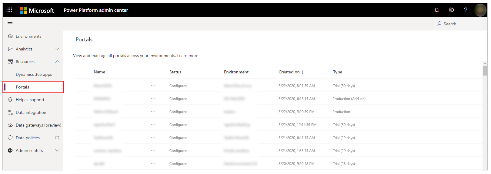
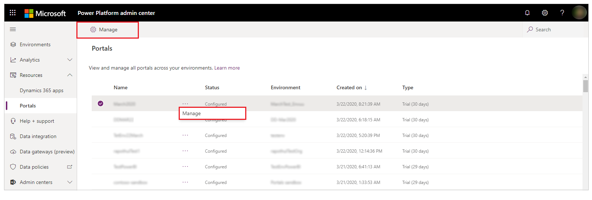
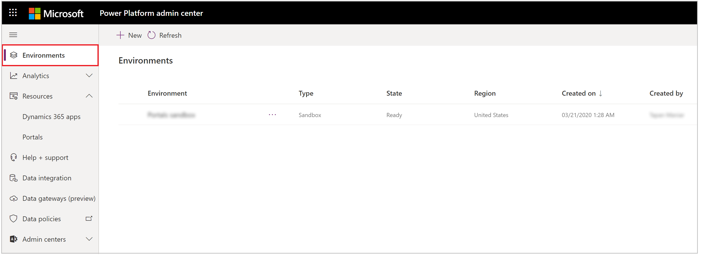
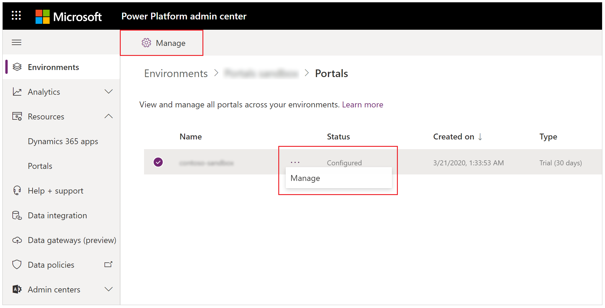

# Manage portals from Power Platform admin center

You can now manage portals in the Power Platform admin center. The Power Platform admin center helps you manage both capacity-based and add-on portals. You an also see information such as how many days a trial portal has before it expires. For more information about the portal licensing, see [licensing FAQ](https://docs.microsoft.com/power-platform/admin/powerapps-flow-licensing-faq#portals) and [portal differences](https://docs.microsoft.com/powerapps/maker/portals/faq#what-is-the-difference-between-power-apps-portals-dynamics-365-portals-and-add-on-portals).

You can manage the portals in Power Platform admin center in two different ways. You can manage all portals for the current tenant from **Resources** -> **Portals** option. And you can manage portals for a specific environment from **Environments** option.

## Manage all portals for a tenant

To see a list of all portals for your tenant:

1. Sign in to the [Power Platform admin center](https://admin.powerplatform.microsoft.com/).

1. Select **Resources** and then **Portals** from the left-side menu.

    

1. Select a portal.

1. To manage a portal, select **More portal actions** (**...**) and then select **Manage**. Alternatively, you can also select the portal and then select **Manage** from the top navigation:

    

To continue and configure portal details, refer [portals details](https://docs.microsoft.com/powerapps/maker/portals/admin/portal-details).

## Manage all portals for an environment

Follow these steps to see a list of all portals for your environment.

1. Sign in to the [Power Platform admin center](https://admin.powerplatform.microsoft.com/).

1. Select **Environments** from the left navigation:

    

1. Hover over and click on the environment name hyperlink to open environments details:

    

1. Select **Portals** under the **Resources** option from the right-side of the screen:

    

1. You'll see a list of Portals installed in the selected environment.

    

1. To manage a portal, select **More portal actions** (**...**) and then select **Manage**. Alternatively, you can also select the portal and then select **Manage** from the top navigation:

    

To continue and configure portal details, refer [portals details](https://docs.microsoft.com/powerapps/maker/portals/admin/portal-details).

### Portal types

The following table explains different types of portals that you can see listed on admin center with descriptions:

| **Type**            | **Description**                                                                    |
|---------------------|------------------------------------------------------------------------------------|
| Production          | Production portal based on capacity-based license.                                  |
| Trial (n days)      | Trial portal based on capacity-based license with n days remaining for suspension. |
| Production (add-on) | Production portal based on add-on license.                                          |
| Trial (add-on)      | Trial portal based on add-on license.                                               |

### Portal status

A portal can be in *Configured*, *Suspended*, or *Not-configured* status. The following table describes each status:

| **Status**     | **Description**                                                                                                                 |
|----------------|---------------------------------------------------------------------------------------------------------------------------------|
| Configured     | This portal has been configured to an environment.                                                                              |
| Suspended      | This portal has been suspended due to trial period over. And this portal will be deleted in 7 days, if not converted to production. |
| Not-configured | This app is ready to be configured to an environment.                                                                           |

> [!NOTE]
> You can [create a new portal](https://docs.microsoft.com/powerapps/maker/portals/provision-portal-add-on) if the portal add-on status is *Not-configured*. The status will change to *Configured* after the portal is provisioned.
