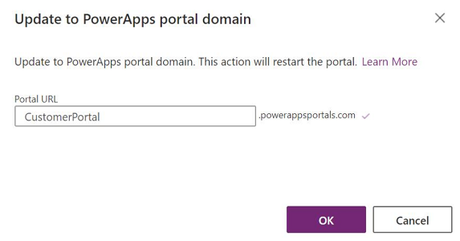
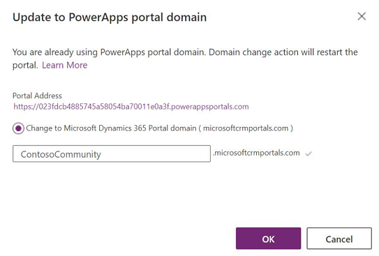

# Update to Power Apps portals domain

If you provision a portal using the older portal add-on, the domain of your portal will be `microsoftcrmportals.com`. With the release of Power Apps portals, you can now update your Dynamics 365 domain `microsoftcrmportals.com` to the Power Apps portals domain `powerappsportals.com`.

> [!NOTE]
> The `microsoftcrmportals.com` domain is deprecated and is limited only to the portals provisioned using the older portal add-on. In deprecation period, this feature will continue to work and is fully supported until it is officially removed. This deprecation notification can span a few years.

1. Open [Power Apps Portals admin center](admin-overview.md).

2. Go to **Portal Actions** > **Update to Power Apps portal domain**.

    > [!div class=mx-imgBorder]
    > 

3. In **Portal URL**, enter the address of the website and select **OK**.

    > [!div class=mx-imgBorder]
    > 

If you are already using the Power Apps portals domain and would like to revert to the old domain, you can use the **Update to Power Apps portal domain** action to revert to the old domain. In this case, the message is displayed as follows:

> [!div class=mx-imgBorder]
> 
