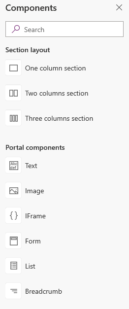
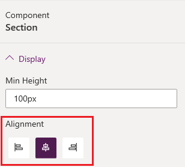
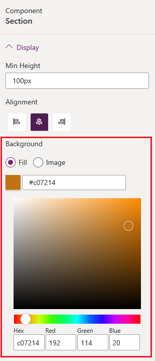
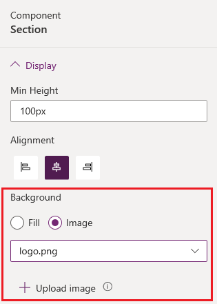
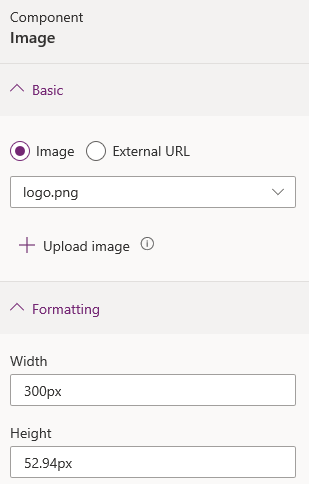
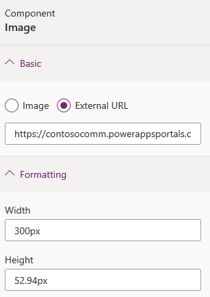
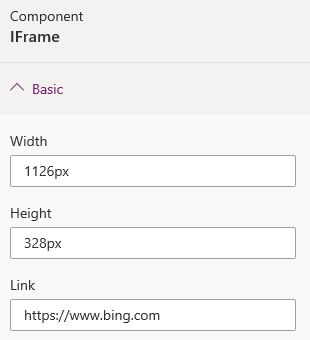
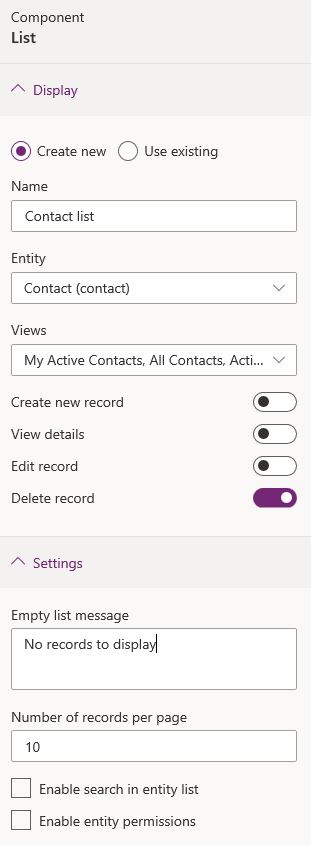
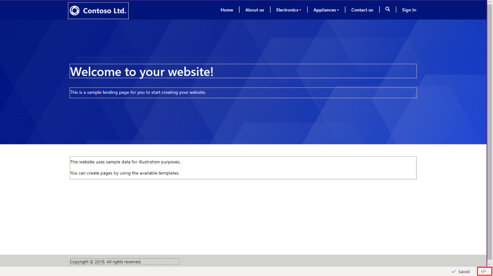

# Compose a page

[!include[cc-beta-prerelease-disclaimer](../../includes/cc-beta-prerelease-disclaimer.md)]

After adding the required webpages and managing their hierarchy in the sitemap, you can add various components. The WYSIWYG editor allows you to add and edit the required components on the canvas easily. You can add and edit the following components on the canvas:

- Sections
    - One column section
    - Two columns section
    - Three columns section
- Portal components
    - Text
    - Image
    - IFrame
    - Form
    - List
    - Breadcrumb

## Use the WYSIWYG editor

1.  [Edit the portal](manage-existing-portals.md#edit) to open it in the portal designer.  

2.  Select the page on which you want to add the component.

3.  Select an editable element on the canvas.

    > [!NOTE]
    > The editable elements are demarcated by a boundary.

4.  Select **Components**  from the toolbelt on the left side of the screen.  

5.  Select the component to be added.

    > [!div class=mx-imgBorder]
    >   

    The selected component is added to the canvas inside the editable element.

6.  To delete a component, select the component on the canvas and then select **Delete** on the command bar at the top of the page.

    > [!div class=mx-imgBorder]
    >   

## Add sections

Sections allow you to define a structure for your page and arrange portal components accordingly. Once you add sections to your page, you can add portal components inside the sections as per the requirement.

1.	Edit the portal to open it in the portal designer.

2.	Select the page on which you want to add a section.

3.	Select an editable element on the canvas.

4.	Select **Components**  from the toolbelt on the left side of the screen.

5.	Under **Section layout**, select the section type to be inserted.

6.	In the properties on the right side of the screen, select the following information:

    - **Alignment**: Select whether the component in the section must be left, center, or right aligned.

        > [!div class=mx-imgBorder]
        >   

    - **Background**: Select if would like to have color or an image as the section background.

        - **Fill**: Select a color for the background.

            > [!div class=mx-imgBorder]
            >   

        - **Image**: Select an image from the list. If you would like to upload a new image, select **Upload image**.

            > [!div class=mx-imgBorder]
            >   

7.	Add the required portal component in the section.

## Add portal components

You can add the following components on a webpage:

- [Text](#add-text-box)
- [Image](#add-image)
- [IFrame](#add-iframe)
- [Form](#add-form)
- [List](#add-list)
- [Breadcrumb](#add-breadcrumb)

### Add text box

1.  [Edit the portal](manage-existing-portals.md#edit) to open it in the portal designer.  

2.  Select the page on which you want to add the component.

3.  Select an editable element on the canvas.

4.  Select **Components**  from the toolbelt on the left side of the screen.  

5.	Under **Portal components**, select **Text**.

6.  Enter the required text in the text box.

7.  To format the text, select the text to display the format options. Modify the font size and style as required.

    > [!div class=mx-imgBorder]
    >   

### Add image

1.  [Edit the portal](manage-existing-portals.md#edit) to open it in the portal designer.  

2.  Select the page on which you want to add the component.

3.  Select an editable element on the canvas.

4.  Select **Components**  from the toolbelt on the left side of the screen.  

5.  Under **Portal components**, select **Image**. The image placeholder is added to the canvas.

6.  In the properties pane on the right side of the screen, enter the following information:

    - **Image**: Select this option if you would like to select an existing image or upload a new one. If you want to select a previously uploaded image, choose an image from the **Select image** list. To upload a new image, select **Upload image**. All the uploaded images are included in the image library, which can be selected again through the **Select image** list.

        > [!div class=mx-imgBorder]
        >   

        > [!NOTE]
        > - You can upload only the images of type png, svg, jpg, and jpeg with the maximum size of 5 MB.
        > - You can't upload an image with the same name. You need to modify the name of the image to upload it again.

    - **External url**: Select this option if you would like to upload an image from an external URL. Enter the URL in the **External url** field. Only secured links are accepted—that is, https:// is mandatory. If you have images stored in your content delivery network, you can provide the link in this field.

        > [!div class=mx-imgBorder]
        >   

    -   **Formatting options**

        - **Width**: Enter width of the image.

        - **Height**: Enter height of the image.

    > [!NOTE]
    > You can also select the image on the canvas and drag the handles to resize it.

### Add IFrame

1.  [Edit the portal](manage-existing-portals.md#edit) to open it in the portal designer.  

2.  Select the page on which you want to add the component.

3.  Select an editable element on the canvas.

4.  Select **Components**  from the toolbelt on the left side of the screen.  

5.  Under **Portal components**, select **IFrame**. The IFrame placeholder is added to the canvas.

6.  In the properties pane on the right side of the screen, enter the following information:

    - **Width**: Enter the width of the IFrame.

    - **Height**: Enter the height of the IFrame.

    - **Link**: Enter the URL of the website to be displayed in the IFrame. Only secured links are accepted—that is, https:// is mandatory. By default, <https://www.bing.com> is available as the value.

        > [!div class=mx-imgBorder]
        >   

    > [!NOTE]
    > You can also select the IFrame on the canvas and drag the handles to resize it.

### Add form

Form is a data-driven configuration that you use to add a form to collect data in the portal without the need for a developer to surface the form in the portal. [Forms are created in Common Data Service](https://docs.microsoft.com/en-us/powerapps/maker/model-driven-apps/form-designer-overview) and you can use them into webpages in the portal or in conjunction with lists to build out complete web applications.  

1.  [Edit the portal](manage-existing-portals.md#edit) to open it in the portal designer.  

2.  Select the page on which you want to add the component.

3.  Select an editable element on the canvas.

4.  Select **Components**  from the toolbelt on the left side of the screen.  

5.  Under **Portal components**, select **Form**.

6.  In the properties pane on the right side of the screen, select one of the following options:

    - **Create new**: Create a new form.
    - **Use existing**: Use an existing form.

7. Enter information or make selection for the following:

    - **Name**: Name of the form.

    - **Entity**: The name of the entity from which the form will be loaded.

    - **Form layout**: The name of the form on the target entity in Common Data Service that is to be rendered.

    - **Mode**: Select one of the following options:

        - **Insert**: Indicates the form should insert a new record upon submission.

        - **Edit**: Indicates the form should edit an existing record.

        - **Read only**: Indicates the form should display an existing record’s noneditable form.

        > [!NOTE]
        > The default option for **Edit** and **ReadOnly** modes is set as Query String Parameter Name passed as ID in URL. To change these values, you need to open Portal Management app and update the form properties.

    - **On success**: Select one of the following options:

        - **Show success message**: Requires a message to be displayed to the user on successful submission of the form. You can also select **Hide form on success** to hide the form upon successful submission.

        - **Redirect to webpage**: Redirects the user to the selected webpage in the portal. You must select a webpage from the **Redirect to webpage** list.

        - **Redirect to URL**: Redirects the user to the specified URL. You must enter a URL in the **Redirect to URL** field.

    - **Show captcha for anonymous users**: Displays captcha to anonymous users.

    - **Show captcha for authenticated users**: Displays captcha to authenticated users.

    - **Enable entity permissions**: Entity permissions to be considered for the form. By default, it is not selected. If selected, explicit permissions are required for any user to access the form. More information: [Entity permission](https://docs.microsoft.com/en-us/dynamics365/customer-engagement/portals/assign-entity-permissions)

        > [!div class=mx-imgBorder]
        > 

### Add list

List is a data-driven configuration that you use to add a webpage that will render a list of records without the need for a developer to surface the grid in the portal. Lists use [Common Data Service views](https://docs.microsoft.com/en-us/powerapps/maker/model-driven-apps/create-and-edit-views) to display records on the portal.  

1.  [Edit the portal](manage-existing-portals.md#edit) to open it in the portal designer.  

2.  Select the page on which you want to add the component.

3.  Select an editable element on the canvas.

4.  Select **Components**  from the toolbelt on the left side of the screen.  

5.  Under **Portal components**, select **List**.

6.  In the properties pane on the right side of the screen, select one of the following options:

    - **Create new**: Create a new list.
    - **Use existing**: Use an existing list.

7.  Enter information or make selection for the following:

    - **Name**: Name of the list.

    - **Entity**: The name of the entity from which the views will be loaded.

    - **Views**: The list of views of the target entity that is to be rendered. You can select multiple views to display records in the list. The view selected first will be the default view.

    - **Create new record**: Allows a user to create a record. Select a webpage that contains a form to create a new record.

    - **View details**: Allows a user to view details. Select a webpage that contains a form to display details.

    - **Edit record**: Allows a user to edit a record. Select a webpage that contains a form to edit the record.

    - **Delete record**: Allows a user to delete a record.

    - **Empty list message**: Message to be displayed when there are no records to be displayed.

    - **Number of records per page**: An integer value to specify the number of the records to display on a page.

    - **Enable search in entity list**: Allows a user to search records in the list.

    - **Enable entity permissions**: Entity permissions to be considered for the list. By default, it is not selected. If selected, explicit permissions are required for any user to access the form. More information: [Entity permission](https://docs.microsoft.com/en-us/dynamics365/customer-engagement/portals/assign-entity-permissions)  

    > [!div class=mx-imgBorder]
    > 

### Add breadcrumb

1.  [Edit the portal](manage-existing-portals.md#edit) to open it in the portal designer.  

2.  Select the page on which you want to add the component.

3.  Select an editable element on the canvas.

4.  Select **Components**  from the toolbelt on the left side of the screen.  

5.  Under **Portal components**, select **Breadcrumb**.

## Add a custom menu

By default, the menu on the website is created automatically based on the hierarchy of the webpages. It is called the **default** menu. To create a custom menu, you must create the web link set in the Portal Management app. More information: [Manage web links](https://docs.microsoft.com/en-us/dynamics365/customer-engagement/portals/manage-web-links)

After you create the web link set:

1.	[Edit the portal](manage-existing-portals.md#edit) to open it in the portal designer.

2.	Select the header component. 

3.	In the properties on the right side of the screen, select the web link set name from the **Navigation Menu** list.

    > [!div class=mx-imgBorder]
    > 

## Use code editor

To view the source of a component on the canvas, select the component, and then select the source code editor icon **&lt;/&gt;** in the footer.

> [!div class=mx-imgBorder]
>   

The source code is displayed in the **Code Editor** pane at the bottom of the screen. The changes you made earlier are updated in the source code. To make changes, update the source code and select **Save**. The changes are reflected on the canvas.

> [!div class=mx-imgBorder]
>  

> [!NOTE]
> You can also add Liquid tags in source code editor for advanced configuration. More information: [Work with Liquid templates](https://docs.microsoft.com/en-us/dynamics365/customer-engagement/portals/custom-templates-dynamic-content)

