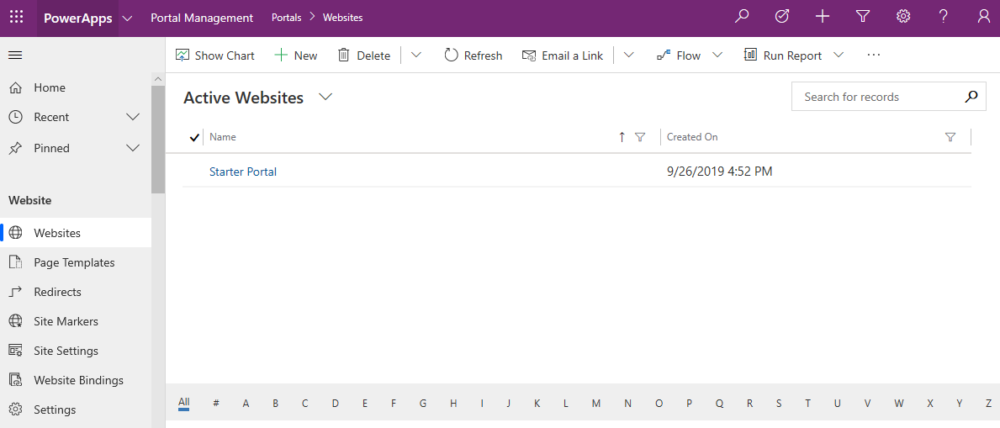

# Portal Management app

The Portal Management app lets you do advanced configuration actions on your portal. The app is available after the database on Common Data Service is created successfully.

To open the Portal Management app, go to the **Your apps** section on the Power Apps home page, locate the Portal Management app, and select it.

> [!div class=mx-imgBorder]
> 

The Portal Management app is opened in the Unified Interface. You can configure your portal as per your requirement.

> [!div class=mx-imgBorder]
> 

> [!NOTE]
> If your web browser has any extensions such as ad-blockers, you may see a script error when using the Portal Management app: `One of the scripts for this record has caused an error. For more details, download the log file.` In addition, the downloaded log file may reference this error: `ReferenceError: Web resource method does not exist.` This error occurs for forms such as [Web pages](web-page.md), [Entity Forms](entity-forms.md), [Entity Lists](entity-lists.md), or [Web Form Steps](web-form-steps.md). To resolve this error, disable extensions such as ad-blockers in your browser. You may also use a different browser instead that doesn't have such extensions enabled.
