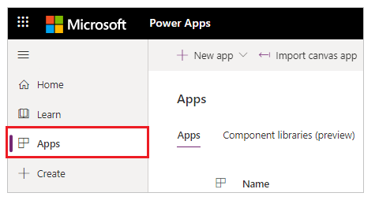
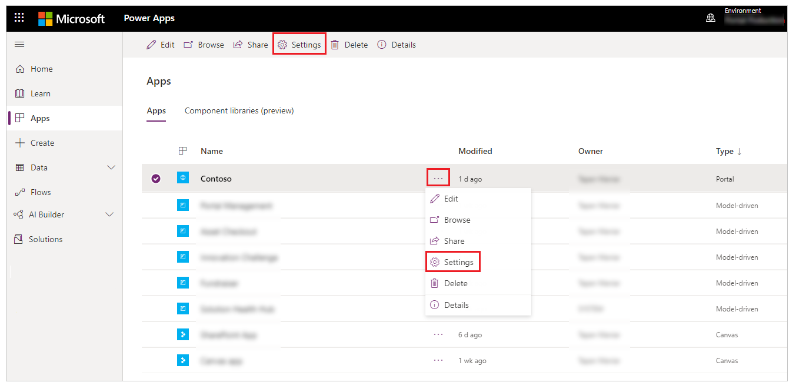
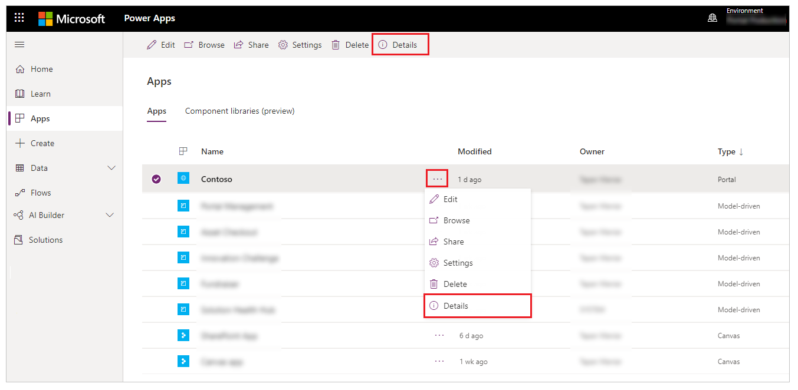
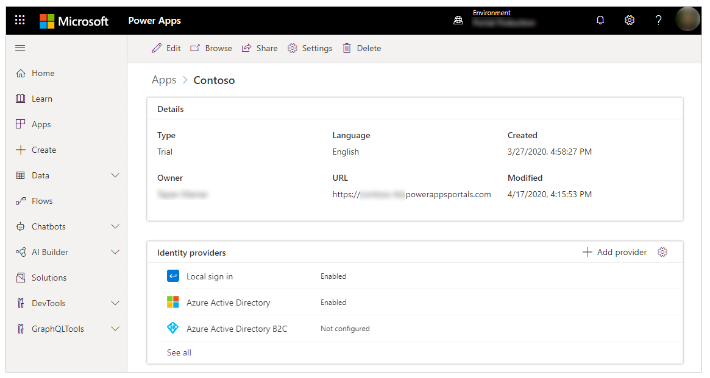
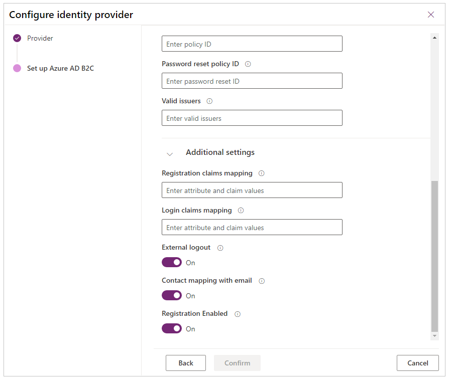
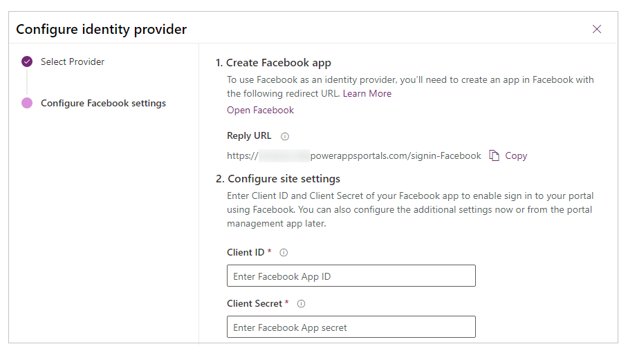
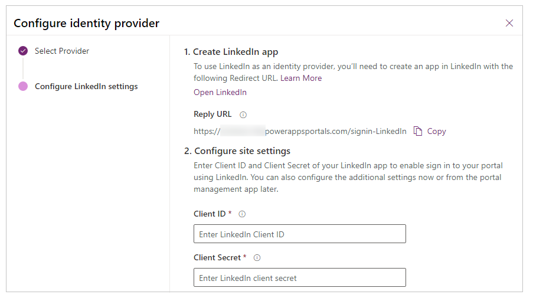
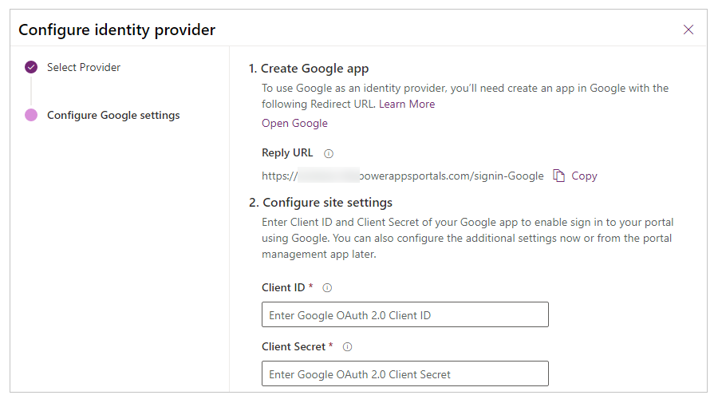
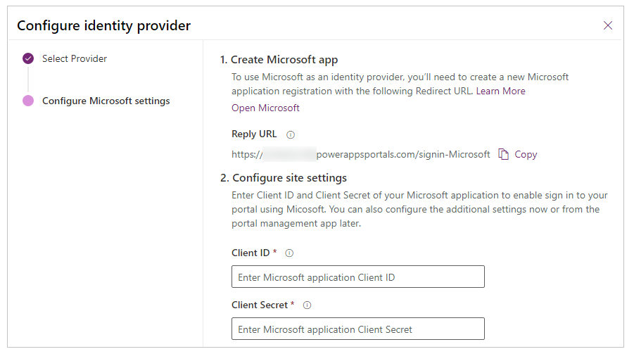

# Simplified authentication and identity provider configuration (Preview)

Setting up authentication is a core customization in any portal. Simplified identity provider configuration in Power Apps portals provides in-app guidance for identity provider setup and abstracts setup complexities. Makers and administrators can easily configure the portal for supported identity providers.

> [!NOTE]
> The simplified authentication and identity provider configuration feature is in preview. To access this preview feature, you must use [Power Apps preview](https://make.preview.powerapps.com). After this preview feature is generally available, you'll be able to access it from [Power Apps](https://make.powerapps.com). You can't turn this preview feature on or off for your portal. For more information about preview features, see [Understand experimental and preview features in Power Apps](https://docs.microsoft.com/powerapps/maker/canvas-apps/working-with-experimental-preview). 

## Overview

You can enable, disable, and configure portal identity providers from [Power Apps preview](https://make.preview.powerapps.com) by using simplified portal authentication configuration. After you select an identity provider, you can then follow prompts to easily enter the provider settings, instead of [setting up authentication manually](set-authentication-identity.md).

### Authentication Settings

To begin configuring an identity provider for your portal:

1. Go to [Power Apps preview](https://make.preview.powerapps.com).

1. Select **Apps** from the left navigation pane.

    

1. Select your portal from the list of available apps.

1. Select **Settings** from the top menu. You can also select **More Commands** (**...**)<!--Is it actually uppercase "Commands"? If not (it shouldn't be!), please change to lowercase throughout. -->, and then select **Settings**.

    

1. From the settings on the right side of your workspace, select **Authentication Settings**.

    

You'll see a list of identity providers that you can configure.<!--You need to provide the list of identity providers in alt text or in the note following this graphic. Information should never exist only in a graphic, it always needs to be available in text form too for accessibility. -->


> [!NOTE]
> Power Apps portals supports several identity providers. However, the simplified authentication and identity provider configuration feature currently only supports the identity providers listed above.

#### Authentication settings from the portal details page

You can also view the identity providers from the portal details page.

1. Select your portal from the list of available apps.

1. Select **Details** from top menu. You can also select **More Commands** (**...**) and then select **Details**.<!--You don't need to provide two ways to accomplish something. I assume you're just trying to fully describe the feature, but all these alternatives are unnecessary. -->

    

The details page displays the **Identity providers** section.<!--You'll need to remove your name from this graphic. -->



> [!NOTE]
> Selecting **See all** from the portal details page takes you to the complete list of identity providers.

## General authentication settings

You can configure the following general authentication settings by selecting **Authentication Settings** on the **Identity providers** page.


- **External login** - When set to **Off**, disables and hides external account registration and sign in.
<br>External authentication is provided by the ASP.NET Identity API. In this case, account credentials and password management are handled by a third-party identity provider, including<!--Is this what "And includes" meant?--> providers Facebook, LinkedIn, Google, Twitter, and Microsoft. Users sign up for access to the portal by selecting an external identity to register with the portal. After it's registered, an external identity has access to the same features as a local account. See [Manage external accounts](set-authentication-identity.md#manage-external-accounts) for related site settings.

- **[Open registration](configure-portal-authentication.md#open-registration)** - When set to **Off**, disables and hides external account registration.

You can also go to general authentication settings from the portal details page by selecting **Settings** in the upper-right corner of the **Identity providers** section.


### Default identity provider

You can set any identity provider as the default. When an identity provider is set as the default, users signing in to the portal aren't redirected to the portal sign-in page; instead, the sign-in experience always defaults to signing in by using the selected provider.


> [!IMPORTANT]
> If you set an identity provider as the default, users won't have the option to choose any other identity provider.

After you set an identity provider as the default, you can select **Remove as default** to remove it as the default. If you remove an identity provider from being the default, users will be redirected to the portal sign-in page and can choose from the identity providers you've enabled.

> [!NOTE]
> You can only set a configured identity provider as the default. The **Set as default** option becomes available after you configure an identity provider.

## Add, configure, or delete an identity provider

Several identity providers are added by default that you can configure. You can add additional Azure Active Directory (Azure AD) B2C providers, or configure the available OAuth 2.0 providers such as LinkedIn and Microsoft.

> [!NOTE]
> - You can't change the configuration of the [local sign-in](configure-portal-authentication.md) and Azure AD providers when using this interface.
> - You can have only one instance of each identity provider type for OAuth 2.0, such as **Facebook**, **LinkedIn**, **Google**, **Twitter**, and **Microsoft**.
> - Updates to identity provider configuration might take a few minutes to be reflected on the portal. To apply your changes immediately, you can [restart the portal](../admin/admin-overview.md#open-power-apps-portals-admin-center).

### Add or configure a provider

To add an identity provider, select **Add provider** from **Authentication Settings**.


You can also select **Add provider** from the portal details page.


You can select from the available list of providers, enter a name, and then select **Next** to configure the provider settings.


> [!NOTE]
> The provider name you enter here is displayed on the sign-in page for users as the text on the button they use when selecting this provider.

To configure a provider, select **Click to Configure**<!--Can you ask someone in the UI design group to change this to "select"? "Click" is against Microsoft style.--> (or select **More Commands** (**...**), and then select **Configure**).


> [!NOTE]
> You can use **Add provider** or **Configure** to add or configure a provider for the first time. After you configure a provider, you can edit it. You can also left-click<!--Should this be "right-click"? If you do mean "left-click," this should just be "select." --> the provider name hyperlink to open the configuration options quickly.

The configuration steps after you select **Next** depend on the type of identity provider you select. For example, the Azure Active Directory B2C configuration is different from how you set up LinkedIn. See the provider-specific sections later in this article to configure the provider of your choice.

### Edit a provider

After you add and configure a provider, you can see the provider in the **Enabled** state on portal settings or details pages.

To edit a provider you've configured, select it, select **More Commands** (**...**), and then select **Edit configuration**.


Refer to the provider-specific sections later in this article to edit settings for the provider type you selected.

### Delete a provider

To delete an identity provider, select **More Commands** (**...**), and then select **Delete**.


Deleting a provider deletes your provider configuration for the selected provider type, and the provider becomes available again for configuration.

> [!NOTE]
> When you delete a provider, only the portal configuration for the provider is deleted. For example, if you delete the LinkedIn provider, your LinkedIn app and app configuration remain intact. Similarly, if you delete an Azure Active Directory B2C provider, only the portal configuration is deleted; the Azure tenant configuration for this provider won't change.

## Configure the Azure Active Directory B2C provider

### Step 1 - Configure the Azure Active Directory B2C application<a name="step-1-configure-azure-active-directory-b2c-application"></a>


To use Azure AD B2C as an identity provider:

1. [Create and configure an Azure AD B2C tenant](https://docs.microsoft.com/azure/active-directory-b2c/tutorial-create-tenant).

1. [Register an application](https://docs.microsoft.com/azure/active-directory-b2c/tutorial-register-applications?tabs=applications#register-a-web-application) in your tenant. Use the **Reply URL** provided in the wizard while configuring the application.

    > [!NOTE]
    > You must choose **Yes** for the **Allow implicit flow** field and enter your portal URL in the **Reply URL** field.

1. [Create a user flow](https://docs.microsoft.com/azure/active-directory-b2c/tutorial-create-user-flows#create-a-sign-up-and-sign-in-user-flow). Optionally, [create a password reset user flow](https://docs.microsoft.com/azure/active-directory-b2c/tutorial-create-user-flows#create-a-password-reset-user-flow).

1. [Configure token compatibility](https://docs.microsoft.com/azure/active-directory-b2c/configure-tokens#configure-token-compatibility) with an **Issuer (iss) claim** URL that includes **tfp**. More information: [Token compatibility](https://docs.microsoft.com/azure/active-directory-b2c/tokens-overview#compatibility)

### Step 2 - Configure site settings

Configure the following site settings and password reset policy for your Azure AD B2C provider.


- **Authority** - The issuer URL defined in the metadata of the sign-up and sign-in policy user flow.​
<br> To get the issuer URL:

   1. Open the sign-up and sign-in user flow you created in [step 1](#step-1-configure-azure-active-directory-b2c-application)<!--Just a side note: Because you're in step 2, you don't really need to link to step 1. -->. For this step, you need to go to the Azure AD B2C tenant on [Azure portal](https://portal.azure.com).
   1. Select **Run user flow**, and in the **Open** dialog box, select the URL at the top to open the configuration document. <br> The URL refers to the *OpenID Connect identity provider configuration document*, also known as<!--Why is this here? Is it something your reader is likely to be more familiar with than the name of the document?--> the *OpenID well-known configuration endpoint*.
   1. Copy the URL of the **Issuer** from the configuration document that opens in a new browser.  

- **Client ID​** - Enter the **Application ID** of the Azure AD B2C application created in [step 1](#step-1-configure-azure-active-directory-b2c-application).


- **Redirect URI** - Enter the portal URL. <br> You only need to change the redirect URI if you use a custom domain name.

#### Password resets

- **Default policy ID** - Enter the name of the sign-up and sign-in user flow you created in [step 1](#step-1-configure-azure-active-directory-b2c-application). The name is prefixed with *B2C_1*.

- **Password reset policy ID** - Enter the name of the password reset user flow you created in [step 1](#step-1-configure-azure-active-directory-b2c-application). The name is prefixed with *B2C_1*.

- **Valid issuers** - A comma-delimited list of issuer URLs for the sign-up and sign-in user flow and password reset user flow you created in [step 1](#step-1-configure-azure-active-directory-b2c-application). 
<br> <!--Didn't they already get the issuer URL for the sign-up and sign-in user flow earlier in this step? I suggest just referring them to the earlier procedure for the password reset user flow; otherwise, they're going to think there's a difference between that procedure and this one.-->To get the issuer URL for the password reset user flow, open the password reset user flow and then follow the steps under "Authority," earlier in this section.

<!--
   1. Open the sign-up and sign-in user flow in created in [step 1](#step-1-configure-azure-active-directory-b2c-application). For this step, you need to go to the Azure AD B2C tenant on [Azure portal](https://portal.azure.com).
   1. Select **Run user flow** and in the open dialog box, select the URL at the top to open the configuration document. <br> The URL refers to the *OpenID Connect identity provider configuration document*, also known as the *OpenID well-known configuration endpoint*.
   1. Copy the URL of the **Issuer** from the configuration document that opens in a new browser.
   1. Repeat the above steps for *password reset user flow*.
-->
For more information about site settings, see [related site settings](azure-ad-b2c.md#related-site-settings).

### Step 3 - Configure additional settings

You have the option of configuring additional setting for the Azure AD B2C identity provider.



- **Registration claims mapping​** - List of logical name/claim pairs to be used to map claim values returned from Azure AD B2C created during sign up to attributes in the contact record. <br> 
For example, if you've enabled **Job Title (jobTitle)** and **Postal Code (postalCode)** as **User Attributes** in your user flow and you want to update the corresponding Contact entity fields **Job Title (jobtitle)** and **Address 1: ZIP / Postal Code (address1_postalcode)**, enter the claims mapping as: ```jobtitle=jobTitle,address1_postalcode=postalCode```.
- **Login claims mapping** - List of logical name/claim pairs to be used to map claim values returned from Azure AD B2C after sign in to the attributes in the contact record. <br> 
For example, if you've enabled **Job Title (jobTitle)** and **Postal Code (postalCode)** as **Application Claims** in your user flow and you want to update the corresponding Contact entity fields **Job Title (jobtitle)** and **Address 1: ZIP / Postal Code (address1_postalcode)**, enter the claims mapping as: ```jobtitle=jobTitle,address1_postalcode=postalCode```.
- **External logout** - Enables or disables federated sign-out. When set to **On**<!--Assuming the screenshot is current?-->, users are redirected to the federated sign-out user experience when they sign out from the portal. When set to **Off**, users are only signed out from the portal.
- **Contact mapping with email** - Specifies whether contacts are mapped to a corresponding email. When set to **On**, this setting associates a unique contact record with a matching email address, and then automatically assigns the external identity provider to the contact after the user successfully signs in.
- **Registration Enabled**​ - Turn [open registration](configure-portal-authentication.md#open-registration) for your portal on or off. Setting this toggle to **Off** disables and hides external account registration.
- **Post Logout Redirect Uri** - URL within the portal that the user is redirected to after sign-out.<!--This doesn't appear on the screenshot, is that okay? -->

Select **Confirm** to view a summary of your configuration and complete the identity configuration.

For more information about claims mapping, see [Azure AD B2C claims mapping scenarios](azure-ad-b2c.md#claims-mapping).

For more information about configuring Azure AD B2C identity provider, see [Azure AD B2C provider settings for portals](azure-ad-b2c.md#customize-the--ad-b2c-user-interface).

## Configure the Facebook provider



To use [Facebook](https://developers.facebook.com) as an identity provider, you need to create an app in Facebook with a redirect URL.

The redirect URL is used by the Facebook app to redirect users to the portal after the authentication succeeds. If your portal uses a custom domain name, you might have a different URL than the one provided here.​

**Portal site settings** for Facebook:

- **Client ID** - A unique app ID generated by Facebook for your app.​
- **Client Secret** -  The app secret for your Facebook app.​<!--To match most of the others, should this be "The app secret generated by Facebook for your app"?-->

To configure additional settings for Facebook, see [configure additional settings for OAuth 2 providers](#configure-additional-settings-for-oauth-2-providers).

For more information about configuring OAuth 2 providers, see [OAuth 2 provider settings for portals](configure-oauth2-settings.md).

## Configure the LinkedIn provider



To use [LinkedIn](https://www.linkedin.com/developers/apps) as an identity provider, you need to create an app in LinkedIn with a redirect URL.

The redirect URL is used by the LinkedIn app to redirect users to the portal after the authentication succeeds. If your portal uses a custom domain name, you might have a different URL than the one provided here.​

**Portal site settings** for LinkedIn:

- **Client ID** - A unique app ID generated by LinkedIn for your app.​
- **Client Secret** -  The app secret for your LinkedIn app.​<!--As above: "The app secret generated by LinkedIn for your app"? -->

To configure additional settings for LinkedIn, see [configure additional settings for OAuth 2 providers](#configure-additional-settings-for-oauth-2-providers).

For more information about configuring OAuth 2 providers, see [OAuth 2 provider settings for portals](configure-oauth2-settings.md).

## Configure the Google provider



To use [Google](https://console.developers.google.com/) as an identity provider, you need to create an app in Google with a redirect URL.

The redirect URL is used by the Google app to redirect users to the portal after the authentication succeeds. If your portal uses a custom domain name, you might have a different URL than the one provided here.​

**Portal site settings** for Google:

- **Client ID** - A unique app ID generated by Google for your app.​
- **Client Secret** -   The client secret generated by Google for your app.

To configure additional settings for Google, see [configure additional settings for OAuth 2 providers](#configure-additional-settings-for-oauth-2-providers).

For more information about configuring OAuth 2 providers, see [OAuth 2 provider settings for portals](configure-oauth2-settings.md).

## Configure the Twitter provider


To use [Twitter](https://developer.twitter.com/apps) as an identity provider, you need to create an app in Twitter with a redirect URL.

The redirect URL is used by the Twitter app to redirect users to the portal after the authentication succeeds. If your portal uses a custom domain name, you might have a different URL than the one provided here.​

**Portal site settings** for Twitter:

- **Client ID** - A unique app ID generated by Twitter for your app.​
- **Client Secret** -   The client secret generated by Twitter for your app.

To configure **Additional settings** for Twitter, see [configure additional settings for OAuth 2 providers](#configure-additional-settings-for-oauth-2-providers).

For more information about configuring OAuth 2 providers, see [OAuth 2 provider settings for portals](configure-oauth2-settings.md).

## Configure the Microsoft provider



To use [Microsoft](https://aka.ms/AppRegistrations) as an identity provider, you need to create an app in Microsoft<!--Edit okay?--> with a redirect URL.

The redirect URL is used by the Microsoft app to redirect users to the portal after the authentication succeeds. If your portal uses a custom domain name, you might have a different URL than the one provided here.​

**Portal site settings** for Microsoft:

- **Client ID** - A unique app ID generated by Microsoft for your app.​
- **Client Secret** -   The client secret generated by Microsoft for your app.

To configure **Additional settings** for Microsoft, see [configure additional settings for OAuth 2 providers](#configure-additional-settings-for-oauth-2-providers).

For more information about configuring OAuth 2 providers, see [OAuth 2 provider settings for portals](configure-oauth2-settings.md).

## Configure additional settings for OAuth 2 providers

The additional authentication settings in this section apply to the **Facebook**, **Twitter**, **Microsoft**, **LinkedIn**, and **Google** providers.


- **Authentication type** - The OWIN authentication middleware type:  [AuthenticationOptions.AuthenticationType](https://docs.microsoft.com/previous-versions/aspnet/mt152183(v=vs.113)?redirectedfrom=MSDN). For example, https://sts.windows.net/contoso.onmicrosoft.com/.
- **Authentication mode** - The OWIN authentication middleware mode:  [AuthenticationOptions.AuthenticationMode](https://docs.microsoft.com/previous-versions/aspnet/mt152179(v=vs.113)?redirectedfrom=MSDN).
- **Backchannel timeout** - Timeout value in milliseconds for back-channel communications: [MicrosoftAccountAuthenticationOptions.BackchannelTimeout](https://docs.microsoft.com/previous-versions/aspnet/mt174421(v=vs.113)?redirectedfrom=MSDN).
- **Callback path** - The request path within the application's base path where the user-agent will be returned: [MicrosoftAccountAuthenticationOptions.CallbackPath](https://docs.microsoft.com/previous-versions/aspnet/mt174433(v=vs.113)?redirectedfrom=MSDN).​
- **Sign in As authentication type** - The name of another authentication middleware that will be responsible for actually issuing a user Claims Identity: [MicrosoftAccountAuthenticationOptions.SignInAsAuthenticationType](https://docs.microsoft.com/previous-versions/aspnet/mt174430(v=vs.113)?redirectedfrom=MSDN).​
- **Scope** - A comma-separated list of permissions to request: [MicrosoftAccountAuthenticationOptions.Scope](https://docs.microsoft.com/previous-versions/aspnet/mt174435(v=vs.113)?redirectedfrom=MSDN).​
- ​**Registration Enabled**​ - Enables or disables the registration requirement for the existing identity provider. When disabled, the user is denied registration with an error if no contact record exists for the user. When enabled, user registration is allowed for a new user only if the site setting **Authentication/Registration/Enabled** is set to true.​

For more information, see [OAuth2 site settings](configure-oauth2-settings.md#create-site-settings-by-using-oauth2).

### See also

- [Set authentication identity for a portal](set-authentication-identity.md)
- [Configure Azure AD B2C provider settings](azure-ad-b2c.md)
- [Configure OAuth2 provider settings](configure-oauth2-settings.md)
