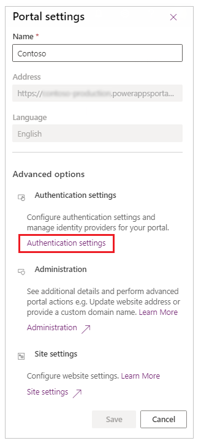
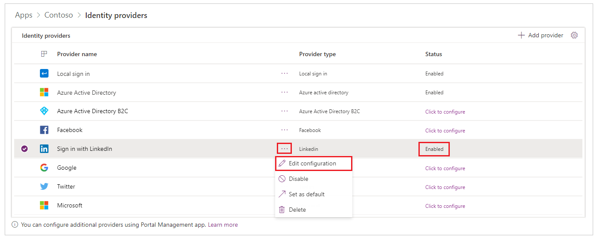
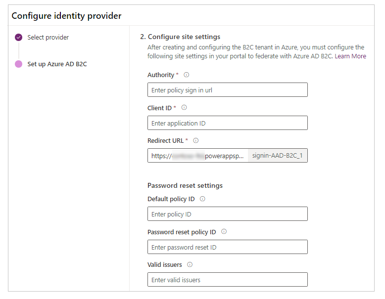
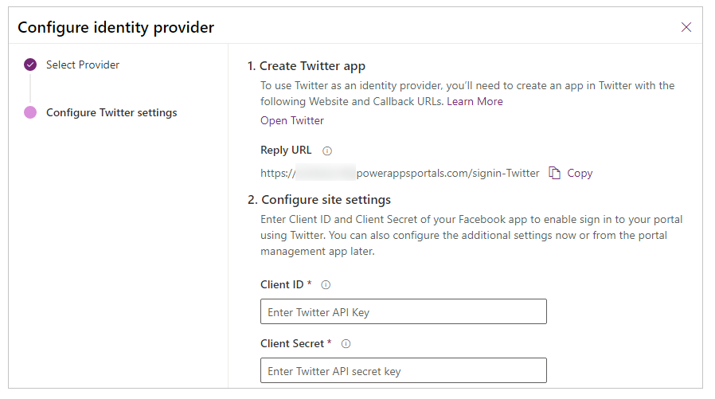
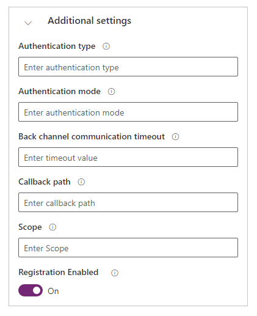

# Simplified authentication and identity provider configuration (Preview)

Setting up authentication is a core customization in any portal. Simplified identity provider configuration in Power Apps portals provides in-app guidance for identity provider setup and abstracts setup complexities. Makers and administrators can easily configure the portal for supported identity providers.

> [!NOTE]
> **Simplified authentication and identity provider configuration** feature is in preview. To access this preview feature, you must use [Power Apps preview](https://make.preview.powerapps.com). After this preview feature is *Generally Available*, you'll be able to access it from [Power Apps](https://make.powerapps.com). You can't turn this preview feature *On* or *Off* for your portal. For more information about preview features, read [Understand experimental and preview features in Power Apps](https://docs.microsoft.com/powerapps/maker/canvas-apps/working-with-experimental-preview). 

## Overview

You can enable, disable, and configure portal identity providers from [Power Apps](https://make.preview.powerapps.com) using simplified portal authentication configuration. 

After you select an identity provider, you can then go through prompts to easily select and enter provider settings instead of setting up authentication [manually](set-authentication-identity.md).

### Authentication Settings

To begin configuring identity provider for your portal: 

1. Go to [Power Apps](https://make.preview.powerapps.com).

1. Select **Apps** from left pane:

    

1. Select your portal from list of available apps.

1. Select **Settings** from top menu. You can also select **More Commands** (**...**) and then select **Settings** instead:

    

1. From the settings on the right side, select **Authentication Settings**:

    

You can see a list of identity providers that you can configure with Power Apps portal:


> [!NOTE]
> Power Apps portals supports several identity providers. However, the **Simplified authentication and identity provider configuration** feature currently only supports the identity providers listed above.

#### Authentication Settings from portal details

You can also view the **Identity providers** from the portal **Details**.

To view **Identity providers** from portal details:

1. Select your portal from list of available apps.

1. Select **Details** from top menu. You can also select **More Commands** (**...**) and then select **Details** instead:

    

The details page shows you the **Identity providers** section:


> [!NOTE]
> Selecting **See all** from portal details takes you to the list of *identity providers*.

## General authentication settings

You can configure the following general authentication settings by selecting the **Authentication Settings** when you view the **Identity providers**:


- **External login** - Turn External login for your portal *On* or *Off*. Setting to *Off* disables and hides external account registration and sign in.
<br> *More information*: External authentication is provided by the ASP.NET Identity API. In this case, account credentials and password management are handled by a third-party identity provider. And includes providers LinkedIn, Google, Twitter, Facebook, and Microsoft. Users sign up to the portal by selecting an external identity to register with the portal. Once registered, an external identity has access to the same features as a local account. See [Manage external accounts](https://docs.microsoft.com/powerapps/maker/portals/configure/set-authentication-identity#manage-external-accounts) for related site settings.
- **Open registration** - Turn [**Open registration**](configure-portal-authentication.md#open-registration) for your portal *On* or *Off*. Setting to *Off* disables and hides external account registration.

You can also go to general authentication settings from **portal details** by using **Settings** on top-right side **Identity providers** section:


### Default identity provider

You can set any identity provider as **default**. When an identity provider is set as default, users signing into the portal aren't redirected to the portal sign in page. Instead, the signing experience always defaults to sign in with the selected provider:


> [!IMPORTANT]
> If you set an identity provider as default, users won't have option to choose any other identity provider.

Once you set an identity provider as default, you can then use **Remove as default** to remove the set default identity provider. If you remove an identity provider from being the default, users will be redirected to portal sign in page and can choose from the identity providers you enable.

> [!NOTE]
> You can only set **configured** identity provider as default. **Set as default** option becomes available after you configure an identity provider.

## Add, configure, or delete an identity provider

Several identity providers are added by default that you can configure. You can add additional *Azure Active Directory B2C* providers, or configure the available OAuth 2.0 providers such as LinkedIn and Microsoft.

> [!NOTE]
> - You can't change the configuration of the [**Local sign in**](configure-portal-authentication.md) and **Azure Active Directory** providers when using this interface.
> - You can have only one instance of each identity provider type for OAuth 2.0, such as **Facebook**, **LinkedIn**, **Google**, **Twitter**, and **Microsoft**.
> - Updates to identity provider configuration may take a few minutes to reflect on the portal. To apply your changes immediately, you can [restart the portal](../admin/admin-overview.md#open-power-apps-portals-admin-center).

### Add or configure provider

To add an identity provider, select **Add provider** from **Authentication Settings**:


You can also select **Add provider** from **portal details** instead:


You can select from the available list of providers, enter a name, and then select **Next** to configure the provider settings:


> [!NOTE]
> The **Provider name** enter here is displayed on the sign in page for users as the button text when selecting this provider.

To configure a provider, select **Click to Configure** or use **More Commands** (**...**) and then select **Configure**:


> [!NOTE]
> You can use **Add provider** or **Configure** to add/configure a provider for the first time. After you configure a provider, you can edit it. You can also **left-click** on the provider name hyperlink to open the configuration options quickly.

The configuration steps after you select **Next** depend on the identity provider type you select. For example, the *Azure Active Directory B2C* configuration is different from how you setup *LinkedIn*. Refer to the provider-specific sections later in this article to configure provider of your choice.

### Edit provider

After you add/configure a provider, you can see the provider in **Enabled** state on portal settings or details.

To edit a provider, select a configured provider, select **More Commands** (**...**) and then select **Edit Configuration**:



Refer to the provider-specific sections later in this article to edit provider setting for the provider type you selected.

### Delete provider

To delete an identity provider, select **More Commands** (**...**) and then select **Delete**:


Deleting a provider deletes your provider configuration for the selected provider type, and the provider becomes available again for configuration.

> [!NOTE]
> When you delete a provider, only the portal configuration for the provider is deleted. For example, if you delete **LinkedIn** provider, your **LinkedIn** app and app configuration remains intact. Similarly, if you delete an **Azure Active Directory B2C** provider, only portal configuration gets deleted. The Azure tenant configuration for this provider doesn't change.

## Configure Azure Active Directory B2C provider

### Step 1 - Configure Azure Active Directory B2C application


To use Azure AD B2C as an identity provider, you must:

1. [**Create and configure Azure AD B2C tenant**](https://docs.microsoft.com/azure/active-directory-b2c/tutorial-create-tenant).

1. [**Register an application**](https://docs.microsoft.com/azure/active-directory-b2c/tutorial-register-applications?tabs=applications#register-a-web-application) in your tenant. Use the **Reply URL** provided in the wizard while configuring the application.

    > [!NOTE]
    > You must choose **Yes** for the **Allow implicit flow** field and enter your portal URL in the **Reply URL** field.

1. [**Create user flow**](https://docs.microsoft.com/azure/active-directory-b2c/tutorial-create-user-flows#create-a-sign-up-and-sign-in-user-flow). Optionally, [create password reset user flow](https://docs.microsoft.com/azure/active-directory-b2c/tutorial-create-user-flows#create-a-password-reset-user-flow).

### Step 2 - Configure site settings

Configure site settings and password reset policy for your Azure AD B2C provider:



- **Authority** - The issuer URL defined in the metadata of the sign up and sign in policy user flow.​
<br> To get issuer URL:

    1. Open the sign-up and sign-in user flow in created in [step 1](#step-1---configure-azure-active-directory-b2c-application).
    1. Select **Run user flow** and in the open dialog box, select the URL at the top to open the configuration document. <br> The URL refers to the *OpenID Connect identity provider configuration document*, also known as the *OpenID well-known configuration endpoint*.
    1. Copy the URL of the **Issuer** from the configuration document that opens in a new browser.  

- **Client ID​** - Enter the **Application ID** of the Azure AD B2C application created in [step 1](#step-1---configure-azure-active-directory-b2c-application).
- **Redirect URI** - Enter portal URL. <br> If your portal uses a custom domain name, you may have a different URL than the one provided here.​

#### Password resets

- **Default policy ID** - Enter the **Name** of the *sign up and sign in user flow* created in [step 1](#step-1---configure-azure-active-directory-b2c-application). The name is  prefixed with *B2C_1*.

- **Password reset policy ID** - Enter the **Name** of the *password reset user flow* created in [step 1](#step-1---configure-azure-active-directory-b2c-application). The name is  prefixed with *B2C_1*.

- **Valid issuers** - A comma-delimited list of issuer URLs for the *sign up and sign in user flow* and *password reset user flow* created in [step 1](#step-1---configure-azure-active-directory-b2c-application). 
<br> To get issuer URL:

    1. Open the sign-up and sign-in user flow in created in [step 1](#step-1---configure-azure-active-directory-b2c-application).
    1. Select **Run user flow** and in the open dialog box, select the URL at the top to open the configuration document. <br> The URL refers to the *OpenID Connect identity provider configuration document*, also known as the *OpenID well-known configuration endpoint*.
    1. Copy the URL of the **Issuer** from the configuration document that opens in a new browser.
    1. Repeat the above steps for *password reset user flow*.

For more information about site settings, read [related site settings](azure-ad-b2c.md#related-site-settings).

### Step 3 - Configure additional settings

Third step to configure Azure AD B2C identity provider is the optional additional settings:


- **Registration claims mapping​** - List of logical name/claim pairs to be used to map claim values returned from AD B2C created during sign up to the attributes in the contact record. <br> 
For example, if you have enabled *Job Title (jobTitle)* and *Postal Code (postalCode)* as **User Attributes** in your user flow and you want to update the corresponding *Contact* entity *Job Title (jobtitle)* and *Address 1: ZIP / Postal Code (address1_postalcode)* fields, enter the claims mapping as: ```jobtitle=jobTitle,address1_postalcode=postalCode```.
- **Login claims mapping** - List of logical name/claim pairs to be used to map claim values returned from AD B2C after sign in to the attributes in the contact record. <br> 
For example, if you have enabled *Job Title (jobTitle)* and *Postal Code (postalCode)* as **Application Claims** in your user flow and you want to update the corresponding *Contact* entity *Job Title (jobtitle)* and *Address 1: ZIP / Postal Code (address1_postalcode)* fields, enter the claims mapping as: ```jobtitle=jobTitle,address1_postalcode=postalCode```.
- **External logout** - Enables or disables federated sign out. When set to true, users are redirected to the federated sign out user experience when they sign out from the portal. When set to false, users are only signed out from the portal.
- **Contact mapping with email** - Specify whether contacts are mapped to a corresponding email.  When set to true, this setting associates a unique contact record with a matching email address, and then automatically assigns the external identity provider to the contact after a successful user sign in.
- **Registration Enabled**​ - Turn [**Open registration**](configure-portal-authentication.md#open-registration) for your portal *On* or *Off*. Setting to *Off* disables and hides external account registration.
- **Post Logout Redirect Uri** - URL within the portal that the user is redirected to after sign out.

Select **Confirm** to view a summary of your configuration and complete the identity configuration.

For more information about claims mapping, read [Azure AD B2C claims mappings scenarios](azure-ad-b2c.md#claims-mapping).

For more information about configuring Azure AD B2C identity provider, read [Azure AD B2C provider settings for portals](azure-ad-b2c.md#customize-the--ad-b2c-user-interface).

## Configure Facebook provider


To use [Facebook](https://developers.facebook.com) as an identity provider, you need to create an app in Facebook with a redirect URL.

The Redirect URL is used by the Facebook app to redirect users to the portal after the authentication succeeds. If your portal uses a custom domain name, you may have a different URL than the one provided here.​

**Portal site settings** for Facebook:

- **Client ID** - Unique app ID generated by Facebook for your app.​
- **Client Secret** -  App secret for your Facebook app.​

To configure **Additional settings** for Facebook, read [configure additional settings for OAuth 2 providers](#configure-additional-settings-for-oauth-2-providers).

For more information about configuring OAuth 2 providers, see [OAuth 2 provider settings for portals](configure-oauth2-settings.md).

## Configure LinkedIn provider


To use [LinkedIn](https://www.linkedin.com/developers/apps) as an identity provider, you need to create an app in LinkedIn with a redirect URL.

The Redirect URL is used by the LinkedIn app to redirect users to the portal after the authentication succeeds. If your portal uses a custom domain name, you may have a different URL than the one provided here.​

**Portal site settings** for LinkedIn:

- **Client ID** - Unique app ID generated by LinkedIn for your app.​
- **Client Secret** -  App secret for your LinkedIn app.​

To configure **Additional settings** for LinkedIn, read [configure additional settings for OAuth 2 providers](#configure-additional-settings-for-oauth-2-providers).

For more information about configuring OAuth 2 providers, see [OAuth 2 provider settings for portals](configure-oauth2-settings.md).

## Configure Google provider


To use [Google](https://console.developers.google.com/) as an identity provider, you need to create an app in Google with a redirect URL.

The Redirect URL is used by the Google app to redirect users to the portal after the authentication succeeds. If your portal uses a custom domain name, you may have a different URL than the one provided here.​

**Portal site settings** for Google:

- **Client ID** - Unique app ID generated by Google for your app.​
- **Client Secret** -   Client secret generated by Google for your app.

To configure **Additional settings** for Google, read [configure additional settings for OAuth 2 providers](#configure-additional-settings-for-oauth-2-providers).

For more information about configuring OAuth 2 providers, see [OAuth 2 provider settings for portals](configure-oauth2-settings.md).

## Configure Twitter provider



To use [Twitter](https://developer.twitter.com/apps) as an identity provider, you need to create an app in Twitter with a redirect URL.

The Redirect URL is used by the Twitter app to redirect users to the portal after the authentication succeeds. If your portal uses a custom domain name, you may have a different URL than the one provided here.​

**Portal site settings** for Twitter:

- **Client ID** - Unique app ID generated by Twitter for your app.​
- **Client Secret** -   Client secret generated by Twitter for your app.

To configure **Additional settings** for Twitter, read [configure additional settings for OAuth 2 providers](#configure-additional-settings-for-oauth-2-providers).

For more information about configuring OAuth 2 providers, see [OAuth 2 provider settings for portals](configure-oauth2-settings.md).

## Configure Microsoft provider


To use [Microsoft](https://aka.ms/AppRegistrations) as an identity provider, you need to create an app in Twitter with a redirect URL.

The Redirect URL is used by the Microsoft app to redirect users to the portal after the authentication succeeds. If your portal uses a custom domain name, you may have a different URL than the one provided here.​

**Portal site settings** for Microsoft:

- **Client ID** - Unique app ID generated by Microsoft for your app.​
- **Client Secret** -   Client secret generated by Microsoft for your app.

To configure **Additional settings** for Microsoft, read [configure additional settings for OAuth 2 providers](#configure-additional-settings-for-oauth-2-providers).

For more information about configuring OAuth 2 providers, see [OAuth 2 provider settings for portals](configure-oauth2-settings.md).

## Configure additional settings for OAuth 2 providers

Applies to authentication settings for **Facebook**, **Twitter**, **Microsoft**, **LinkedIn, and **Google**:



- **Authentication type** - The OWIN authentication middleware type:  [AuthenticationOptions.AuthenticationType](https://docs.microsoft.com/previous-versions/aspnet/mt152183(v=vs.113)?redirectedfrom=MSDN). For example, https://sts.windows.net/contoso.onmicrosoft.com/.
- **Authentication mode** - The OWIN authentication middleware mode:  [AuthenticationOptions.AuthenticationMode](https://docs.microsoft.com/previous-versions/aspnet/mt152179(v=vs.113)?redirectedfrom=MSDN).
- **Backchannel timeout** - Timeout value in milliseconds for back channel communications: [MicrosoftAccountAuthenticationOptions.BackchannelTimeout](https://docs.microsoft.com/previous-versions/aspnet/mt174421(v=vs.113)?redirectedfrom=MSDN).
- **Callback path** - The request path within the application's base path where the user-agent will be returned: [MicrosoftAccountAuthenticationOptions.CallbackPath](https://docs.microsoft.com/previous-versions/aspnet/mt174433(v=vs.113)?redirectedfrom=MSDN).​
- **Sign in As authentication type** - The name of another authentication middleware that will be responsible for actually issuing a user Claims Identity: [MicrosoftAccountAuthenticationOptions.SignInAsAuthenticationType](https://docs.microsoft.com/previous-versions/aspnet/mt174430(v=vs.113)?redirectedfrom=MSDN).​
- **Scope** - A comma-separated list of permissions to request: [MicrosoftAccountAuthenticationOptions.Scope](https://docs.microsoft.com/previous-versions/aspnet/mt174435(v=vs.113)?redirectedfrom=MSDN).​
- ​**Registration Enabled**​ - Enables or disables the registration requirement for the existing identity provider. When disabled, the user is denied registration with an error if no contact record exists for the user. When enabled, user registration is allowed for a new user only if the Site Setting Authentication/Registration/Enabled is set to true.​

For more information, read [OAuth2 site settings](configure-oauth2-settings.md#create-site-settings-by-using-oauth2).

### See also

- [Set authentication identity for a portal](set-authentication-identity.md)
- [Configure Azure AD B2C provider settings](azure-ad-b2c.md)
- [Configure OAuth2 provider settings](configure-oauth2-settings.md)
