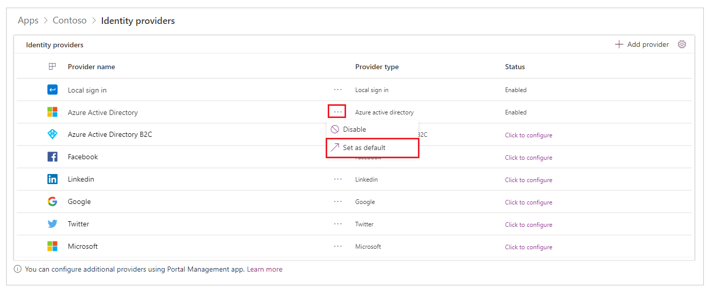
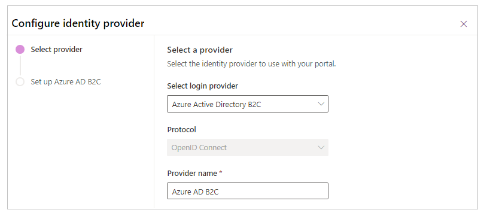
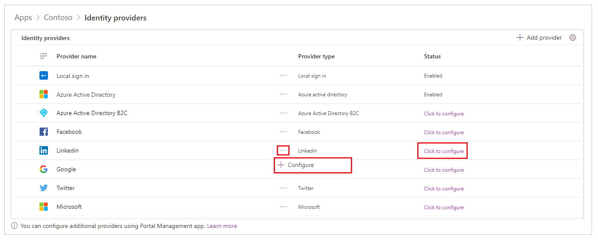

# Simplified portal authentication configuration (Preview)

Setting up authentication provider is a core customization in any portal. Simplified portal identity provider configuration provides in-app guidance for identity provider setup and abstracts setup complexities. This helps makers and administrators quickly and easily perform setup for supported identity providers and also reduce usual configuration errors.

> [!IMPORTANT]
> **Simplified portal authentication** feature is in preview. For more information about preview features, read [Understand experimental and preview features in Power Apps](https://docs.microsoft.com/powerapps/maker/canvas-apps/working-with-experimental-preview).

## Overview

You can enable, disable and configure portal identity providers from [Power Apps](https://make.powerapps.com) using simplified portal authentication configuration. After you select an identity provider, you can then go through prompts to easily select and enter provider settings instead of setting up authentication [manually](set-authentication-identity.md).

### Authentication Settings

To begin configuring identity provider for your portal: 

1. Go to [Power Apps](https://make.powerapps.com).

1. Select **Apps** from left pane:

    

1. Select your portal from list of available apps.

1. Select **Settings** from top menu. You can also select **More Commands** (**...**) and then select **Settings** instead:

    

1. From the settings on the right side, select **Authentication Settings**:

    

You can see a list of identity providers that you can configure with Power Apps portal:


#### Authentication Settings from portal details

You can also view the **Identity providers** from the portal **Details**. 

To view **Identity providers** from portal details:

1. Select your portal from list of available apps.

1. Select **Details** from top menu. You can also select **More Commands** (**...**) and then select **Details** instead:

    

The details page shows you the **Identity providers** section:


> [!NOTE]
> Selecting **See all** from portal details takes you to the **Authentication Settings** page.

## General authentication settings

You can turn the following general authentication settings **On** or **Off** by selecting the **Authentication Settings** when you view the **Identity providers**:


- **External login** - Turn [**External login**](set-authentication-identity.md#manage-external-accounts) for your portal *On* or *Off*.
- **Open registration** - Turn [**Open registration**](configure-portal-authentication.md#open-registration) for your portal *On* or *Off*.

You can also go to general authentication settings from **portal details** by selecting **settings** on top right in **Identity providers** section:


## Default identity provider

You can set any identity provider as **default**. When an identity provider is set as default, users signing into the portal always default to sign in with this provider first:



> [!NOTE]
> You can only set **configured** identity provider as default. **Set as default** option becomes available after you configure an identity provider.

## Add, configure or delete an identity provider

By default, you have the available identity providers added that you can configure. You can still add the identity provider but the added identity provider replaces the provider of same type available by default.

For example, if you want to add a new **LinkedIn** identity provider named **Contoso LinkedIn**, it updates the default **LinkedIn** provider with your configuration. And **LinkedIn** provider gets changed to **Contoso LinkedIn**.. Alternatively, you can also add a new identity provider and select the provider as **LinkedIn**.

If you delete the **Contoso LinkedIn** identity provider you configured, you can then add or configure the **LinkedIn** identity provider again.

> [!NOTE]
> - The identity providers [**Local sign in**](configure-portal-authentication.md) and **Azure Active Directory** can be only **Enabled** or **Disabled**.
> - You can have only one instance of each identity provider type.

### Add or configure provider

To add an identity provider, select **Add provider** from **Authentication Settings**:


You can also select **Add provider** from **portal details** instead:


You can select from the available list of providers, enter a name and then select **Next** to configue the provider settings:



Similarly, to configure a provider, select **Configure**:



> [!NOTE]
> You can use **Add provider** or **Configure** to add/configure a provider for the first time. After you configure a provider, you can edit it.

The configuration steps after you select **Next** depend on the identity provider type you select. For example, the *Azure Active Directory B2C* configuration is different from how you setup *LinkedIn*. Refer to the provider-specific sections later in this article to configure provider of your choice.

### Edit provider

After you add/configure a provider, you can see the provider in **Enabled** state on portal settings or details.

To edit a provider, select a configured provider, select **More Commands** (**...**) and then select **Edit Configuration**:


Refer to the provider-specific sections later in this article to edit provider setting for the provider type you selected.

### Delete provider

To delete an identity provider, go to **Authentication Settings** and then select **Delete** from the top menu. You can also use **More Commands** (**...**) and then select **Delete**:


Deleting a provider deletes your provider configuration for the selected provider type, and the deleted provider gets reset. 

For example, the **Contoso LinkedIn** provider after deleted is reset with default **LinkedIn** provider.

> [!NOTE]
> When you delete a provider, only the portal configuration for the provider is deleted. For example, if you delete **LinkedIn** provider, your **LinkedIn** app and app configuration remains intact. Similarly, if you delete an **Azure Active Directory B2C** provider, only portal configuration gets deleted. The Azure tenant configuration for this provider doesn't change.

## Azure Active Directory B2C

### Step 1 - Configure Azure Active Directory B2C application


To use Azure AD B2C as an identity provider, you must create and configure Azure AD B2C tenant. And then, [register an application](https://docs.microsoft.com/azure/active-directory-b2c/tutorial-register-applications?tabs=applications#register-a-web-application) in your tenant.

For more details, read [create and configure Azure AD B2C application](azure-ad-b2c.md#use-azure-ad-b2c-as-an-identity-provider-for-your-portal).

### Step 2 - Configure site settings

Configure site settings and password reset policy for your Azure AD B2C provider:


- **Authority** - The issuer URL defined in the metadata of the sign up & sign in policy user flow.​
- **Client ID​** - The ID associated with the application created in Azure Active Directory B2C tenant to be used with the portal.​
- **Redirect URI** - The location where Azure AD B2C will send an authentication response.

#### Password resets

- **Default policy ID** - ID of the sign in or sign up user flow created in Azure Active Directory B2C.​

- **Password reset policy ID** - ID of the password reset user flow created in Azure Active Directory B2C.​

- **Valid issuers** - A comma-delimited list of issuers that includes the issuer of the sign up or sign in user flow, and the issuer of the password reset user flow.

For a complete list of site settings, read [related site settings](azure-ad-b2.mdc#related-site-settings).

### Step 3 - Configure additional settings

Third step to configure Azure AD B2C identity provider is the optonal additional settings:


- **Registration claims mapping​** - List of logical name/claim pairs to be used to map claim values returned from AD B2C created during sign up to the attributes in the contact record. Enter the values in the following format: ```attribute1=claim1,attribute2=claim2,attribute3=claim3​```
- **Login claims mapping** - List of logical name/claim pairs to be used to map claim values returned from AD B2C after sign in to the attributes in the contact record. Enter the values in the following format: ```attribute1=claim1,attribute2=claim2,attribute3=claim3​```
- **External logout** - Enables or disables federated sign out. When set to true, users are redirected to the federated sign out user experience when they sign out from the portal. When set to false, users are only signed out from the portal.
- **Contact mapping with email** - Specify whether contacts are mapped to a corresponding email.  When set to true, this setting associates a unique contact record with a matching email address, and then automatically assigns the external identity provider to the contact after a successful user sign in.​- **Registration Enabled**​ - Enables or disables the registration requirement for the existing identity provider. When disabled, the user is denied registration with an error if no contact record exists for the user. When enabled, user registration is allowed for a new user only if the Site Setting Authentication/Registration/Enabled is set to true.​
- **Post Logout Redirect Uri** - URL within the portal that the user is redirected to after sign out.

Select **Confirm** to view a summary of your configuration and complete the identity configuration.

For more information about claims mapping, read [Azre AD B2C claims mappings scenarios](azure-ad-b2c.md#claims-mapping).

For more information about configuring Azure AD B2C identity provider, read [Azure AD B2C provider settings for portals](azure-ad-b2c.md#customize-the--ad-b2c-user-interface).

## Facebook

Content here

## LinkedIn

Content here

## Google

Content here

## Twitter

Content here

## Microsoft

Content here

### See also

- [Set authentication identity for a portal](set-authentication-identity.md)
- [Configure Azure AD B2C provider settings](azure-ad-b2c.md)
- [Configure OAuth2 provider settings](configure-oauth2-settings.md)
