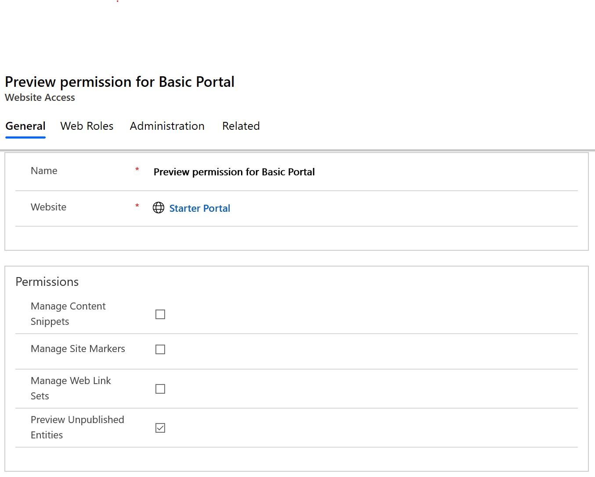

# Create website access permissions

Website Access Permissions is a permission set, associated with a [web role](create-web-roles.md), that permits front-side editing of the various content managed elements within the portal other than just web pages. The permission settings determine which components can be managed in the portal.

| Name                         | Description                                                                                      |
|------------------------------|--------------------------------------------------------------------------------------------------|
| Manage Content Snippets      | Allows the editing of Snippet controls.                                                          |
| Manage Site Markers          | Allows the editing of hyperlinks that use Site Markers                                           |
| Manage Web Link Sets         | Allows the editing of [web link sets](manage-web-links.md), including adding an removing web links from a web link set. |
| Preview Unpublished Entities | Allows the viewing of portal-exposed entities that have a publishing state of Draft.             |
|||

To create a website access permission and add it to a web role:

1. Open the [Portal Management app](configure-portal.md).

2. Go to **Portals** > **Website Access Permissions**.

3. Select **New**.

4. Under **General**, enter name, website, and select the required permissions.

5. Under **Web Roles**, select and add the web role to associate the permission with.

6. Save the changes.

      
