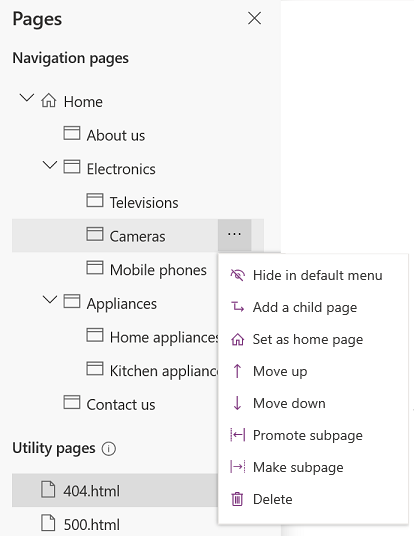

# Create and manage webpages

A webpage is a document that is identified by a unique URL in a website. It is one of the core objects of the website and builds a hierarchy of the website through parent and child relationships to other webpages.

## Create webpage

1.  [Edit the portal](manage-existing-portals.md#edit) to open it in the maker experience.  

2.  From the command bar, select **New page** and choose the page template.

    

3.  In the **Properties** pane, enter the following information:

    - **Name**: Name of the page. This value is also used as the title of the page.

    - **Partial URL**: The URL path segment used to build the portal URL of this page.

    - **Template**: Page template used to render this page on the portal. If required, you can choose another template from the list.

    

The webpages you create are added and their hierarchy are displayed in the **Pages** pane. To view the **Pages** pane, select **Pages**  from the toolbelt on the left side of the screen.  

Let's say you have created a few webpages for your portal. The page hierarchy looks as follows:

  

The navigation on the website is created automatically based on the hierarchy of the webpages.

  

## Manage webpage

1.  [Edit the portal](manage-existing-portals.md#edit) to open it in the maker experience.  

2.  Select **Pages**  from the toolbelt on the left side of the screen.  

3.  Hover over the page you want to manage and select the **Ellipsis** button (…) for the webpage you want to manage.

4.  Select the required action from the context menu:

    - **Hide from navigation**: Hide the page from being displayed in the sitemap.

    - **Add a child page**: Add a child page to the selected page. The child page inherits the page template of its parent page.

    - **Set as home page**: Set the page as the home page. The URL of the new home page is set to the root of the website and URL of the old page is updated accordingly.

    - **Move up**: Move the page up in hierarchy.

    - **Move down**: Move the page down in hierarchy.

        > [!NOTE]
        > Moving a page up or down is supported among the pages at the same level.

    - **Promote subpage**: Decrease the indent and make the child page at the level of the previous page in the hierarchy.

    - **Make subpage**: Increase the indent and make the page a child page of the previous page in the hierarchy.

    - **Delete**: Delete the page.

      

