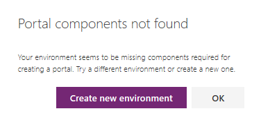
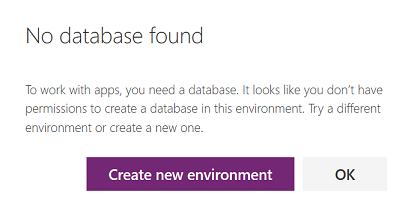

# Create a portal in PowerApps

[!include[cc-beta-prerelease-disclaimer](../../includes/cc-beta-prerelease-disclaimer.md)]

With the capability to build a portal in PowerApps, you can create a website for external and internal users enabling them to interact with data stored in Common Data Service.

These are some benefits of creating a portal:

- Because the data is stored in Common Data Service, you don't need to create a connection from PowerApps as you do with data sources such as SharePoint, Dynamics 365 for Customer Engagement apps, or Salesforce. You need only to specify the entities that you want to show or manage in the portal.

- You can design the portal through the WYSIWYG maker experience by adding and configuring components on the webpages.

To create a portal:

1.  Sign in to [PowerApps](http://web.powerapps.com).  

2.  Under **Make your own app**, select **Portal from blank**.

3.  In the Portal components not found window, select **Create new environment**.

      

    > [!NOTE]
    > If you try to create a portal in an environment that contains previous version of Common Data Service database or doesn't contain a Common Data Service database or you don't have permissions to create a new database, following message is displayed instead:
    >
    >   

4.  In the **New environment** pane, enter a name for the environment, and then select a region and environment type from the drop-down lists. You cannot change the region once the environment is created. When you're done, select **Create environment**.

      

5.  Once the environment is created, you'll receive a confirmation message in the dialog box, and you'll be prompted to create a database. Select **Create database** to enable access to Common Data Service.

    > [!NOTE]
    > The prompt to create a database might not be displayed automatically. In this case, you must go to the new environment and select the **Portal from blank** tile again.

      

6.  Select the currency and language for the data stored in the database. You cannot change the currency or language once the database is created. When you're done, select **Create my database**. The database is created with the starter portal that enables you to quickly get started with sample content once the portal is provisioned.

      

    It might take several minutes to create the database on Common Data Service. Once the database is created, the new environment is selected in the list of environments on the PowerApps home page and the Portal Management app is created. This app is not the actual portal but a model-driven companion app that allows you to perform advance administration activities. You can now proceed with creating the portal for designing the external-facing website.

      

    > [!NOTE]
    > Since database creation may take a few minutes to get completed, you must not select **Portal from blank** tile again on the PowerApps home page. If you select the tile, the prompt to create a new database is displayed. It is recommended not to create the database again. To check the status of database creation, go to [PowerApps Admin Center](https://admin.powerapps.com/environments) and select your environment.  

7.  Under **Make your own app**, select **Portal from blank**.

    > [!NOTE]
    > If the database is created and you are still getting the create database prompt, you must refresh the PowerApps home page before selecting the **Portal from blank** tile.

8.  In the **Portal from blank** window, enter a name for the portal and address for the website, and select a language from the drop-down list. When you're done, select **Create**.

      

    Once the portal is created, you are redirected to the maker experience. You can use the maker experience to create and customize your website.

      

    More information: Add and manage webpages, Compose a page, and Work with templates.

