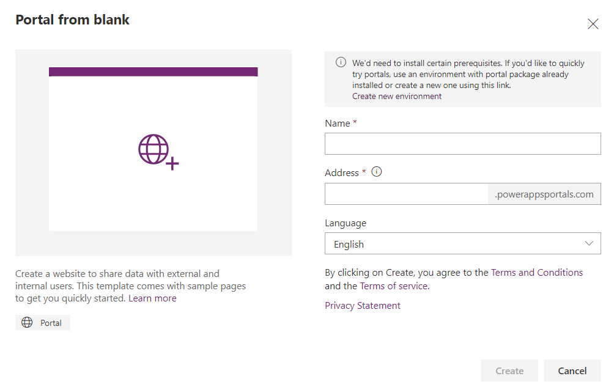
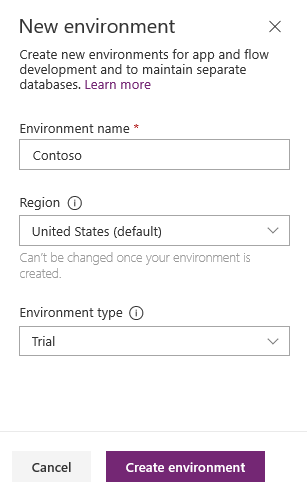
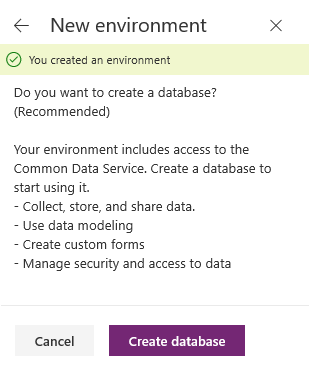
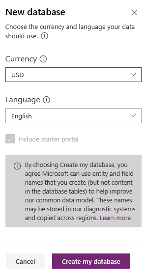
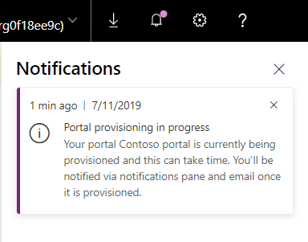
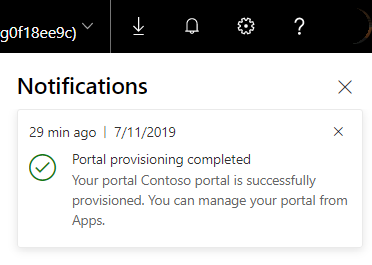

# Create a Common Data Service starter portal

[!include[cc-beta-prerelease-disclaimer](../../includes/cc-beta-prerelease-disclaimer.md)]

With the capability to build a portal in PowerApps, you can create a website for external and internal users enabling them to interact with data stored in Common Data Service.

These are some benefits of creating a portal:

- Because the data is stored in Common Data Service, you don't need to create a connection from PowerApps as you do with data sources such as SharePoint, Dynamics 365 apps, or Salesforce. You need only to specify the entities that you want to show or manage in the portal.

- You can design the portal through the WYSIWYG portal designer by adding and configuring components on the webpages.

You can create a portal either in a new environment or in your existing environment.

If you choose to create your portal in a new environment using the **Create new environment** link, the required portal pre-requisites such as entities, data, and a starter portal template are installed when the environment is created. In this method, the portal is provisioned in a few minutes.

If you choose to create your portal in an existing environment without portal pre-requisites, the pre-requisites are installed first and then the portal is created. In this method, the portal provisioning can take some time and you’ll be notified when the portal is provisioned.

You can create Common Data Service starter portal or Dynamics 365 Portal in PowerApps based on the selected environment.

More information on working with environments: [Working with environments and Microsoft PowerApps](https://docs.microsoft.com/en-us/powerapps/maker/canvas-apps/working-with-environments)

More information on available portal templates: [Portal templates](portal-templates.md)

To create a portal:

1.  Sign in to [PowerApps](http://web.powerapps.com).  

2.  Under **Make your own app**, select **Portal from blank (preview)**.

3.	If the selected environment does not contain portal pre-requisites, a message is displayed in the **Portal from blank (preview)** window suggesting you select another environment or create a new one.

    > [!div class=mx-imgBorder]
    > 

4.	If you choose to proceed with the current environment, enter the required information in the window as mentioned in the following steps. If you choose to create a new environment, see [Create new environment](#create-new-environment).

5.  In the **Portal from blank (preview)** window, enter a name for the portal and address for the website, and select a language from the drop-down list. When you're done, select **Create**.

    > [!div class=mx-imgBorder]
    >   

After you select **Create**, the portal will begin provisioning and the provisioning status is displayed through [notifications](#portal-provisioning-notifications).

If you have created your portal in the environment that doesn't have portal pre-requisites installed, the provisioning status is also displayed in the grid:

> [!div class=mx-imgBorder]
> 

After the portal is provisioned successfully, the status is updated and the portal is displayed in the grid:

> [!div class=mx-imgBorder]
> 

To edit the portal in portal designer, see [Edit a portal](manage-existing-portals.md#edit).

> [!NOTE]
> - You can create a maximum of five portals in a tenant. However, there can only be one portal of each type created in an environment.
> - If you don't have sufficient privileges to provision a portal, an error is displayed. You must have System Administrator or at least System Customizer role in Common Data Service to create a portal. You must also have the **Access Mode** set to **Read-Write** under **Client Access License (CAL) Information** in the user record.

## Create new environment

Follow these steps when you create an environment using the option provided in the **Portal from blank (preview)** window.

1.  In the **New environment** pane, enter a name for the environment, and then select a region and environment type from the drop-down lists. You cannot change the region once the environment is created. When you're done, select **Create environment**.

    > [!div class=mx-imgBorder]
    >   

2.  Once the environment is created, you'll receive a confirmation message in the dialog box, and you'll be prompted to create a database. Select **Create database** to enable access to Common Data Service.

    > [!NOTE]
    > The prompt to create a database might not be displayed automatically. In this case, you must go to the new environment and select the **Portal from blank** tile again.

    > [!div class=mx-imgBorder]
    >   

3.  Select the currency and language for the data stored in the database. You cannot change the currency or language once the database is created. When you're done, select **Create my database**. The database is created with the starter portal that enables you to quickly get started with sample content once the portal is provisioned.

    > [!NOTE]
    > The **Include starter portal** option is available only when you create an environment using the option provided in the **Portal from blank (preview)** window. This option is not available when you create an environment from PowerApps admin center.

    > [!div class=mx-imgBorder]
    >  

    It might take several minutes to create the database on Common Data Service. Once the database is created, the new environment is selected in the list of environments on the PowerApps home page and the Portal Management app is created. This app is not the actual portal but a model-driven companion app that allows you to perform advance administration activities. You can now proceed with creating the portal for designing the external-facing website.

    > [!div class=mx-imgBorder]
    > 

4. After creating the environment and database, under **Make your own app**, select **Portal from blank (preview)**. 

    > [!NOTE]
    > If the database is created and you are still getting the create database prompt, you must refresh the PowerApps home page before selecting the **Portal from blank (preview)** tile.

## Portal provisioning notifications

After you select **Create**, the portal will begin provisioning and the provisioning status is displayed through notifications.

**Notification as a toast**

The following notification is displayed when you select **Create** to provision the portal.

> [!div class=mx-imgBorder]
>  

**Notifications in the Notifications pane**

Once the provisioning request is successfully placed, the following notifications are displayed in the **Notification** pane.

Notification shown for provisioning in progress

> [!div class=mx-imgBorder]
>  

Notification shown for provisioning successfully completed

> [!div class=mx-imgBorder]
>  

If the portal provisioning fails, the notifications are displayed similarly.
  

