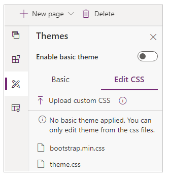
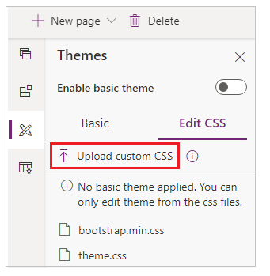

# Edit CSS for themes in Power Apps portal

Cascading Style Sheets (CSS) allows you to control the formatting of your website. By default, bootstrap.min.css and theme.css files are available. You can edit the existing CSS files and upload new CSS files. When you upload a new CSS file, it will be available as a web file in the Portal Management app.

> [!NOTE]
> Power Apps portals are based on Bootstrap 3.3.x with the exception of [Event portal](https://docs.microsoft.com/dynamics365/marketing/developer/event-management-web-application). Portal developers should not replace Bootstrap 3 with other CSS libraries as some of the scenarios in Power Apps portals are dependent on Bootstrap 3.3.x.

To open a CSS in code editor:

1.  [Edit the portal](manage-existing-portals.md#edit) to open it in Power Apps portals Studio.  

2.  Select **Theme**  from the toolbelt on the left side of the screen. The available themes are displayed.  

    

3.  Select the required CSS to open it in the code editor.

4.  Edit the code and save the changes.

To upload a new CSS file:

1.  [Edit the portal](manage-existing-portals.md#edit) to open it in Power Apps portals Studio.  

2.  Select **Theme**  from the toolbelt on the left side of the screen. The available themes are displayed.  

3. Select **Upload custom CSS**.

     

4. Browse and select the CSS file to upload.

