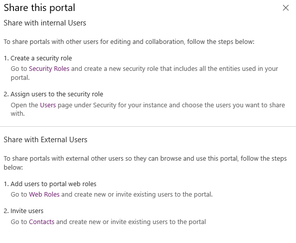

# Share

Share your portal with internal or external users. Follow the steps mentioned in the **Share this portal** pane.

  

## Share with internal users

To share the portal with internal users you must first create a security role and then assign users to the security role so they can use the portal.

> [!NOTE]
> As a user in Common Data Service, if you do not have appropriate privileges on portal entities, you might see errors such as “You do not have access to view solutions in this environment.” or “You do not have access to view Website in this environment”. For this preview, it is recommended that you are either in a **System Administrator** or at least a **System Customizer** security role in the corresponding Common Data Service database.

### Step 1: Create a security role

1.  In the **Share this portal** pane, under **Create a security role**, select **Security Roles**. A list of all the configured security roles is displayed.

2.  On the Actions toolbar, select **New**.

3.  In the **New Security Role** window, enter the role name.

4.  Set the privileges for all the entities used in your portal.

5.  When you have finished configuring the security role, on the toolbar, select **Save and Close**.

For information on security roles and privileges, see [Security roles and privileges](https://docs.microsoft.com/en-us/dynamics365/customer-engagement/admin/security-roles-privileges).  

### Step 2: Assign users to the security role

1.  In the **Share this portal** pane, under **Assign users to the security role**, select **Users**. A list of all users is displayed.

2.  Select the user that you want to assign a security role to.

3.  Select **Manage Roles**.

    > [!NOTE]
    > If you are unable to see the **Manage Roles** button on the command bar, you must change the client by setting forceUCI to 0 in the URL. For example, https://&lt;org\_url&gt;/main.aspx?pagetype=entitylist&etn=systemuser&forceUCI=0

4.  In the **Manage User Roles** dialog box, select the security role that you created earlier, and then select **OK**.

## Share with external users

Your portal should work anonymously and should be accessible by the external users. If you want to try advanced capabilities for managing roles and permissions for external users, see [Configure a contact for use on a portal](https://docs.microsoft.com/en-us/dynamics365/customer-engagement/portals/configure-contacts), [Invite contacts to your portals](https://docs.microsoft.com/en-us/dynamics365/customer-engagement/portals/invite-contacts), [Create web roles for portals](https://docs.microsoft.com/en-us/dynamics365/customer-engagement/portals/create-web-roles), [Assign entity permissions](https://docs.microsoft.com/en-us/dynamics365/customer-engagement/portals/assign-entity-permissions).  

