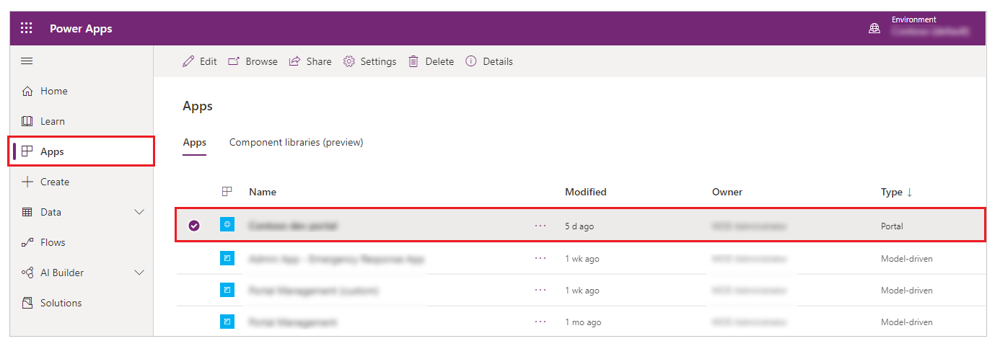
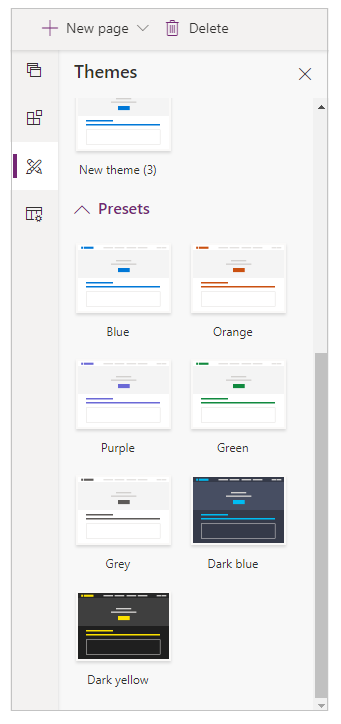
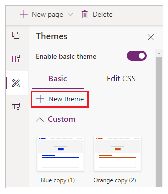
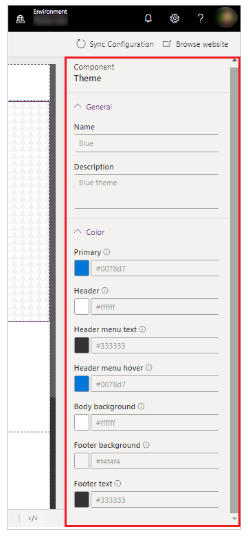
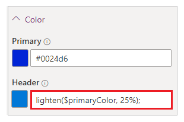

# Overview of themes in Power Apps portals

In Power Apps portals<!--Via Cloud Style Guide, the feature name is plural lowercase "portals"; a "portal" is a single instance.-->, the **Enable basic theme** feature is set to **Off**. When you turn on this feature, you can use default themes called **Presets**. You can also create copies of the preset themes for additional customization.

In this article, you'll walk through the basic themes feature. For advanced theme customization, see [Edit CSS](edit-css.md).

> [!IMPORTANT]
> The basic theme feature is in preview. For more information about preview features, see [Understand experimental and preview features in Power Apps](https://docs.microsoft.com/powerapps/maker/canvas-apps/working-with-experimental-preview).

## Enable basic themes for existing portals (Preview)

1. Sign in to [Power Apps](https://make.powerapps.com).

1. Select **Apps** from the left navigation pane, and then select the portal.

    

1. Select **More Commands** (**...**), and then select **Edit**.

    

1. Select **Themes** from the left navigation pane, and then turn on the **Enable basic theme** toggle.

    

## Change a preset theme

You can set any existing theme in your portal to a default theme.<!--The title "Change a preset theme" is confusing to me. You aren't actually changing the preset, are you? It's more that you're changing a theme that already existed in your portal to one of these new preset, default themes? -->

1. Sign in to [Power Apps](https://make.powerapps.com).

1. Select **Apps** from the left navigation pane, and then select the portal.

1. Select **More Commands** (**...**), and then select **Edit**.

1. Select **Theme** from the components pane.<!--It would be good to turn this into a small graphic so we could use it inline. -->

    

1. Select any default theme from the available presets (in our example, we selected **Green**).

    

The selected theme is applied to your portal.


## Create a new theme

1. Sign in to [Power Apps](https://make.powerapps.com).

1. Select **Apps** from the left navigation pane, and then select the portal.

1. Select **More Commands** (**...**), and then select **Edit**.

1. Select **Theme** from the components pane.

1. Select **New Theme**.

    

## Edit theme details

You can update theme name, description, color, and other typography settings in Power Apps Studio. 

1. Sign in to [Power Apps](https://make.powerapps.com).

1. Select **Apps** from the left navigation pane, and then select the portal.

1. Select **More Commands** (**...**), and then select **Edit**.

1. Select **Theme** from the components pane.

1. Select the theme that's currently applied, or select a new theme from the presets.
   Selecting a theme opens the details pane on the right side of your workspace.

    

1. Edit theme details such as name, description, and color for different areas.

    |Color option | Affected area |
    | --- | ---  |
    | Primary | Button and link colors. |
    | Header | Header background color. |
    | Header menu text | Text color for the header menu. |
    | Header menu hover | Background color of menu items when they're hovered over. |
    | Body background |  Background color of the body section.​ |
    | Footer background | Background color for the footer.​ |
    | Footer text | Footer text color.​ |

1. Save and publish the changes.

## Copy a preset theme

1. Sign in to [Power Apps](https://make.powerapps.com).

1. Select **Apps** from the left navigation pane, and then select the portal.

1. Select **More Commands** (**...**), and then select **Edit**.

1. Select **Theme** from the components pane.

1. Select the theme from presets that you want to copy, select **...**, and then select **Save as Copy**.

    

1. Update the theme details as described in the preceding section, and then save the theme.

## Sass variables

[Sass](https://sass-lang.com/) is a stylesheet language with fully CSS-compatible syntax. When you enable the basic theme feature, you can use [Sass variables](https://sass-lang.com/documentation/variables) instead of values to configure theme colors.

For example, if you want the **Header** color to be 25 percent lighter than the **Primary** color, you can use the following value instead of a specific color:

```
lighten($primaryColor, 25%);
```



You can use the following Sass variables with basic themes:

|Color option | Sass variable name |
| - | - |
| Primary | ```$primaryColor``` |
| Header | ```$headerColor``` |
| Header menu text | ```$headerMenuTextColor``` |
| Header menu hover | ```$headerMenuHoverColor``` |
| Body background |  ```$bodyBackground``` |
| Footer background | ```$footerColor​``` |
| Footer text | ```$footerTextColor``` |

### Sass variable order

Sass variables work from top to bottom. You can set the *Header* color to ```lighten($primaryColor, 25%);```. But, you can't set the *Primary* color to ```lighten($headerColor, 25%);``` because *Header* is below *Primary* in the list of color options.

## Basic theme considerations

- You can't have two themes with the same theme name or the same theme file name. 
- Any color value you enter manually must be for a valid color.
- Changing the CSS for preset themes isn't supported.
- The recommended theme foreground and background color contrast ratio is 4.5:1, for accessibility.

### Next steps

[Edit theme CSS](edit-css.md)
