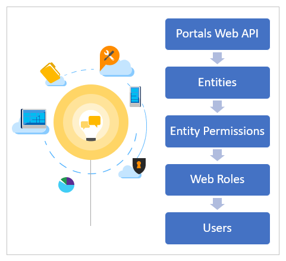

# Portals Web API

## Overview

Portals Web API enables building a richer user experience inside Power Apps portals pages. You can use Web API to create, read, update, and delete (CRUD) operations across all Common Data Service entities from your portal pages.

For example, you can create a new account, update a contact, or change the [entity permissions](configure/assign-entity-permissions.md) for a product using portals Web API instead of using Portal Management app.

> [!IMPORTANT]
> Portals Web APIs are build for creating rich user experience inside portal pages. And it is not optimized for 3rd party services or application integration.
> Portals Web API operations are limited to entities related to data. For example, entities such as Accounts, Contacts or your custom entity. Configuration of entity metadata, or portal configuration entity data isn't supported when using the portals Web API. For example, configuring portals entities such as adx_contentsnippet, adx_entityform or adx_entitylist isn't supported using portals Web API. 

> [!Known bug]
> With current release Web APIs operations are not block on configuration entities, however this issue will be fix in upcoming releases. 

## Web API operations

Portals Web API offers a subset of capabilities for Common Data Service operations that you can do using Common Data Service API. We have kept the API format as same as possible, so user will have less learning curve.

| Web API operations | Available in portals Web API |
| - | - |
| [Create an entity](./webapi-api-perform-operations.md) | &check; |
| [Retrieve an entity](./webapi-api-perform-operations.md) | &check; |
| [Update and delete entities](./webapi-api-perform-operations.md) | &check; |
| [Associate and disassociate entities](./webapi-api-perform-operations.md) | &check; |

## Site settings for Web API

You must enable site setting to enable the portals Web API for your portal. Also, you can configure field-level Web API that determines the entity fields that can or can't be modified using portals Web API.

When you configure inner error site setting, the Web API response includes **what?** @Neeraj: What is inner error?

| Site Setting Name | Description|
| - |- |
| *webapi/\<entity name\>/enabled* | Enables or disables OData API for \<entity name\>.   **Default:** `False`   **Valid values:** `True, False` |
| *webapi/\<entity name\>/fields*  | Defines the comma-separated list of attributes that can be modified using Web API.    **Possible values:**    - *All attributes:* `*`   - *Specific attributes:* `attr1,attr2,attr3`   **Note**: **\*** takes precedence over individual attribute names. For example, **\*** is considered and all attributes are allowed if the value is: `attr1,*,attr3`.   **Important**: Mandatory site setting. When this setting is missing, you'll see this error: *No fields defined for this entity.* |
| *webapi/error/innererror* | Enables or disables innererror.   **Default:** `False`   **Valid values:** `True, False`

> [!NOTE]
> Site settings must be set to **Active** for changes to take effect.

For example, to expose OData API for case entity where authenticated
users are allowed to perform CRUD operation on this entity, the site settings are:

| Site Setting Name | Site Setting Value|
| - |- |
| *webapi/incident/enabled* | true |
| *webapi/incident/fields* | attr1,attr2,attr3 |

## Security with portals Web API

You can configure record-based security to individual records in portals using [entity permissions](configure/assign-entity-permissions.md). Portals Web API access entity records and follow the entity permissions given to users through the associated [web role](configure/create-web-roles.md).

## Authenticating portals Web API requests

You don't need to include authentication code since authentication and authorization are managed by the application session. All POST call must include CSRF token.

## General Data Protection Regulation (GDPR)

All request header should have contact id passed for auditing purpose. For
anonymous user, it will be passed as `null`.

If audit logging is enabled, then user can see all the audit events in [Office 365 audit log](https://protection.office.com/unifiedauditlog).

More information: [Enable and use Activity Logging](https://docs.microsoft.com/power-platform/admin/enable-use-comprehensive-auditing), [Export, configure, and view audit log records](https://docs.microsoft.com/microsoft-365/compliance/export-view-audit-log-records).

## Web API and licensing

Portals uses existing license behavior, that includes the API calls
for each user type. For more information about API limits for Power Apps portals, download and read [Microsoft Power Apps and Power Automate Licensing Guide](https://go.microsoft.com/fwlink/?linkid=2085130).

## Next steps

[Perform Web API operations](web-api-perform-operations.md)

### See also

- [Compose HTTP requests and handle errors](web-api-http-requests-handle-errors.md)
