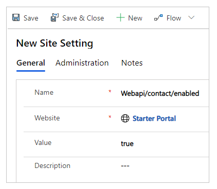
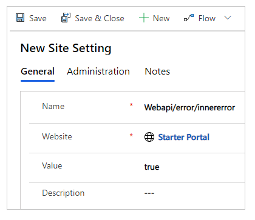
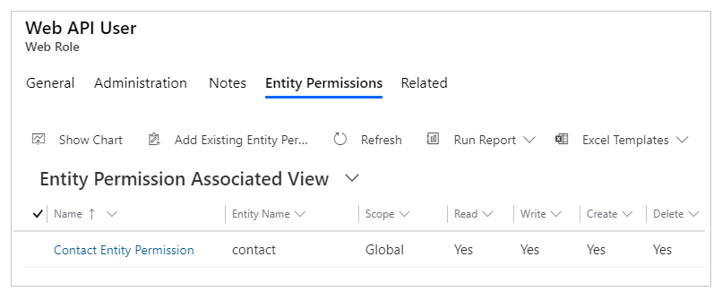
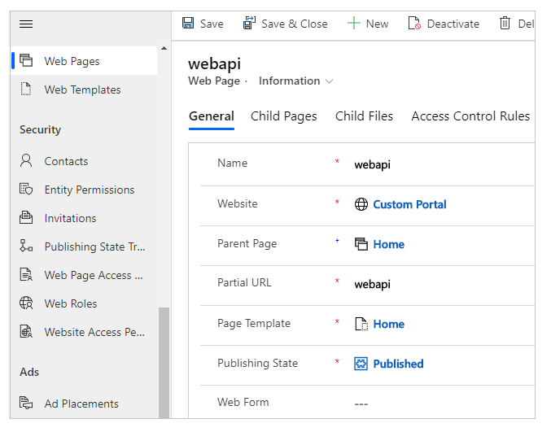
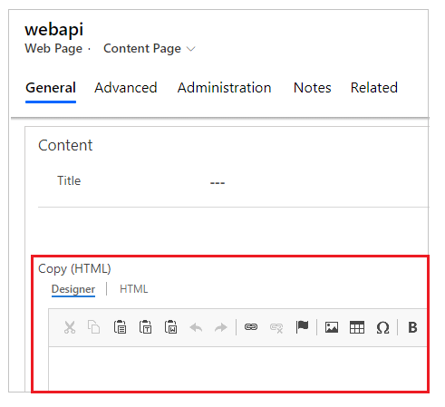
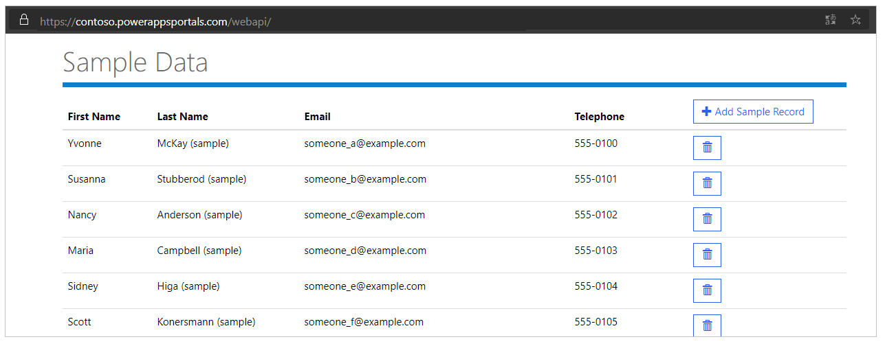

# Portals operations using the Web API (Preview)

[This article is pre-release documentation and is subject to change.]

You can perform the [available Web API operations](web-api-overview.md#web-api-operations) in portals. Web API operations consist of [HTTP requests and responses](../../developer/common-data-service/webapi/compose-http-requests-handle-errors.md). This article shows sample operations, methods, URI, and the sample JSON you can use in the HTTP request.

> [!IMPORTANT]
> This feature is in preview. For more information, see [experimental and preview features](../canvas-apps/working-with-experimental-preview.md).

## Create an entity record

### Basic Create

<table style="text-align:left">
  <tr>
    <th>Operation</th>
    <th>Method</th>
    <th>URI</th>
    <th>JSON Sample</th>
  </tr>
  <tr>
    <td>Basic create</td>
    <td>POST</td>
    <td><i>[Portal URI]/_api/accounts</i></td>
    <td>{"name":"Sample Account"}</td>
  </tr>
</table>

#### Sample JSON for creating related entity records in one operation
For example, the following request body posted to the Account entity set will create a total of four new entities in the context of creating an account.
- A contact is created because it is defined as an object property of the single-valued navigation property primarycontactid.
- An opportunity is created because it is defined as an object within an array that is set to the value of a collection-valued navigation property opportunity_customer_accounts.
- A task is created because it is defined an object within an array that is set to the value of a collection-valued navigation property Opportunity_Tasks.

```json
{
 "name": "Sample Account",
 "primarycontactid":
 {
     "firstname": "Alton",
     "lastname": "Stott"
 },
 "opportunity_customer_accounts":
 [
  {
      "name": "Opportunity associated to Sample Account",
      "Opportunity_Tasks":
      [
       { "subject": "Task associated to opportunity" }
      ]
  }
 ]
}
```

Complete request and response details: [Basic Create](../../developer/common-data-service/webapi/create-entity-web-api.md#basic-create)

### Associate entity records on create

<table style="text-align:left">
  <tr>
    <th>Operation</th>
    <th>Method</th>
    <th>URI</th>
    <th>JSON Sample</th>
  </tr>
  <tr>
    <td>Associate entity records on create</td>
    <td>POST</td>
    <td><i>[Portal URI]/_api/accounts</i></td>
    <td><code>{"name":"Sample Account","primarycontactid@odata.bind":"/contacts(00000000-0000-0000-0000-000000000001)"}</code></td>
  </tr>
</table>

#### Sample JSON for creating annotation via Web API

```json
{
    "new_attribute1": "test attribute 1",
    "new_attribute2": "test attribute 2",
    "new_comments": "test comments",
    "new_recordurl": recordURL,
    "new_feedback_Annotations":
        [
            {
                "notetext": "Screenshot attached",
                "subject": "Attachment",
                "filename": file.name,
                "mimetype": file.type,
                "documentbody": base64str,
            }
        ]
    }
```

`documentbody` will contain the attachment as base64 string.

Complete request and response details: [Associate entity records on create](../../developer/common-data-service/webapi/create-entity-web-api.md#associate-entity-records-on-create)

## Update and delete entities using the Web API

### Basic update

<table style="text-align:left">
  <tr>
    <th>Operation</th>
    <th>Method</th>
    <th>URI</th>
    <th>JSON Sample</th>
  </tr>
  <tr>
    <td>Basic update</td>
    <td>PATCH</td>
    <td><i>[Portal URI]/_api/accounts(00000000-0000-0000-0000-000000000001)</i></td>
    <td><code>{      "name": "Updated Sample Account ",      "creditonhold": true,      "address1_latitude": 47.639583,      "description": "This is the updated description of the sample account",      "revenue": 6000000,      "accountcategorycode": 2  }</code></td>
  </tr>
</table>

Complete request and response details: [Basic update](../../developer/common-data-service/webapi/update-delete-entities-using-web-api.md#basic-update)

### Update a single property value

<table style="text-align:left">
  <tr>
    <th>Operation</th>
    <th>Method</th>
    <th>URI</th>
    <th>JSON Sample</th>
  </tr>
  <tr>
    <td>Update a single property value</td>
    <td>PUT</td>
    <td><i>[Portal URI]/_api/accounts(00000000-0000-0000-0000-000000000001)/name</i></td>
    <td><code>{"value": "Updated Sample Account Name"}</code></td>
  </tr>
</table>

Complete request and response details: [Update a single property value](../../developer/common-data-service/webapi/update-delete-entities-using-web-api.md#update-a-single-property-value)

### Delete a single property value

<table style="text-align:left">
  <tr>
    <th>Operation</th>
    <th>Method</th>
    <th>URI</th>
  </tr>
  <tr>
    <td>Delete a single property value</td>
    <td>DELETE</td>
    <td><i>[Portal URI]/_api/accounts(00000000-0000-0000-0000-000000000001)/description</i></td>
  </tr>
</table>

Complete request and response details: [Delete a single property value](../../developer/common-data-service/webapi/update-delete-entities-using-web-api.md#delete-a-single-property-value)


### Basic delete

<table style="text-align:left">
  <tr>
    <th>Operation</th>
    <th>Method</th>
    <th>URI</th>
  </tr>
  <tr>
    <td>Basic delete</td>
    <td>DELETE</td>
    <td><i>[Portal URI]/_api/accounts(00000000-0000-0000-0000-000000000001)</i></td>    
  </tr>
</table>

Complete request and response details: [Basic delete](../../developer/common-data-service/webapi/update-delete-entities-using-web-api.md#basic-delete)

## Associate and disassociate entities using Web API

### Add a reference to a collection-valued navigation property

<table style="text-align:left">
  <tr>
    <th>Operation</th>
    <th>Method</th>
    <th>URI</th>
    <th>JSON Sample</th>
  </tr>
  <tr>
    <td>Add a reference to a collection-valued navigation property</td>
    <td>POST</td>
    <td><i>[Portal URI]/_api/accounts(00000000-0000-0000-0000-000000000002)/opportunity_customer_accounts/$ref</i></td>
    <td><code>{"@odata.id":"[Portal URI]/_api/opportunities(00000000-0000-0000-0000-000000000001)"}</code></td>
  </tr>
</table>

Complete request and response details: [Add a reference to a collection-valued navigation property](../../developer/common-data-service/webapi/associate-disassociate-entities-using-web-api.md#add-a-reference-to-a-collection-valued-navigation-property)

### Remove a reference to an entity

<table style="text-align:left">
  <tr>
    <th>Operation</th>
    <th>Method</th>
    <th>URI</th>
  </tr>
  <tr>
    <td>Remove a reference to an entity</td>
    <td>DELETE</td>
    <td><i>[Portal URI]/_api/accounts(00000000-0000-0000-0000-000000000002)/opportunity_customer_accounts/$ref?$id=[Portal URI]/_api/opportunities(00000000-0000-0000-0000-000000000001)</i></td>
  </tr>
</table>

Complete request and response details: [Remove a reference to an entity](../../developer/common-data-service/webapi/associate-disassociate-entities-using-web-api.md#remove-a-reference-to-an-entity)

### Change the reference in a single-valued navigation property

<table style="text-align:left">
  <tr>
    <th>Operation</th>
    <th>Method</th>
    <th>URI</th>
  </tr>
  <tr>
    <td>Change the reference in a single-valued navigation property</td>
    <td>PUT</td>
    <td><i>[Portal URI]/_api/opportunities(00000000-0000-0000-0000-000000000001)/customerid_account/$ref </i></td>
  </tr>
</table>

Complete request and response details: [Change the reference in a single-valued navigation property](../../developer/common-data-service/webapi/associate-disassociate-entities-using-web-api.md#change-the-reference-in-a-single-valued-navigation-property)

### Remove a reference to an entity for a single-valued navigation property
For a single-valued navigation property, remove the $id query string parameter.
<table style="text-align:left">
  <tr>
    <th>Operation</th>
    <th>Method</th>
    <th>URI</th>
  </tr>
  <tr>
    <td>Remove a reference to an entity for a single-valued navigation property</td>
    <td>DELETE</td>
    <td><i>[Portal URI]/_api/opportunities(00000000-0000-0000-0000-000000000001)/customerid_account/$ref</i></td>
  </tr>
</table>

Complete request and response details: [Remove a reference to an entity for a single-valued navigation property](../../developer/common-data-service/webapi/associate-disassociate-entities-using-web-api.md#remove-a-reference-to-an-entity)

### Change the reference in a single-valued navigation property

<table style="text-align:left">
  <tr>
    <th>Operation</th>
    <th>Method</th>
    <th>URI</th>
    <th>JSON Sample</th>
  </tr>
  <tr>
    <td>Change the reference in a single-valued navigation property</td>
    <td>PUT</td>
    <td><i>[Portal URI]/_api/opportunities(00000000-0000-0000-0000-000000000001)/customerid_account/$ref</i></td>
    <td><code>{"@odata.id":"[Portal URI]/_api/accounts(00000000-0000-0000-0000-000000000002)"}</code></td>
  </tr>
</table>

Complete request and response details: [Remove a reference to an entity for a single-valued navigation property](../../developer/common-data-service/webapi/associate-disassociate-entities-using-web-api.md#change-the-reference-in-a-single-valued-navigation-property)

### Associate entities on create

As described in [Create related entities in one operation](../../developer/common-data-service/webapi/create-entity-web-api.md#create-related-entity-records-in-one-operation), new entities can be created with relationships using *deep* insert.

### Associate entities on update using single-valued navigation property

You can associate entities on update using the same message described in [Basic update](#basic-update) but you must use the `@odata.bind` annotation to set the value of a single-valued navigation property. The following example changes the account associated to an opportunity using the customerid_account single-valued navigation property.

### Associate entities on update using single-valued navigation property

<table style="text-align:left">
  <tr>
    <th>Operation</th>
    <th>Method</th>
    <th>URI</th>
    <th>JSON Sample</th>
  </tr>
  <tr>
    <td>Associate entities on update using single-valued navigation property</td>
    <td>PATCH</td>
    <td><i>[Portal URI]/_api/opportunities(00000000-0000-0000-0000-000000000001)</i></td>
    <td><code>{"customerid_account@odata.bind":"[Portal URI]/_api/accounts(00000000-0000-0000-0000-000000000002)"}</code></td>
  </tr>
</table>

Complete request and response details: [Associate entities on update using single-valued navigation property](../../developer/common-data-service/webapi/associate-disassociate-entities-using-web-api.md#associate-entities-on-update-using-single-valued-navigation-property)

## Web API AJAX samples

This sample demonstrates how to create, update and delete entity records using Asynchronous JavaScript and XML (AJAX).

### Wrapper AJAX function

```javascript
	(function(webapi, $){
		function safeAjax(ajaxOptions) {
			var deferredAjax = $.Deferred();
	
			shell.getTokenDeferred().done(function (token) {
				// add headers for AJAX
				if (!ajaxOptions.headers) {
					$.extend(ajaxOptions, {
						headers: {
							"__RequestVerificationToken": token
						}
					}); 
				} else {
					ajaxOptions.headers["__RequestVerificationToken"] = token;
				}
				$.ajax(ajaxOptions)
					.done(function(data, textStatus, jqXHR) {
						validateLoginSession(data, textStatus, jqXHR, deferredAjax.resolve);
					}).fail(deferredAjax.reject); //AJAX
			}).fail(function () {
				deferredAjax.rejectWith(this, arguments); // on token failure pass the token AJAX and args
			});
	
			return deferredAjax.promise();	
		}
		webapi.safeAjax = safeAjax;
	})(window.webapi = window.webapi || {}, jQuery)
```

### Create

```javascript
	webapi.safeAjax({
		type: "POST",
		url: "/_api/accounts",
		contentType: "application/json",
		data: JSON.stringify({
			"name": "Sample Account"
		}),
		success: function (res, status, xhr) {
      //print id of newly created entity record
			console.log("entityID: "+ xhr.getResponseHeader("entityid"))
		}
	});

```

### Update

```javascript
  webapi.safeAjax({
    type: "PATCH",
    url: "/_api/accounts(00000000-0000-0000-0000-000000000001)",
    contentType: "application/json",
    data: JSON.stringify({
      "name": "Sample Account - Updated"
    }),
    success: function (res) {
      console.log(res);
    }
  });
```

### Delete

```javascript
	webapi.safeAjax({
		type: "DELETE",
		url: "/_api/accounts(00000000-0000-0000-0000-000000000001)",
		contentType: "application/json",
		success: function (res) {
			console.log(res);
		}
  });
```

## Example

In this example, you'll use a sample script to view, edit, create and delete **contacts** using the fields *firstname*,*lastname*, *fullname*, *emailaddress1* and *telephone1*.

You can change the field names, or use a different entity while following the steps in this example.

### Step 1 - Create Site Settings

Before you can use portals Web API, you have to enable the required Site Settings using the Portal Management app. The Site Settings depend on the entity that you want to use when interacting with the Web API.

1. Go to [Power Apps](https://make.powerapps.com).

1. Select **Apps** from the left pane.

1. Select **Portal Management** app.

    

1. In the **Portal Management** app, select **Site Settings** from the left pane.

    

1. Select **New**.

1. Enter Name as `Webapi/contact/enabled`.

1. Select your *Website* record.

1. Enter Value as `true`.

    

1. Select **Save & Close**.

1. Select **New**.

1. Enter Name as `Webapi/contact/fields`.

1. Select your *Website* record.

1. Enter Value as `firstname,lastname,fullname,emailaddress1,telephone1`.

   

1. Select **Save & Close**.

1. Select **New**.

1. Enter Name as `Webapi/error/innererror`.

1. Select your *Website* record.

1. Enter Value as `true`.

    

1. Select **Save & Close**.

1. Verify **Site Settings** for **Web API**.

     

### Step 2 - Configure permissions

You'll have to configure permissions so that the users are able to use the Web API feature. In this example, you'll enable the **Contact** entity for entity permissions, create a Web Role for using Web API, add the entity permissions for **Contact** entity to this Web Role, and then, add the Web Role to users to allow users to use the Web API.

1. In the **Portal Management** app, select **Entity Permissions** from the left pane.

1. Select **New**.

1. Enter Name as *Contact Entity Permission*.

1. Select Entity Name as *Contact (contact)*.

1. Select your Website record.

1. Select Scope as *Global*.

1. Select *Read*, *Write*, *Create*, and *Delete* privileges.

1. Select **Save & Close**.

    

1. Select **Web Roles** from the left pane.

1. Select **New**.

1. Enter Name as *Web API User*.

1. Select your Website record.

1. Select *Yes* for Authenticated Users Role.

    

1. Select **Save**.

1. Select **Related** > **Entity Permissions**.

    

1. Select **Add Existing Entity Permission**.

1. Select *Contact Entity Permission* created earlier.

1. Select **Add**.

    

1. Select **Save & Close**.

    

1. Select **Contacts** from the left pane.

1. Select a contact that you want to use in this example for Web API.

    > [!NOTE]
    > This contact is the user account used in this example for testing Web API. Ensure you select the correct contact in your portal.

1. Select **Related** > **Web Roles**.

    

1. Select **Add Existing Web Role**.

1. Select *Web API User* role created earlier.

1. Select **Add**.

    

1. Select **Save & Close**.

### Step 3 - Create a Web Page

Now that you have enabled Web API and configured user permissions, create a Web Page with sample code to view, edit, create and delete records.

1. In the **Portal Management** app, select **Web Pages** from the left pane.

1. Select **New**.

1. Enter Name as *webapi*.

1. Select your Website record.

1. Select Parent Page as *Home*.

1. Enter Partial URL as *webapi*.

1. Select Page Template as *Hope*.

1. Select Publishing State as *Published*.

1. Select **Save**.

    

1. Select **Related** > **Web Pages**.

    

1. From **Web Page Associated View**, select *webapi*.

    

1. Scroll down to the **Content** section and then go to **Copy (HTML)** (HTML Designer).

    

1. Copy the following sample code snippet and paste it in the HTML Designer.

    ```html
            //This is sample is for webapi demostration purpose
    <style>
        #processingMsg {
            width: 150px;
            text-align: center;
            padding: 6px 10px;
            z-index: 9999;
            top: 0;
            left: 40%;
            position: fixed;
            -webkit-border-radius: 0 0 2px 2px;
            border-radius: 0 0 2px 2px;
            -webkit-box-shadow: 0 2px 4px rgba(0, 0, 0, 0.2);
            box-shadow: 0 2px 4px rgba(0, 0, 0, 0.2);
        }
    </style>
    
    
    <fetch version="1.0" mapping="logical">
        <entity name="contact">
            <attribute name="fullname"></attribute>
            <attribute name="firstname"></attribute>
            <attribute name="lastname"></attribute>
            <attribute name="contactid"></attribute>
            <attribute name="emailaddress1"></attribute>
            <attribute name="telephone1"></attribute>
            <order attribute="contactid" descending="false"></order>
        </entity>
    </fetch>
    
    <script>
        //Adding the contact data in json object
        var contactList = [
            
        {
            id: "{{entity.contactid}}",
                fullname: "{{entity.fullname}}",
                    firstname: "{{ entity.firstname }}",
                        lastname: "{{ entity.lastname }}",
                            emailaddress1: "{{ entity.emailaddress1 }}",
                                telephone1: "{{ entity.telephone1 }}"
        } , 
          
    ];
    
        $(function () {
            //Web API ajax wrapper
            (function (webapi, $) {
                function safeAjax(ajaxOptions) {
                    var deferredAjax = $.Deferred();
                    shell.getTokenDeferred().done(function (token) {
                        // add headers for ajax
                        if (!ajaxOptions.headers) {
                            $.extend(ajaxOptions, {
                                headers: {
                                    "__RequestVerificationToken": token
                                }
                            });
                        } else {
                            ajaxOptions.headers["__RequestVerificationToken"] = token;
                        }
                        $.ajax(ajaxOptions)
                            .done(function (data, textStatus, jqXHR) {
                                validateLoginSession(data, textStatus, jqXHR, deferredAjax.resolve);
                            }).fail(deferredAjax.reject); //ajax
                    }).fail(function () {
                        deferredAjax.rejectWith(this, arguments); // on token failure pass the token ajax and args
                    });
                    return deferredAjax.promise();
                }
                webapi.safeAjax = safeAjax;
            })(window.webapi = window.webapi || {}, jQuery)
    
            // Notification component
            var notificationMsg = (function () {
                var $processingMsgEl = $('#processingMsg'),
                    stack = 0,
                    endTimeout;
                $processingMsgEl.hide();
                return {
                    show: function () {
                        if (stack === 0) {
                            clearTimeout(endTimeout);
                            $processingMsgEl.show();
                        }
                        stack++;
                    },
                    hide: function () {
                        stack--;
                        if (stack <= 0) {
                            stack = 0;
                            clearTimeout(endTimeout);
                            endTimeout = setTimeout(function () {
                                $processingMsgEl.hide();
                            }, 500);
                        }
                    }
                }
            })();
    
            // Inline editable table component
            var webAPIExampleTable = (function () {
                var trTpl = '<% _.forEach(data, function(data){ %>' +
                    '<tr data-id="<%=data.id%>" data-name="<%=data.fullname%>">' +
                    '<% _.forEach(columns, function(col){ %>' +
                    '<td data-attribute="<%=col.name%>" data-label="<%=col.label%>" data-value="<%=data[col.name]%>"><%-data[col.name]%></td>' +
                    '<% }) %>' +
                    '<td>' +
                    '<button class="btn btn-default delete" type="submit"><i class="glyphicon glyphicon-trash" aria-hidden="true"></i></button>' +
                    '</td>' +
                    '</tr>' +
                    '<% }) %>';
                var tableTpl = '<table class="table table-hover">' +
                    '<thead>' +
                    '<tr>' +
                    '<% _.forEach(columns, function(col){ %>' +
                    '<th><%=col.label%></th>' +
                    '<% }) %>' +
                    '<th>' +
                    '<button class="btn btn-default add" type="submit">' +
                    '<i class="glyphicon glyphicon-plus" aria-hidden="true"></i> Add Sample Record' +
                    '</button>' +
                    '</th>' +
                    '</tr>' +
                    '</thead>' +
                    '<tbody>' +
                    trTpl +
                    '</tbody>' +
                    '</table>';
    
                function getDataObject(rowEl) {
                    var $rowEl = $(rowEl),
                        attrObj = {
                            id: $rowEl.attr('data-id'),
                            name: $rowEl.attr('data-name')
                        };
                    $rowEl.find('td').each(function (i, el) {
                        var $el = $(el),
                            key = $el.attr('data-attribute'),
                            value = $el.attr('data-value'),
                            label = $el.attr('data-label');
                        if (key) {
                            attrObj[key] = value;
                            attrObj.label = label;
                        }
                    })
                    return attrObj;
                }
    
                function bindRowEvents(tr, config) {
                    var $row = $(tr),
                        $deleteButton = $row.find('button.delete'),
                        dataObj = getDataObject($row);
                    $.each(config.columns, function (i, col) {
                        var $el = $row.find('td[data-attribute="' + col.name + '"]');
                        $el.on('click', $.proxy(col.handler, $el, col.name, dataObj));
                    });
                    //user can delete record using this button
                    $deleteButton.on('click', $.proxy(config.deleteHandler, $row, dataObj));
                }
    
                function bindTableEvents($table, config) {
                    $table.find('tbody tr').each(function (i, tr) {
                        bindRowEvents(tr, config);
                    });
                    $table.find('thead button.add').on('click', $.proxy(config.addHandler, $table));
                }
    
                return function (config) {
                    var me = this,
                        columns = config.columns,
                        data = config.data,
                        addHandler = config.addHandler,
                        deleteHandler = config.deleteHandler,
                        $table;
                    me.render = function (el) {
                        $table = $(el).html(_.template(tableTpl)({ columns: columns, data: data })).find('table');
                        bindTableEvents($table, { columns: columns, addHandler: addHandler, deleteHandler: deleteHandler });
                    }
                    me.addRecord = function (record) {
                        $table.find('tbody tr:first').before(_.template(trTpl)({ columns: columns, data: [record] }));
                        bindRowEvents($table.find('tbody tr:first'), config);
                    }
                    me.updateRecord = function (attributeName, newValue, record) {
                        $table.find('tr[data-id="' + record.id + '"] td[data-attribute="' + attributeName + '"]').text(newValue);
                    }
                    me.removeRecord = function (record) {
                        $table.find('tr[data-id="' + record.id + '"]').fadeTo("slow", 0.7, function () {
                            $(this).remove();
                        });
                    }
                };
            })();
    
            //Applicaton ajax wrapper 
            function appAjax(ajaxOptions) {
                notificationMsg.show();
                return webapi.safeAjax(ajaxOptions)
                    .fail(function (response) {
                        alert("Error: " + response.responseJSON.error.message)
                    }).always(function () {
                        notificationMsg.hide();
                    });
            }
    
            function addSampleRecord() {
                //sample data
                var recordObj = {
                    firstname: "Sample Contact",
                    lastname: (new Date()).toLocaleString(),
                    emailaddress1: "someone@contoso.com",
                    telephone1: "123-456-789"
                };
                appAjax({
                    type: "POST",
                    url: "/_api/contacts",
                    contentType: "application/json",
                    data: JSON.stringify(recordObj),
                    success: function (res, status, xhr) {
                        recordObj.id = xhr.getResponseHeader("entityid");
                        recordObj.fullname = recordObj.firstname + " " + recordObj.lastname;
                        table.addRecord(recordObj);
                    }
                });
                return false;
            }
    
            function deleteRecord(recordObj) {
                var response = confirm("Are you sure, you want to delete \"" + recordObj.name + "\" ?");
                if (response == true) {
                    appAjax({
                        type: "DELETE",
                        url: "/_api/contacts(" + recordObj.id + ")",
                        contentType: "application/json",
                        success: function (res) {
                            table.removeRecord(recordObj);
                        }
                    });
                }
                return false;
            }
    
            function updateRecordAttribute(attributeName, recordObj) {
                var newValue = prompt("Please enter \"" + recordObj.label + "\"", recordObj[attributeName]);
                if (newValue != null) {
                    appAjax({
                        type: "PUT",
                        url: "/_api/contacts(" + recordObj.id + ")/" + attributeName,
                        contentType: "application/json",
                        data: JSON.stringify({
                            "value": newValue
                        }),
                        success: function (res) {
                            table.updateRecord(attributeName, newValue, recordObj);
                        }
                    });
                }
                return false;
            }
    
            var table = new webAPIExampleTable({
                columns: [{
                    name: 'firstname',
                    label: 'First Name',
                    handler: updateRecordAttribute
                }, {
                    name: 'lastname',
                    label: 'Last Name',
                    handler: updateRecordAttribute
                }, {
                    name: 'emailaddress1',
                    label: 'Email',
                    handler: updateRecordAttribute
                }, {
                    name: 'telephone1',
                    label: 'Telephone',
                    handler: updateRecordAttribute
                }],
                data: contactList,
                addHandler: addSampleRecord,
                deleteHandler: deleteRecord
            });
    
            table.render($('#dataTable'));
    
        });
    </script>
    <div id="processingMsg" class="alert alert-warning" role="alert">Processing...</div>
    <div id="dataTable"></div>
    ```
1. Select **Save & Close**.

### Step 4 - Use Web API to view, edit, create and delete

The sample Web Page with the URL *webapi* created earlier in this example is now ready for testing.

To test the Web API functionality:

1. Open a new browser and browse to the *webapi* Web Page created earlier. For example, *https://contoso.powerappsportals.com/webapi*.

    

1. Select **Add Sample Record** to add the sample record from the script.

1. Select a field, such as **Email** to change the email address of a contact.

1. Select  (Trash icon) to delete a record.

Now that you've created a web page with a sample in this example to view, edit, create and delete records, you can customize the forms and layout.

## Next steps

[Compose HTTP requests and handle errors](web-api-http-requests-handle-errors.md)

### See also

- [Web API overview](web-api-overview.md)
