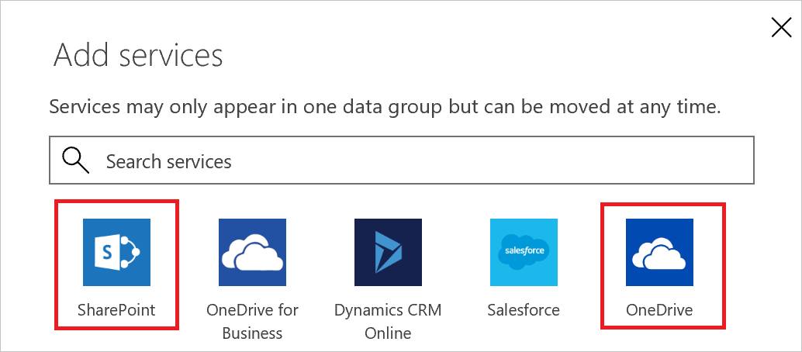

# Data loss prevention (DLP) policies
## What is a data loss prevention policy?
An organization's data is critical to its success. Its data needs to be readily available for decision-making but it needs to be protected so that it isn't shared with audiences that should not have access to it. To protect this data, Microsoft PowerApps (PowerApps) provides you with the ability to create and enforce policies that define which consumer services/connectors specific business data can be shared with. These policies that define how data can be shared are referred to as data loss prevention (DLP) policies.  

## Why create a DLP policy?
You would create DLP policy to clearly define which consumer services business data may be shared with. For example, an organization that uses PowerApps may not want its business data that's stored in SharePoint to be automatically published to its Twitter feed. To prevent this, you can create a DLP policy that blocks SharePoint data from being used as the source for tweets.

## Benefits of a DLP policy
* Ensures that data is managed in a uniform manner across the organization  
* Prevents important business data from being accidentally published to services such as social media sites.   

## Managing DLP policies
**Prerequisites**  
In order to create, edit, or delete DLP policies, the following items are required:

* Either environment admin or tenant admin permissions. You can learn more about permissions in the [environments topic](environments-administration.md)

## Create a DLP policy
**Prerequisites**  
In order to create a DLP policy, you must have permissions to at least one environment.  

Follow these steps to create a DLP policy that prevents data that is stored in your SharePoint database from being published to Twitter:  

1. While on the Data Policies tab, select the **New policy** link:  
       
2. Enter the name of the DLP policy as *Secure Data Access for Contoso* in the **Data Policy Name** label at the top of the page that opens:   
     
3. Select the [environment](environments-administration.md) on the **Applies to** tab.  
     
4. Select the **Data groups** tab:  
     
5. Select the **+ Add** link located inside the **Business data only** group box:    
     
6. Select the **SharePoint** and **Salesforce** services from the **Add services** page:  
     
7. Select the **Add services** button to add the services you selected to the list of services that are allowed to share business data:    
     
8. Select **Save Policy**:  
     
9. After a few moments, your new DLP policy will be displayed in the data loss prevention policies list:  
     
10. **Optional** Send an email or other communication to your team, alerting them that a new DLP policy is now available.

Congratulations, you have now created a DLP policy that allows app to share data between SharePoint and Salesforce and blocks the sharing of data with any other services.  

## Find a DLP policy
### Admins
Admins can use the search feature from the Admin center to find specific DLP policies.  

> [!NOTE]
> Admins should publish all DLP policies so that users in the organization are aware of the policies prior to creating PowerApps.

### Makers
If you don't have admin permissions and you wish to learn more about the DLP policies in your organization, contact your administrator. You can also learn more from the [maker environments topic](environments-overview.md)  

> [!NOTE]
> Only admins can edit or delete DLP policies.  

## Edit a DLP policy
1. Launch the Admin center by browsing to https://admin.powerapps.com.   
2. In the Admin center that launches, select the **Data polices** link on the left side.  
     
3. Search the list of existing DLP policies and select the edit link next to the policy you intend to edit:  
     
4. Make the changes you wish to make. You can modify the environment or the services in the data groups, for example.  
5. Select **Save Policy** to save your changes:  
     

Your policy has now been updated. You can confirm that the changes have been made to your policy by finding it in the data loss prevention policies list and reviewing its properties.   

## Delete a DLP policy
1. Launch the Admin center by browsing to https://admin.powerapps.com    
2. In the Admin center that launches, select the **Data polices** link on the left side.  
     
3. Search the list of existing DLP policies and select the delete link next to the policy you intend to delete:  
     
4. Confirm that you really want to delete the policy by selecting the **Delete** button:  
     

Your policy has now been deleted. You can confirm that the policy is no longer listed in the data loss prevention policies list by selecting the **Data Policies** link on the left and reviewing the list of policies.   

## DLP policy permissions
Only tenant and environment admins can create and modify DLP policies. Learn more about permissions in the [environments](environments-administration.md) topic.  

## Next steps
* [Learn more about environments](environments-administration.md)  
* [Learn more about Microsoft PowerApps](getting-started.md)  
* [Learn more about the admin center](introduction-to-the-admin-center.md)  

