# Configure master data in the admin app

This article provides information on how you can use the admin app (model-driven app) to add and manage master data for your solution.

These tasks are typically performed by business admins in your organization.

See the overview video or follow the steps to configure master data. Estimated time to complete these steps: **35–40 minutes.**

## Demo: Quick overview on how to configure master data 

Watch a quick overview on how to configure master data. 

 

> [!VIDEO https://www.microsoft.com/en-us/videoplayer/embed/RE4xijh]

## Step 1: Configure and manage setup data for your organization

Use the admin app to create and manage master data for your organization. This data is required for the **Higher Education Crisis Financial Impact Tracker** app to work.

> [!IMPORTANT]
> Ensure that your IT admin has deployed the solution into your organization and has granted appropriate permissions for business admins to use the admin app.
More information: [Deploy the Higher Education Crisis Financial Impact Tracker app](deploy-solution.md).

You must add master data in to these entities in the following sequence:

1. [App Configs](#app-configs)

2. [Frequently Asked Questions](#frequently-asked-questions)

3. [Campuses](#campuses)

4. [Colleges](#colleges)

5. [Departments](#departments)

6. [Loss Reasons](#loss-reasons)

7. [Pay Period](#pay-periods)

The master data is managed from the **Administration** area in the left navigation pane in the admin app:

> [!div class="mx-imgBorder"]
> 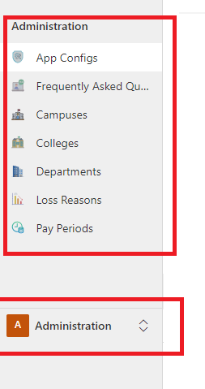

### App Configs

The App Configs entity lets you manage key configurations of the applications. To
update the App Configs entity record:

1. Sign in to the admin app using the url provided by your IT admin.

1. Select **Administration** > **App Configs** in the left navigation pane.

   > [!div class="mx-imgBorder"]
   > 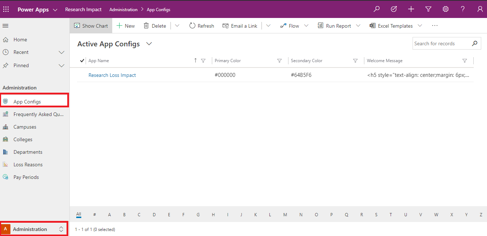

1. Select the record.
    
    > [!div class="mx-imgBorder"]
    > 

1. Enter or update the fields with appropriate values:

    | Field | Description|
    |------------|--------------|
    | App Name  | Enter the name of the app. |
    | Primary Color| Enter the primary color for the app.|
    | Secondary Color | Enter the secondary color for the app.|
    | Welcome Message | Enter the HTML based welcome message that you want to display on the app.|
    | Owner| The owner field automatically default to your user. |
    |||

1. Double-click on the image on the form to update with the new one.
    
    > [!div class="mx-imgBorder"]
    > 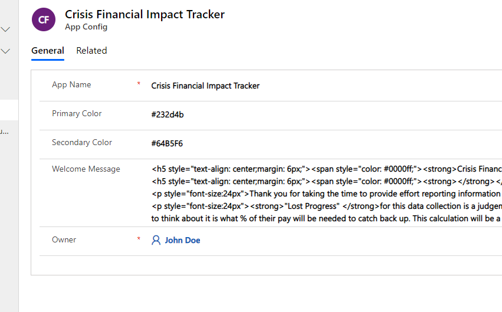

1. Select the **Upload Image** to select a new image for your app.
    
    > [!div class="mx-imgBorder"]
    > 

### Frequently asked questions 

The Frequently Asked Questions entity lets you manage and maintain frequently asked questions, which help the app users to create records. To create a new frequently asked questions record:

1. Sign in to the admin app using the url provided by your IT admin.

1. Select **Administration** > **Frequently Asked Questions** in the left  navigation pane and select **New**.

1. Enter the following field value to create a new record:

   > [!div class="mx-imgBorder"]
   > 

   | Field    | Description |
   |----------|----------------|
   | Question | Enter the frequently asked question for the app users.|
   | Answer   |Enter the answer for the question above, which is suitable for the app users.|
   | Owner| The owner field automatically defaults to the user.|
   |||
1. Select **Save & Close**. The newly created record will be available in the
    **Frequently asked questions** list.

To edit the record, select the record, update the values as required, and select
**Save & Close.**

### Campuses

The Campuses entity lets you manage and maintain university campuses, which will
be participated in this program. To create the record:

1. Sign in to the admin app using the url provided by your IT admin.

1. Select **Administration** > **Campuses** in the left navigation pane and select **New**.

1. Enter the following field values to create a new record:

   > [!div class="mx-imgBorder"]
   > 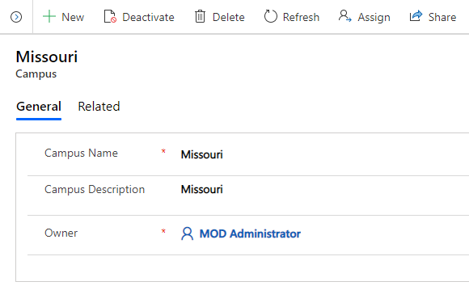

   | Field  | Description |
   |---------|-----|
   | Campus Name | Enter the name of the campus.|
   | Campus Description | Enter the description of the campus.|
   | Owner| The owner field automatically defaults to your user. |
   |||

1. Select **Save & Close**. The newly created record will be available on the
    **Campus** list.

To edit the record, select the record, update the values as required, and select
**Save & Close.**

### Colleges

The colleges entity lets you manage and maintain colleges of the University campuses, which will be participated in this program. To create
the record:

1. Sign in to the admin app using the url provided by your IT admin.

1. Select **Administration** > **Colleges** in the left navigation pane and select **New**.

1. Enter the following field values to create a new record:

    > [!div class="mx-imgBorder"]
    > 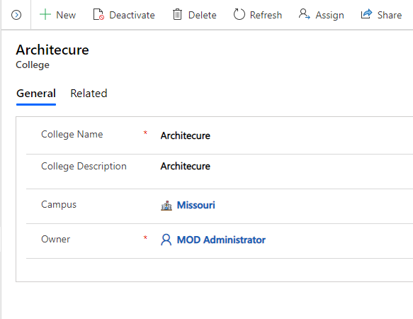

    | Field  | Description  |
    |------------|-------------|
    | College Name | Enter the name of the college/school. |
    | College Description | Enter the description of the college/school.|
    | Campus | Select a campus this college/school is associated with this college. This list is populated based on the **Campus** data you have created earlier. |
    | Owner | The owner field automatically defaults to your user.|
    |||

1. Select **Save & Close**. The newly created record will be available in the
    **College** list.

To edit the record, select the record, update the values as required, and select
**Save & Close.**

### Departments

The Department entity lets you manage and maintain departments of each college, which will be participated in this program. To create the
record:

1. Sign in to the admin app using the url provided by your IT admin.

1. Select **Administration** > **Departments** in the left navigation pane and select **New**.

1. Enter the following field values to create a new record:

   > [!div class="mx-imgBorder"]
   > 

    | Field  | Description   |
    |-------------|---------|
    | Department | Enter the name of the department.|
    | Department Description | Enter the description of the department.|
    | College | Select a college this department is associated with. This list is populated based on the **College** data you have created earlier. |
    | Owner  | The owner will automatically default to your user. |
    |||

1. Select **Save & Close**. The newly created record will be available in the
    **Department** list.

To edit the record, select the record, update the values as required, and select
**Save & Close.**

### Loss Reasons

The Loss Reason entity lets you manage and maintain loss reason associated
with the effort impact. To create the record:

1. Sign in to the admin app using the url provided by your IT admin.

1. Select **Administration** > **Loss Reason** in the left navigation pane and select **New**.

1. Enter the following field values to create a new record:

   > [!div class="mx-imgBorder"]
   > 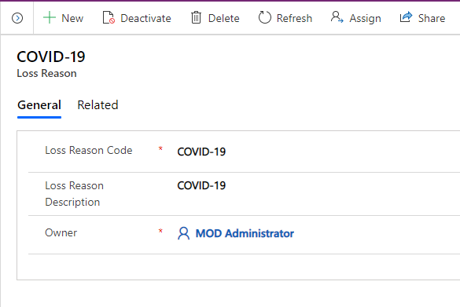

   | Field   | Description |
   |-----------|--------------|
   | Loss Reason Code | Enter the code for the Loss Reason.|
   | Loss Reason Description | Enter the description of the Loss Reason.|
   | Owner | The owner field automatically defaults to your user. |
   |||

1. Select **Save & Close**. The newly created record will be available in the
    **Loss Reason** list.

To edit the record, select the record, update the values as required, and select
**Save & Close.**

### Pay Periods

The Pay Period entity lets you manage and maintain the reporting
period associated with the effort impact. To create the record:

1. Sign in to the admin app using the url provided by your IT admin.

1. Select **Administration** > **Pay Period** in the left navigation pane and select **New**.
1. Enter the following field values to create a new record:

   > [!div class="mx-imgBorder"]
   > 

    | Field | Description |
    |-----------|--------------|
    | Pay Period Code | Enter the code of the Loss Reason.|
    | Pay Period Description | Enter the description of the Loss Reason.|
    | Owner  | The owner field automatically defaults to your user. |
    |||

1. Select **Save & Close**. The newly created record will be available in the
    **Loss Reason** list.

To edit the record, select the record, update the values as required, and select
**Save & Close.**

## Step 2: Configure and manage master data for your organization

Use the admin app to create and manage master data for your organization. This data is required for the **Crisis Financial Impact Tracker** app to work.

You must add master data in these entities in the following sequence:

1. [Employees](#employees)

2. [Sponsors](#sponsors)

3. [Grants](#grants)

4. [Sponsored Programs](#sponsored-programs)

5. [Employee Compensation](#employee-compensation)

The master data is managed from the **Crisis Financial Impact Tracker** area in the left navigation pane in the admin app:

> [!div class="mx-imgBorder"]
> 

### Employees

The Employees entity lets you manage and maintain the employees that are associated with the sponsored program in different roles like Principal
Investigator, Co-Principal Investigator, Researcher, etc.

To create the record:

1. Sign in to the admin app using the url provided by your IT admin.

1. Select **Crisis Financial Impact Tracker** > **Employees** in the left navigation pane and select **New**.

1. Enter the following field values to create a new record:

   > [!div class="mx-imgBorder"]
   > 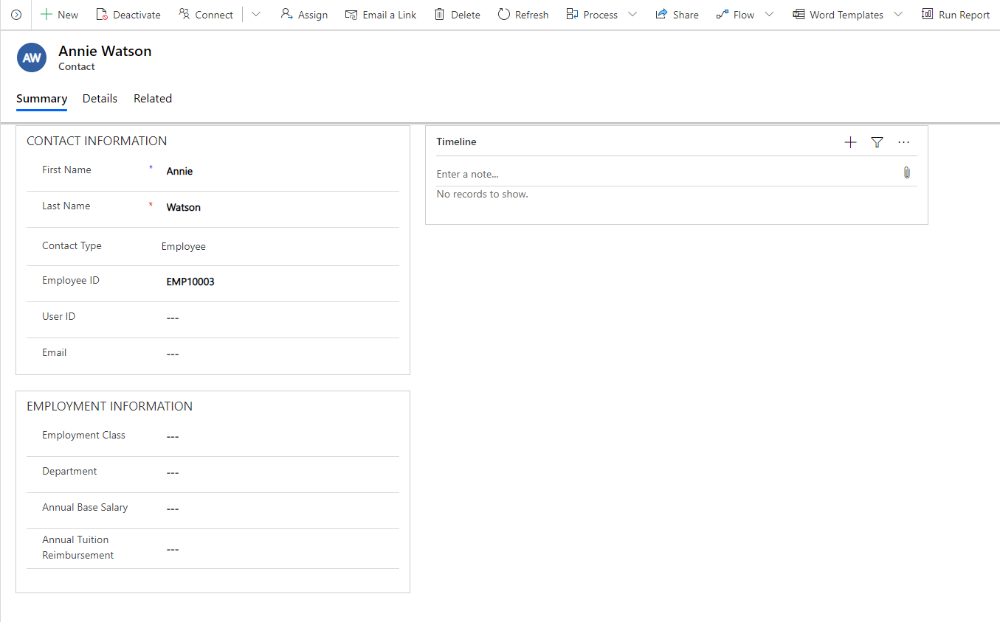

   | Field  | Description |
   |--------|-----------|
   | Contact Type | Enter the type of contact. |
   | Employee ID  | Enter the employee id or number for the contact for reference in orders, service cases, or other communications with the contact's organization.|
   | User ID  | Enter the user id. |
   | Email| Enter the primary email address for the contact. |
   | First Name | Enter the employee's first name to make sure the contact is addressed correctly in sales calls, email, and marketing campaigns.|
   | Last Name   | Enter the employee's last name to make sure the contact is addressed correctly in sales calls, email, and marketing campaigns.|
   | Middle Name | Enter the employee's middle name or initial to make sure the contact is addressed correctly.|
   | Employment Class | Enter the classification of employees. |
   | Department | Enter the department where the employee works.|
   | Annual Base Salary | Enter the annual base salary of the employee.|
   | Annual Tuition Reimbursement | Enter the annual tuition reimbursement of the employee.|
   |||

   > [!NOTE] 
   > Email address of the employee must match the employee email id of the user accessing the app.

1. Select **Save & Close**. The newly created record will be available on the **Employee** list.

To edit the record, select the record, update the values as required, and select
**Save & Close.**

### Sponsors

The Sponsor entity lets you manage and maintain the sponsors that are
associated with the sponsored program.

To create the record:

1. Sign in to the admin app using the url provided by your IT admin.

1. Select **Crisis Financial Impact Tracker** > **Sponsors** in the left navigation pane, and select **New**.

1. Enter the following field values to create a new record:

   > [!div class="mx-imgBorder"]
   > 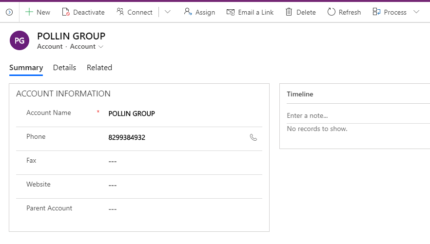

    | Field   | Description |
    |---------|------------|
    | Account Name  | Enter the name of the sponsor.|
    | Phone  | Enter the primary phone number of the sponsor.|
    | Fax   | Enter the fax number of the sponsor. |
    | Website  | Enter the website of the sponsor.|
    | Parent Account | Select the parent account associated with this sponsor.|
    |||

1. Select **Save & Close**. The newly created record will be available on the
    **Sponsor** list.

To edit the record, select the record, update the values as required, and select
**Save & Close.**

### Grants

The Grants entity lets you manage and maintain the grants that are associated with the sponsored program.

To create the record:

1. Sign in to the admin app using the URL provided by your IT admin.

1. Select **Crisis Financial Impact Tracker** > **Grants** in the left navigation pane and select **New**.

1. Enter the following values to create a new record:

   > [!div class="mx-imgBorder"]
   > 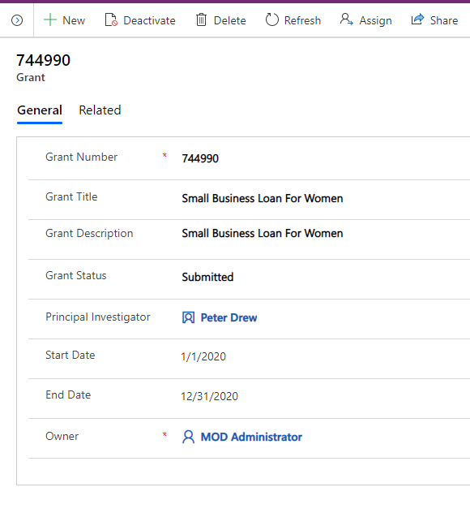

    | Field  | Description |
    |---------|--------------|
    | Grant Number | Enter the grant number.|
    | Grant Title | Enter the title of the grant.|
    | Grant Description| Enter the description of the grant.|
    | Grant Status | Select the status for the grant.|
    | Principal Investigator | Select the principal investigator.|
    | Start Date | Enter the start date of the grant.|
    | End Date| Enter the end date of the grant|
    | Owner | The owner field automatically defaults to your user. |
    |||

1. Select **Save & Close**. The newly created record will be available on the
**Grant** list.

To edit the record, select the record, update the values as required, and select
**Save & Close.**

### Sponsored Programs

The Sponsored Program entity lets you manage and maintain the sponsored program that is associated with the Grants entity.

To create the record:

1. Sign in to the admin app using the url provided by your IT admin.

1. Select **Crisis Financial Impact Tracker** > **Sponsored Program** in the left navigation pane and select **New**.

1. Enter the following values to create a new record:

    > [!div class="mx-imgBorder"]
    > 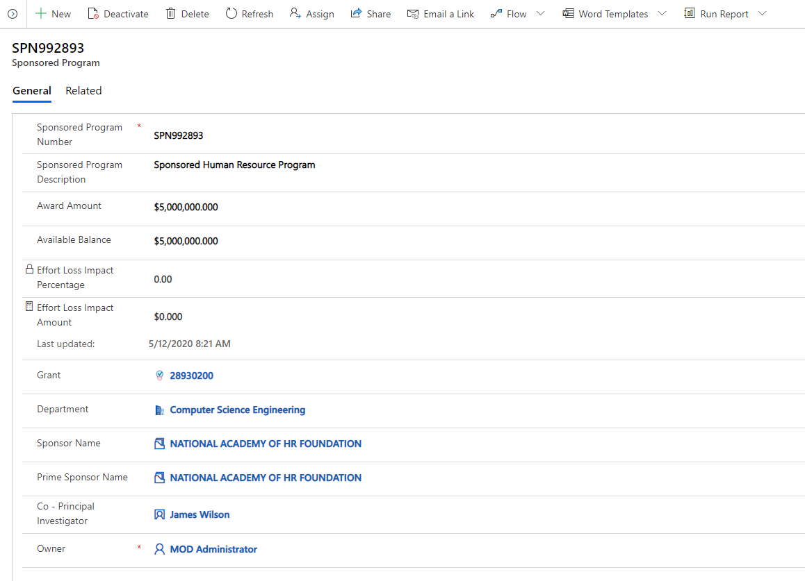

    | Field  | Description  |
    |-------------|--------------|
    | Sponsored Program Number  | Enter the number of the sponsored program.|
    | Sponsored Program Description | Enter the description of the sponsored program.|
    | Award Amount | Enter of the award amount for the sponsored program.|
    | Available Balance  | Enter of the balance amount for the sponsored program.|
    | Effort Loss Impact Percentage | Enter the percentage of total loss impact.|
    | Effort Loss Impact Amount | Enter of the total loss impact amount for the sponsored program.|
    | Grant | select the grant this sponsored program is associated with.|
    | Department | Select the department of the sponsored program.|
    | Sponsor Name | Select the sponsor name of the sponsored program.|
    | Prime Sponsor Name | Select the prime sponsor name of the sponsored program.|
    | Co-Principal Investigator| Select the co-principal investigator name of the sponsored program. |
    | Owner  | The owner field automatically defaults to your user. |
    |||

1. Select **Save & Close**. The newly created record will be available on the
    **Sponsored Programs** list.

To edit the record, select the record, update the values as required, and select
**Save & Close.**

### Employee Compensation 

The Employee Compensation entity lets you manage and maintain the employee
effort amount, effort loss, and reason by pay period for each
sponsored program.

To create the record:

1. Sign in to the admin app using the url provided by your IT admin.

1. Select **Crisis Financial Impact Tracker** > **Employee Compensation** in the left navigation pane and select **New**.

1. Enter the following values to create a new record:

   > [!div class="mx-imgBorder"]
   > 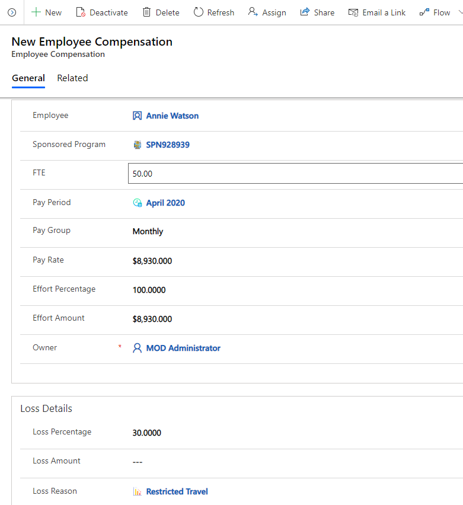

   | Field     | Description  |
   |-------------|----------------------|
   | Employee  | Select the employee. |
   | Sponsored Program | Select the sponsored program. |
   | FTE    | Enter the full-time equivalent. |
   | Pay Period   | Select the pay period. |
   | Pay Group   | Select the pay group.|
   | Pay Rate    | Enter the pay rate. |
   | Effort Percentage | Enter the effort percentage. |
   | Effort Amount     | Enter the effort amount. |
   | Loss Percentage   | Enter the effort percentage. |
   | Loss Amount  | Enter the loss amount.|
   | Loss Reason  | Select the loss reason. |
   | Owner   | The owner field automatically defaults to your user. |
   |||

1. Select **Save & Close**. The newly created record will be available on the
    **Sponsored Programs** list.

To edit the record, select the record, update the values as required, and select
**Save & Close.**
