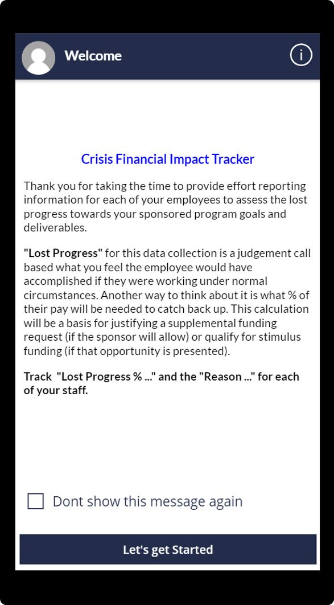
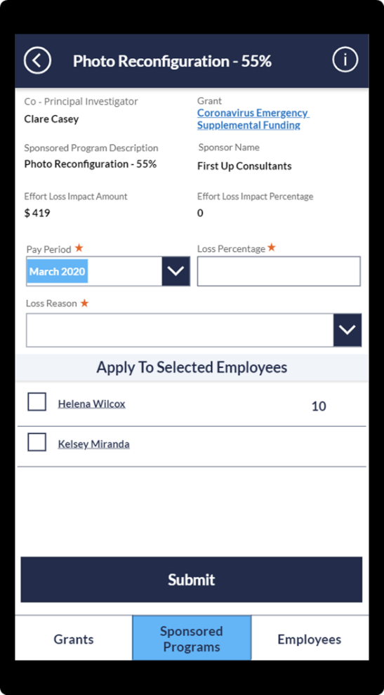
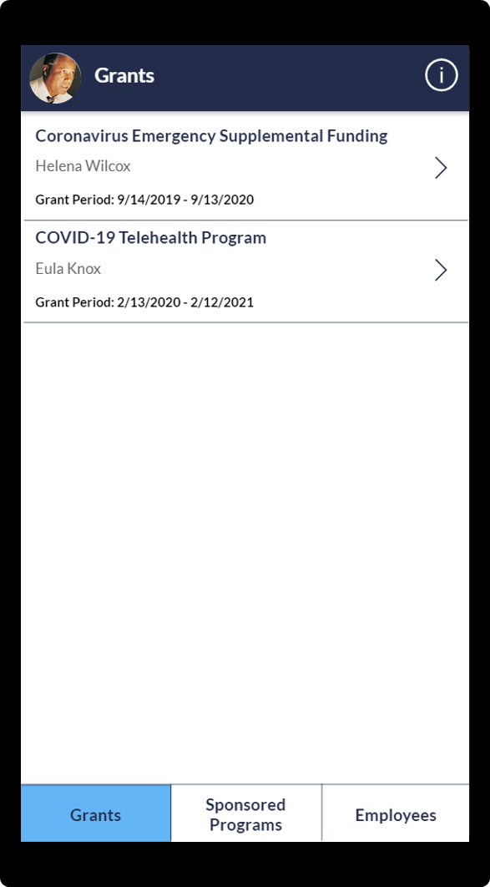
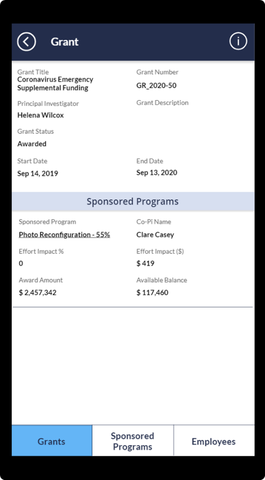
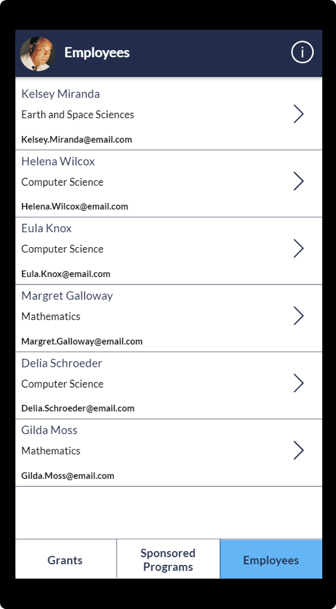
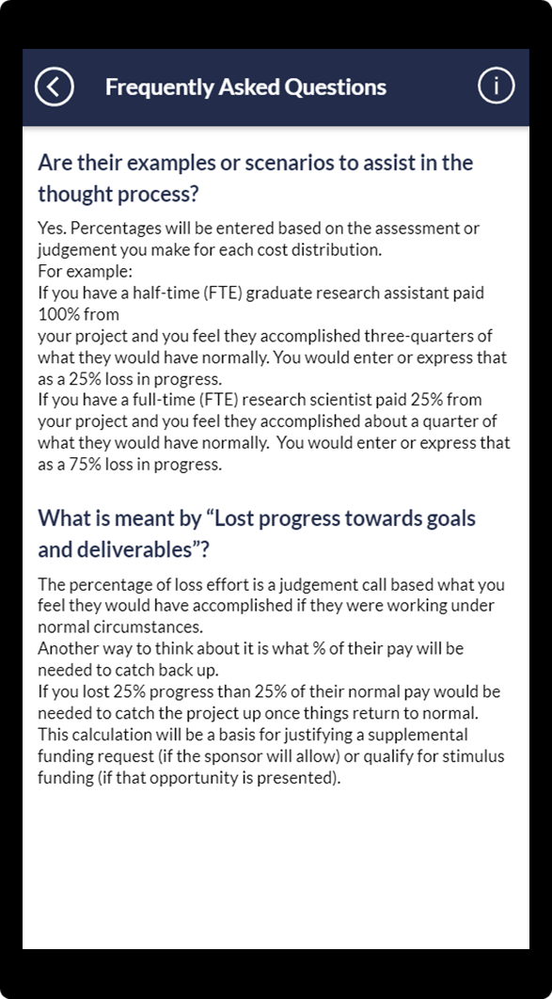

# Use the Higher Education Crisis Financial Impact tracker mobile app

The Higher Education Crisis Financial Impact Tracker app allows users to review the sponsored programs they are working on and report loss of effort because of the pandemic or a crisis. 

## Prerequisites 

To get started with the mobile app, you need to download the Power Apps Mobile app on your device using the device's app store.

-  Download the [Power Apps Mobile](https://powerapps.microsoft.com/downloads)

    - For **Apple** devices such as iPhone and iPad, use [App store](https://aka.ms/powerappsios).

    - For **Android** devices, use [Google Play](https://aka.ms/powerappsandroid).

-   Ensure your organization has deployed and configured the **Higher Education Crisis Financial Impact Tracker** app, as explained in [Deploy](deploy-solution.md) and [configure](configure-data.md) the app.

After you install the Power Apps Mobile, open the app from your device and sign in with your company's Azure Active Directory account. You can view all apps shared with you by your organization once you sign in. More information: [Power Apps mobile device sign in](https://docs.microsoft.com/powerapps/user/run-app-client#open-power-apps-and-sign-in).

## Using the mobile app

Open the Higher Education Crisis Financial Impact Tracker app from Power Apps Mobile, review the welcome message and select **Let's get Started** to start using the app.

> [!div class="mx-imgBorder"]
> 

> [!NOTE]
> When you launch the app first time, it will display the welcome message configured in the admin app of the solution. As a user, you can choose to select
**Don't show this message again** and the welcome message will not appear again.

## App Components 

The Higher Education Crisis Financial impact tracker app consists of following key components:

- [Grant](#grants): List of the grant the user is associated with as a Co-Principal Investigator. Users will be able to review the summary of the grants and sponsored programs.

- [Sponsored Programs](#sponsored-programs): List of sponsored programs the user is associated as a Co-Principal Investigator. Users will be able to review the sponsored program summary and report effort loss for each employee.

- [Employee](#employee): List of employees who are associated with sponsored programs in the sponsored program tab. Users will be able to review the summary of employee effort loss by pay period.

### Sponsored Programs

Sponsored Program allows users to review the list of sponsored programs associated with the user as a Co-Principal Investigator. You will be able to
**search** by entering the text in the search text.

> [!div class="mx-imgBorder"]
> 

Select the **>** to view the details of the sponsored program.

You can select the **Grants** to view [Grant details](#grant-details) and similarly  **Employees** to see [employee details](#employee-detail). You can also select the **Information Icon** on the top-right corner to view the [frequently asked questions](#frequently-asked-questions).

### Sponsored Program details

Sponsored Program form allows you to review the summary of the sponsored program and report the effort loss for each employee.

> [!div class="mx-imgBorder"]
> 

Enter the **Pay Period**, **loss percentage**, and, **Loss Reason**. Select the **employee(s)** you are reporting the effort loss and select **Submit** to report the effort loss.

Select **<** icon from top-left if you want to go back to the sponsored program list without submitting any change . **Submit** button submits the values you entered.

You can select **Grants** tab to view [Grant details](#grant-details) and similarly **Employees** tab to see [employee details](#employee-detail). You can also select the **Information Icon** on the top-right corner to view the [frequently asked questions](#frequently-asked-questions)

**Field and description**

| Field   | Description   |
|---------|---------------|
| Co-Principal Investigator  | Name of the co-principal investigator.  |
| Grant   | Name of the grant this sponsored program is associated with. You can select the name to view the grant details.|
| Sponsored Program Description | Description of the sponsored program.|
| Sponsor name | The name of the organization which is sponsoring the sponsored program.|
| Effort Loss Impact Amount  | Sum of the all the effort loss amount across multiple pay periods which is reported at this time.|
| Effort loss percentage | This is the total effort loss in percentage as we compare to the total awarded amount. (Effort Loss Impact Amount )/ (Award Amount ) x 100 .|
| Pay Period | Select pay period that is configured in the financial impact tracker admin app.|
| Loss Percentage | Enter loss percentage for the employee for selected pay period.|
| Loss Reason | Select the reason for the reported loss.|
| Employee Check Box List | List of employees who are working in the selected sponsored program.|
|||

### Grants

Grants allows users to review the list of **Grants** associated with the user as a Co-Principal Investigator.

> [!div class="mx-imgBorder"]
> 

Select **>** next to the grant record to view the details of the sponsored program.

You can select **Sponsored Programs** tab to view [Sponsored Program details](#sponsored-program-details) and similarly **Employees** to see [employee details](#employee-detail). You can select **Information Icon** on the top-right corner to view [frequently asked questions](#frequently-asked-questions).

### Grant Details

Grants detail form allows you to review the summary of the **Grants** and **Sponsored Programs** associated with the selected grant.

> [!div class="mx-imgBorder"]
> 

Select **<** from top-left if you want to go back to the **Grants** list page.

You can select **Sponsored Programs** tab to view [Sponsored Program details](#sponsored-program-details) and similarly **Employees** to see [employee details](#employee-detail). You can select **Information Icon** on the top-right corner to view [frequently asked questions](#frequently-asked-questions).

**Field and description**

| Field  | Description  |
|------------|----------------------|
| Grant Title  | Enter the title of the grant. |
| Grant Number | The unique number of the grant. |
| Principal Investigator | Name of the principal investigator of the grant.  |
| Grant description  | The description of the grant.  |
| Grant Status  | The status of the grant. |
| Start Date | Date when the grant was started.  |
| End Date  | Date when this grant is ending. |
| Sponsored Program List  | List of all the sponsored program that is associated with the grant and you as co-principal investigator.|
| Sponsor name | The name of the organization which is sponsoring the sponsored program.|
| Co-Principal Investigator | Name of the co-principal investigator.|
| Effort Impact % | This is the total effort loss in percentage as we compare to the total awarded amount. (Effort Loss Impact Amount )/ (Award Amount ) x 100. |
| Effort Impact (\$)  | Sum of the all the effort loss amount across multiple pay/reporting periods which is reported at this time.|
| Award Amount | Amount award for the Sponsored Program.|
| Available Balance | Available balance amount for the sponsored program. |
|||

### Employee

Employee allows users to review the list of Employees associated with the sponsored programs list.

> [!div class="mx-imgBorder"]
> 

Select **>** next to the employee record to view the details of the employee. You can select **Sponsored Programs** tab to view [Sponsored Program details](#sponsored-program-details) and similarly **Grants** to see [Grant details](#grant-details). You can also select **Information Icon** tab on the top-right corner to view [frequently asked questions](#frequently-asked-questions).

### Employee detail

Employee detail form allows you to review the summary of the employee and effort impact associated with the employee.

> [!div class="mx-imgBorder"]
> 

Select the **<** from top-left if you want to go back to the employee list page.

You can select **Sponsored Programs** tab to view [Sponsored Program details](#sponsored-program-details) and similarly **Grants** to see [Grant details](#grant-details). You can also select **Information Icon** tab on the top-right corner to view [frequently asked questions](#frequently-asked-questions).

**Field and description**

| Field   | Description  |
|---------|--------------|
| Employment Class | The classification of the employee. |
| Department | The department of the employee.|
| Full name | The full name of the employee.|
| College | The college of the employee .|
| Annual Base Salary | The annual base salary of the employee. |
| Effort Impact List  | List of all the sponsored program the employee is working and effort impact reported for each pay period. |
| Reporting Period | Pay period when the loss impact was reported.|
| Sponsored Program | The name of the sponsored program.|
| Avg. Effort % | The average effort of the employee associated with the sponsored program.|
| Amount (\$) | Effort amount based on the average effort for the pay.|
| Effort Impact % .| Effort impact reported for the pay period.|
| Effort Impact (\$) | Effort impact amount which was reported for the pay period.|
| Reason for the Effort Loss | The reason for the effort loss for the pay period.|
|||

### Frequently Asked Questions 

You can review frequently asked questions by selecting the icon from any screen. These frequently asked questions are configured in the Financial Impact Tracker admin app based on your organization rules and guidelines. If you need additional information, you will need to reach out to your system administrator. Select **<** from top-left if you want to go back to the previous page.

> [!div class="mx-imgBorder"]
> 

## Report issues 

To report an issue with the Higher Education Crisis Financial Impact Tracker app, visit <https://aka.ms/emergency-response-issues>.