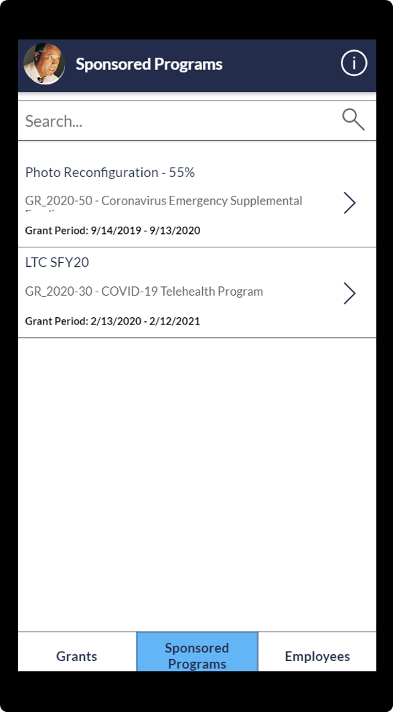
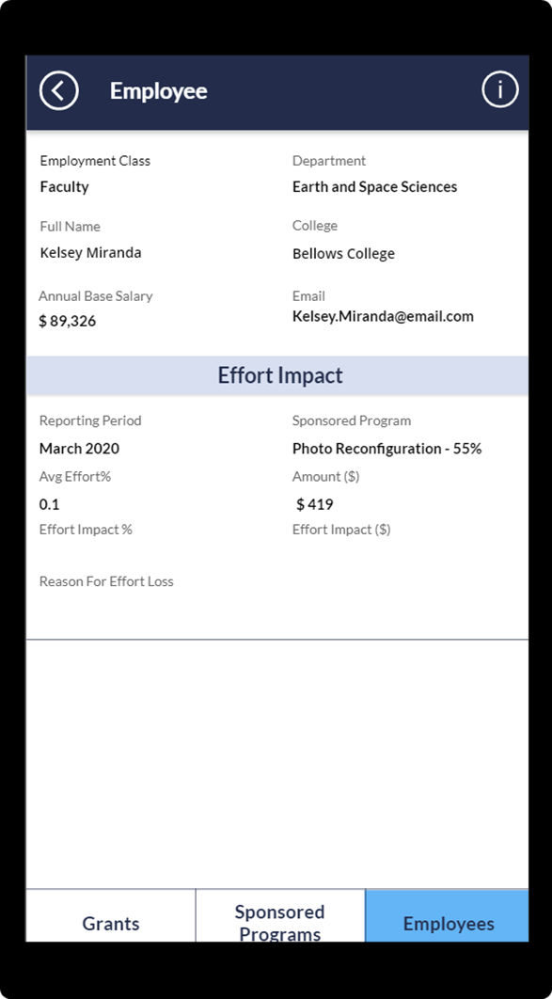

# Use the Higher Education Crisis Financial Impact Tracker mobile app

With the Higher Education Crisis Financial Impact Tracker app, users can review the sponsored programs they're working on and report loss of effort caused by the pandemic or other crisis. 

## Prerequisites 

To get started with the mobile app, you need to download the Power Apps Mobile app on your device using the device's app store.

-  Download [Power Apps Mobile](https://powerapps.microsoft.com/downloads).

    - For Apple devices such as iPhone and iPad, use [App store](https://aka.ms/powerappsios).

    - For Android devices, use [Google Play](https://aka.ms/powerappsandroid).

-   Ensure that your organization has [deployed](deploy-solution.md) and [configured](configure-data.md) the Higher Education Crisis Financial Impact Tracker app.<

After you install Power Apps Mobile, open the app from your device and sign in with your company's Azure Active Directory account. You can view all apps shared with you by your organization after you sign in. More information: [Power Apps mobile device sign-in](https://docs.microsoft.com/powerapps/user/run-app-client#open-power-apps-and-sign-in)

## Using the mobile app

Open the Higher Education Crisis Financial Impact Tracker app from Power Apps Mobile, review the welcome message, and then select **Let's get Started**.

> [!div class="mx-imgBorder"]
> 

> [!NOTE]
> When you open the app for the first time, it displays the welcome message configured in the admin app of the solution. If you don't want to see it again, select **Don't show this message again**.

## App components 

The Higher Education Crisis Financial Impact Tracker app consists of the following key components:

- [Grant](#grants): A list of the grants you're associated with as a co-principal investigator. You can review the summary of the grants and sponsored programs.

- [Sponsored Programs](#sponsored-programs): A list of sponsored programs you're associated as a co-principal investigator. You can review the sponsored program summary and report effort loss for each employee.

- [Employees](#employees): The list of employees who are associated with the sponsored programs on the **Sponsored Program** tab. You'll be able to review the summary of employee effort loss by pay period.

### Sponsored Programs

On the **Sponsored Program** tab, you can review the list of sponsored programs associated with you as a co-principal investigator. You can enter text in the search box to find a specific program.

> [!div class="mx-imgBorder"]
> 

Select **>** to view details about the sponsored program.

You can select **Grants** to view [grant details](#grant-details) and, similarly, **Employees** to view [employee details](#employee-details). You can also select the information symbol  in the upper-right corner to view [frequently asked questions](#frequently-asked-questions).

### Sponsored Program details

You can use the **Sponsored Programs** details form to review the summary of the sponsored program and report the effort loss for each employee.

> [!div class="mx-imgBorder"]
> 

Enter the **Pay Period**, **Loss Percentage**, and **Loss Reason**. Select the employees you're reporting the effort loss for, and then select **Submit** to report the effort loss.

Select **<** in the upper-left corner to go back to the sponsored program list without submitting any changes. Select **Submit** to submit the values you entered.

**Fields and descriptions for Sponsored Programs**

| Field   | Description   |
|---------|---------------|
| Co-Principal Investigator  | Name of the co-principal investigator.  |
| Grant   | Name of the grant this sponsored program is associated with. Select the name to view the grant details.|
| Sponsored Program Description | Description of the sponsored program.|
| Sponsor Name | The name of the organization which is sponsoring the sponsored program.|
| Effort Loss Impact Amount  | Sum of the all the effort loss across the pay periods that have been reported at this time.|
| Effort Loss Impact Percentage | This is the total effort loss in percentage compared to the total awarded amount. (Effort Loss Impact Amount ) / (Award Amount) &times; 100 .|
| Pay Period | Select the pay period that's configured in the Higher Education Crisis Financial Impact Tracker admin app.|
| Loss Percentage | Enter loss percentage for the employee for selected pay period.|
| Loss Reason | Select the reason for the reported loss.|
| Employee list | List of employees who are working in the selected sponsored program.|
|||

### Grants

On the **Grants** tab, you can review the list of grants associated with you as a co-principal investigator.

> [!div class="mx-imgBorder"]
> 

Select **>** next to the grant record to view details about the grant.

You can select **Sponsored Programs** to view [sponsored program details](#sponsored-program-details) and, similarly, **Employees** to view [employee details](#employee-details). You can select the information symbol  in the upper-right corner to view [frequently asked questions](#frequently-asked-questions).

### Grant details

You can use the **Grants** details form to review the summary of the grants and sponsored programs associated with the selected grant.

> [!div class="mx-imgBorder"]
> 

Select **<** in the upper-left corner to go back to the **Grants** list page.

**Fields and descriptions for Grants**

| Field  | Description  |
|------------|----------------------|
| Grant Title  | The title of the grant.|
| Grant Number | The unique number of the grant. |
| Principal Investigator | Name of the principal investigator of the grant.  |
| Grant description  | The description of the grant.  |
| Grant Status  | The status of the grant. |
| Start Date | Date when the grant was started.  |
| End Date  | Date when the grant will end. |
| Sponsored Program List  | List of all the sponsored programs that are associated with the grant and associated with you as co-principal investigator.|
| Sponsor name | The name of the organization that's sponsoring the program.|
| Co-Principal Investigator | Name of the co-principal investigator.|
| Effort Impact % | This is the total effort loss in percentage compared to the total awarded amount. (Effort Loss Impact Amount) / (Award Amount) &times; 100. |
| Effort Impact (\$)  | Sum of the all the effort loss amounts across multiple pay periods or reporting periods that have been reported at this time.|
| Award Amount | Amount of the award for the sponsored program.|
| Available Balance | Available balance for the sponsored program. |
|||

### Employees

On the **Employees** tab, you can review the list of employees associated with the sponsored programs list.

> [!div class="mx-imgBorder"]
> 

Select **>** next to the employee record to view details about the employee.

You can select **Sponsored Programs** to view [sponsored program details](#sponsored-program-details) and, similarly, select **Grants** to see [grant details](#grant-details). You can also select the information symbol  in the upper-right corner to view [frequently asked questions](#frequently-asked-questions).

### Employee details

You can use the **Employees** details form to review the summary of the employee and effort impact associated with the employee.

> [!div class="mx-imgBorder"]
> 

Select **<** in the upper-left corner to go back to the employee list page.

**Fields and descriptions for Employees**

| Field   | Description  |
|---------|--------------|
| Employment Class | The classification of the employee. |
| Department | The department of the employee.|
| Full name | The full name of the employee.|
| College | The college of the employee .|
| Annual Base Salary | The annual base salary of the employee. |
| Effort Impact List  | List of all the sponsored programs the employee is working, and the effort impact reported for each pay period. |
| Reporting Period | Pay period when the loss impact was reported.|
| Sponsored Program | The name of the sponsored program.|
| Avg. Effort % | The average effort of the employee associated with the sponsored program.|
| Amount (\$) | Effort amount based on the average effort for the pay.|
| Effort Impact % .| Effort impact reported for the pay period.|
| Effort Impact (\$) | Effort impact amount that was reported for the pay period.|
| Reason for the Effort Loss | The reason for the effort loss for the pay period.|
|||

### Frequently Asked Questions

You can review frequently asked questions by selecting the information symbol  on any screen. These frequently asked questions are configured in the Higher Education Crisis Financial Impact Tracker admin app based on your organization's rules and guidelines. If you need additional information, reach out to your system administrator. Select **<** in the upper-left corner to go back to the previous page.

> [!div class="mx-imgBorder"]
> 

## Report issues 

To report an issue with the Higher Education Crisis Financial Impact Tracker app, visit <https://aka.ms/crisis-financial-impact-tracker-issues>.

